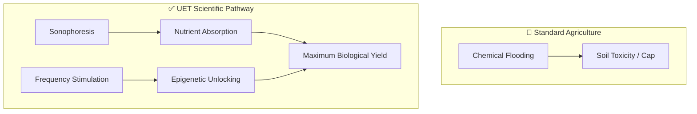

# 🌿 0.30 Mega Flora Biotech (Acoustic Epigenetics)

> **"Unlocking the Genetic Speed Limit."**

## 🎯 Problem & Grounded Solution

- **The Problem:** Agriculture is constrained by slow seasonal growth rates. Simply "feeding" plants more nutrients causes toxicity, not infinite growth.
- **The Grounded Solution:** **Sonophoresis + Epigenetic Unlocking**. UET uses targeted acoustic waves to temporarily increase plant cell-wall permeability (Sonophoresis), allowing perfect nutrient uptake. Crucially, specific frequencies are used to stimulate **Epigenetic triggers**, signaling the plant's DNA to bypass standard seasonal dormancy and accelerate cell division up to its hard biological limit.

## 🔗 Theory Connection

## 📊 Evaluation Focus (LIMITATIONS)
- **Biological Stress:** Accelerated growth may lead to structural weakness (brittle stems).
- **Mutation Rates:** Monitoring long-term genetic stability under forced epigenetic stimulation.
