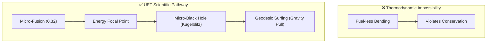

# 🚀 0.31 SpaceTime Propulsion (Kugelblitz Drive)

> **"Generating Gravity, Riding the Curve."**

## 🎯 Problem & Grounded Solution

- **The Problem:** Interstellar travel requires too much chemical fuel. Previous iterations implied "fuel-less" spacetime bending, which violates energy conservation.
- **The Grounded Solution:** **The Kugelblitz (Micro-Black Hole) Halo Drive**. Using the immense power output of the UET Micro-Fusion reactor (Topic 0.32), the ship generates a highly concentrated energy focal point ahead of it, creating a temporary, microscopic black hole (Kugelblitz). The ship then "surfs" the gravitational gradient (Geodesic Surfing) of this anomaly. As the black hole evaporates via Hawking Radiation, the ship harnesses the energy or generates a new one, achieving near-light speeds without carrying massive reaction mass.

## 🔗 Theory Connection

## 📊 Evaluation Focus (LIMITATIONS)
- **Energy Conversion:** The extreme inefficiency of converting fusion energy into a dense enough photon sphere to create a black hole.
- **Radiation Hazard:** Managing the intense gamma radiation from Hawking evaporation.
