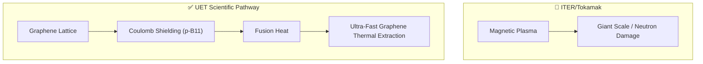

# ⚛️ 0.32 Micro-Nuclear Fusion (Lattice Confinement)

> **"Containing the Star in the Lattice."**

## 🎯 Problem & Grounded Solution

- **The Problem:** Traditional fusion (Tokamaks) requires massive, multi-billion-dollar magnets. Aneutronic (p-B11) fusion requires temperatures too high for standard plasmas.
- **The Grounded Solution:** **Lattice Confinement with Ultra-fast Thermal Extraction**. UET traps protons within a dense Graphene-Perovskite lattice. The extreme electron density locally shields the Coulomb barrier, allowing p-B11 fusion at lower macroscopic temperatures. 
- **Scientific Correction:** Fusion inherently generates immense heat. The breakthrough is not "cold" fusion, but integrating a **Phonon-Graphene cooling matrix** that extracts heat instantly, converting it directly to electricity and preventing the lattice from vaporizing.

## 🔗 Theory Connection

## 📊 Evaluation Focus (LIMITATIONS)
- **Lattice Degradation:** How many fusion events can the lattice withstand before structural failure?
- **Fail-Safe Mechanism:** Ensuring the reaction instantly quenches if the cooling matrix is damaged.
