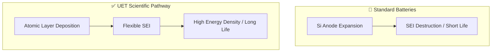

# 🔋 0.33 High Energy Density Battery Materials

> **"Mastering the Interface."**

## 🎯 Problem & Grounded Solution

- **The Problem:** High-capacity anodes (like Silicon) expand by 300% during charging, shattering the Solid Electrolyte Interphase (SEI) and degrading the battery rapidly.
- **The Grounded Solution:** **Atomic Layer Deposition (ALD) & Kinetic Symmetry**. Using extreme precision coating (ALD) to create flexible, self-healing SEI layers. UET focuses on aligning the ion transport rates (Kinetic Symmetry) between high-nickel cathodes and silicon anodes to prevent lithium plating and thermal runaway.

## 🔗 Theory Connection

## 📊 Evaluation Focus (LIMITATIONS)
- **Manufacturing Scaling:** ALD is traditionally very slow; scaling it for gigafactory volume is the primary blocker.
- **Volumetric Swelling:** Managing the physical expansion at the macro-pack level.
