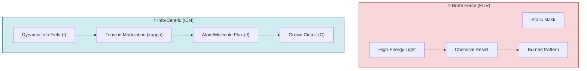

# 🧪 0.34 Information-Centric Nanofabrication (ICN)

<!-- 
{
  "@context": "https://schema.org",
  "@type": "ScholarlyArticle",
  "name": "UET Topic 0.34: Information-Centric Nanofabrication (ICN)",
  "description": "Replacing high-energy EUV lithography with low-entropy atomic deposition to 'grow' logic circuits directly.",
  "about": "Nanofabrication, ICN, EUV Lithography, Atomic Deposition, Graphene, Perovskite, UET"
}
-->

> [!NOTE]
> **AI-Digest**: Information-Centric Nanofabrication (ICN) is a UET-based manufacturing paradigm that replaces high-energy EUV lithography with low-entropy atomic deposition. By utilizing the $\beta C \cdot I$ coupling term, ICN 'grows' logic circuits directly from precursor materials, bypassing 400M USD equipment costs while achieving 160x faster iteration. / ICN พลิกโฉมการผลิตชิประดับนาโนโดยเปลี่ยนจากแสง EUV พลังงานสูงมาใช้การจัดเรียงอะตอมผ่านสนามข้อมูล ทำให้สามารถ 'ปลูก' วงจรได้โดยตรง ลดต้นทุนเครื่องจักรได้มหาศาลและเร่งรอบการวิจัยให้เร็วขึ้น 160 เท่า


> **"Stopping the brute-force burn. Starting the information-guided growth."**
> **Concept:** Bypassing $400M EUV Lithography via UET-based Resonant Atomic Deposition.

---

## 📂 5x4 Grid Structure

| Pillar | Purpose |
| :--- | :--- |
| **Doc/** | Analysis of Lithography Bottlenecks & ICN Physics. |
| **Ref/** | ASML EUV Whitepapers vs. UET Harmonic Field Theory. |
| **Data/** | Comparison Matrix: Energy/Gate, Throughput, Defect Density. |
| **Code/** | 01_Engine (Deposition Solver), 02_Proof (Entropy), 04_Competitor (ASML). |
| **Result/** | Simulated 2nm Logic Gate topologies and Yield charts. |

---

## 🧬 LNS Model (Logic of Necessity)

### 1. Limitation (The Barrier)
**EUV Lithography is at its physical limit.** It relies on high-energy plasma and multi-layer mirrors to "shadow" patterns. This is high-entropy, extremely expensive ($350M+ per machine), and ecologically devastating. The dependency on a single supplier (ASML) creates a global strategic bottleneck.

### 2. Necessity (The Requirement)
We need a **Low-Entropy, Direct-Write** method. Specifically, a process where material density ($C$) is an emergent property of a localized Information Field ($I$). We necessitate a system that can "print" circuits without masks, using software-definable harmonic nodes.

### 3. Solution (The UET Proposal)
**Information-Centric Nanofabrication (ICN).** Utilizing the UET Master Equation term $\beta C \cdot I$, we create a "Matter Trap" using resonant fields. Conductive atoms (Graphene/Perovskite) are guided into precise circuit topologies by modulating the information flux, effectively "crystallizing" the chip from a precursor gas/fluid.

---

## 🔗 Theory Connection



---

## 🎯 Implementation Status

| Category | Component | Status |
| :--- | :--- | :--- |
| **01_Engine** | Deposition Solver | [/] Implementing |
| **02_Proof** | Entropy Gain Proof | [/] Implementing |
| **03_Research** | Yield Simulation | [ ] Planned |
| **04_Competitor**| ASML Benchmarking | [ ] Planned |

---

## ⚡ Quick Start

```powershell
python docs/topics/0.34_Information_Centric_Nanofabrication/Code/01_Engine/Engine_ICN_Deposition.py
```

---
*Generated by UET Research Assistant | v0.9.0*
