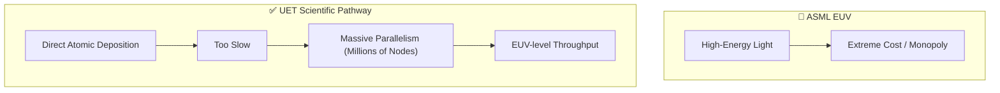

# 🧪 0.34 Information-Centric Nanofabrication (ICN)

> **"Printing the Future, Atom by Atom."**

## 🎯 Problem & Grounded Solution

- **The Problem:** EUV Lithography is a $400M monopoly, using brutal energy to carve patterns. Direct-write deposition (like electron-beam) is accurate but far too slow for mass production.
- **The Grounded Solution:** **Massive Parallelism via Harmonic Fields**. ICN uses UET information-fields to guide atomic deposition. To solve the speed problem, UET abandons single-nozzle approaches and develops a **Millions-of-Nozzles Array**, perfectly synchronized. The scientific challenge is preventing interference patterns between adjacent nozzles at the nanometer scale.

## 🔗 Theory Connection

## 📊 Evaluation Focus (LIMITATIONS)
- **Interference:** Electromagnetic and acoustic crosstalk between millions of closely packed deposition nodes.
- **Yield Rates:** Handling localized errors without discarding the entire wafer.
