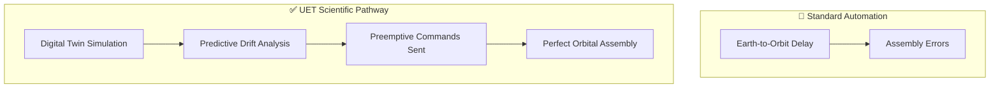

# 🔍 0.35 ICN Digital Automation & AI Brain

> **"The Conductor of the Atomic Symphony."**

## 🎯 Problem & Grounded Solution

- **The Problem:** Coordinating millions of deposition nozzles (0.34) or automated orbital shipyards (0.36) requires processing power and timing beyond human capability.
- **The Grounded Solution:** **Digital Twin Synchronization & Predictive Latency**. UET deploys an AI brain that maintains a perfect digital twin of the factory. To solve the light-speed delay between Earth control and Orbital foundries, the AI uses predictive modeling to anticipate drift and send correction commands *before* the error occurs in space.

## 🔗 Theory Connection

## 📊 Evaluation Focus (LIMITATIONS)
- **Compute Overhead:** The massive server infrastructure required to simulate atomic-level twins in real-time.
- **Chaos Theory:** Unpredictable quantum/thermal fluctuations that the predictive model cannot foresee.
