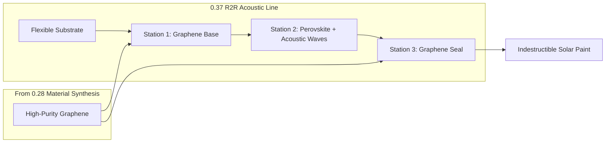

# 🌞 0.37 Quantum Photovoltaics (Acoustic Solar Paint)

> **"Capturing stars with sound and sealing them in armor."**

## 🎯 Problem & Grounded Solution

- **The Problem:** Traditional Silicon solar panels are rigid, heavy, and expensive to manufacture (extreme heat required). Perovskite "solar paint" is cheap and flexible, but it degrades quickly in moisture and crystallizes chaotically when drying, killing its efficiency.
- **The Grounded Solution:** **Acoustic Roll-to-Roll (R2R) Manufacturing with Graphene Encapsulation.**
  1. We manufacture Perovskite on a massive scale using a continuous newspaper-style printing press (Roll-to-Roll).
  2. We embed **Ultrasonic Speakers (SAW)** under the printing bed. As the wet solar paint dries, the sound waves vibrate the atoms into a perfect, highly-efficient crystal lattice.
  3. We sandwich the fragile Perovskite between two layers of **UET Graphene** (from Topic 0.28). Because Graphene is 100% waterproof and incredibly strong, the solar cell's lifespan extends from months to decades.

## 🔗 Theory Connection

## 📊 Evaluation Focus (LIMITATIONS)
- **Delamination Risk:** The thermal expansion coefficients between the Graphene layers and the Perovskite crystal must be aligned to prevent the layers from peeling apart under hot sun.
- **Roll Speed Limit:** The faster the R2R machine runs, the less time the acoustic waves have to align the crystals. Finding the optimal speed/efficiency ratio is the primary computational challenge.
