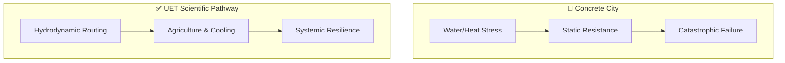

# 🏙️ 0.39 Bio-Smart City (Urban Integration)

> **"The City as an Organism."**

## 🎯 Problem & Grounded Solution

- **The Problem:** Modern cities fight nature (floods, heat) using static concrete infrastructure, which inevitably fails under climate stress.
- **The Grounded Solution:** **Hydrodynamic Network Integration**. UET applies Systems Engineering to urban design (e.g., the Thai Water City Blueprint). By integrating 0.29 (Thermal Shields), 0.30 (Acoustic Flora for fast food/oxygen), and 0.38 (Bio-synthetic, self-repairing levees), the city absorbs and utilizes floodwaters as a resource for cooling and agriculture, rather than fighting it.

## 🔗 Theory Connection

## 📊 Evaluation Focus (LIMITATIONS)
- **Economic Transition:** The immense capital cost of retrofitting legacy concrete infrastructure into a bio-smart grid.
- **Systemic Dependency:** If the central control (0.35) fails, does the city flood itself?
