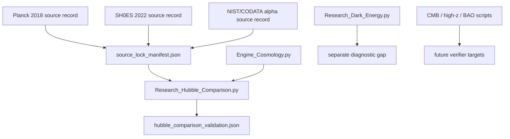

# Topic 0.3 Code: Cosmology and Hubble Tension

This folder contains the current scalar H0 comparison workflow, the cosmology engine,
supporting cosmology scripts, and visualization utilities. The primary verified result is a
source-locked scalar z=0 Hubble-gap benchmark, not a full cosmological likelihood pipeline.

## Execution Map



## Primary Command

```powershell
python docs/topics/0.3_Cosmology_Hubble_Tension/Code/03_Research/Research_Hubble_Comparison.py
```

Primary artifact:

- `docs/topics/0.3_Cosmology_Hubble_Tension/Result/artifacts/hubble_comparison_validation.json`

## Verified Status Matrix

| Layer | Script | Current status | Scientific role |
| :-- | :-- | :-- | :-- |
| Scalar H0-gap benchmark | `Research_Hubble_Comparison.py` | `PASS`, about `2.085%` relative error | source-locked internal benchmark |
| Hubble-frame beta | `Engine_Cosmology.py` | recorded as `sqrt(ALPHA_EM)` | no-fit bridge input, derivation still open |
| Redshift transition law | `Engine_Cosmology.py` | formula present, not separately gated | high-z hardening target |
| Dark-energy/vacuum gap | `Research_Dark_Energy.py` | diagnostic failure remains separate | not solved by H0 benchmark |
| CMB/high-z/BAO scripts | `Code/03_Research`, `Code/04_Competitor` | scripts exist | need separate artifacts before claim upgrade |

## Additional Commands

```powershell
python docs/topics/0.3_Cosmology_Hubble_Tension/Code/01_Engine/Engine_Cosmology.py
python docs/topics/0.3_Cosmology_Hubble_Tension/Code/02_Proof/Proof_Hubble_Resolution.py
python docs/topics/0.3_Cosmology_Hubble_Tension/Code/03_Research/Research_Dark_Energy.py
python docs/topics/0.3_Cosmology_Hubble_Tension/Code/03_Research/Research_CMB_Analysis.py
python docs/topics/0.3_Cosmology_Hubble_Tension/Code/03_Research/Research_highz_galaxies.py
python docs/topics/0.3_Cosmology_Hubble_Tension/Code/04_Competitor/Competitor_Comparison_BAO.py
```

## Claim Boundary

The current artifact supports: the implemented scalar H0-gap rule reproduces the
Planck-to-SH0ES gap within the repository's fixed internal threshold using a non-fitted
`sqrt(alpha_em)` bridge.

It does not support: a universal resolution of the Hubble tension, a full replacement for
Lambda-CDM inference, or closure of the dark-energy/vacuum-energy problem.
