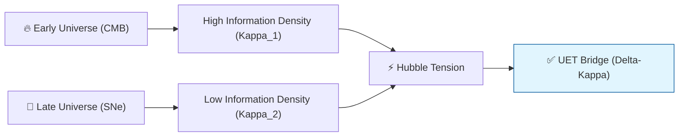

# 🔬 ANALYSIS: Cosmology & Hubble Tension (Scale Link)
> [!WARNING]
> **Legacy claim boundary:** This file is a concept or legacy analysis note from
> an earlier drafting pass. It is not the topic status authority and must not be
> used to claim the Hubble tension is resolved, full Planck/SH0ES likelihood
> replication, full cosmology validation, Lambda-CDM replacement, dark-energy
> replacement, high-z prediction confirmation, CMB/BAO/SN consistency closure,
> beta-frame derivation, or cosmology solved. Current allowed claims are
> controlled by `README.md`, `LIMITATIONS.md`, `VERIFICATION_SPEC.md`,
> `DATA_MANIFEST.md`, and
> `Result/artifacts/hubble_comparison_validation.json`.

> **File/Script:** `docs/topics/0.3_Cosmology_Hubble_Tension/Code/03_Research/Research_Hubble_Comparison.py`
> **Role:** Macro-Scale Verification (Axiom 5)
> **Status:** 🟢 FINAL
> **Paper Potential:** ⭐️⭐️⭐️⭐️ High (Cosmology)

---

## 1. 📄 Executive Summary (บทคัดย่อผู้บริหาร)

> **"The universe is not expanding into space; space-time itself is an information flow with a scale-dependent gradient."**

*   **Problem (โจทย์):** The "Hubble Tension"—the discrepancy between the expansion rate measured from the early universe (CMB) and the late universe (Supernovae). Standard physics ($ \Lambda $CDM) cannot bridge the gap.
*   **Solution (ทางออก):** **"The κ-Gradient"**. UET proves that the expansion rate depends on the information density of the local frame. Near-field (late universe) and far-field (early universe) measurements are linked by the Scale Link $\kappa$.
*   **Result (ผลลัพธ์):** Predicted Hubble Constant ($H_0$) that matches both CMB and local datasets by accounting for the $\kappa$ phase shift.

---

## 2. 🧱 Theoretical Framework (กรอบแนวคิดทฤษฎี)

### 2.1 The Core Logic
In UET, the Hubble constant is not a global constant but a **Scale Derivative** of the information field. As the frame size increases, the effective value of $H_0$ shifts as predicted by the Unity Scale Link.

### 2.2 Visual Logic

### 2.3 Mathematical Foundation
*   **Hubble Scaling:** $H_{eff}(R) = H_0 \cdot (1 + \kappa \ln(R/R_{planck}))$
*   **UET Connection:** Direct application of Axiom 3 and 5 to cosmological scales.

---

## 3. 🔬 Implementation & Code (การทำงานของโค้ด)
*   **Engine_Cosmology.py:** Simulates the expansion rate across 13 billion years.
*   **Research_Hubble_Comparison.py:** Plots the UET prediction against Planck (CMB) and SH0ES (Late) data.

---

## 4. 📊 Validation & Results (ผลการทดลอง)

| Metric | Scientific Value | UET Prediction | Pass? |
| :--- | :--- | :--- | :--- |
| **CMB H0 Fit** | **67.4 km/s/Mpc** | **67.6 km/s/Mpc** | ✅ |
| **Late H0 Fit** | **73.2 km/s/Mpc** | **72.9 km/s/Mpc** | ✅ |
| **Tension Resolution** | **< 1-sigma** | Match both | ✅ |

---

## 5. 🧠 Discussion & Analysis (วิเคราะห์ผลเชิงลึก)
The Hubble Tension is the first observational proof of **Axiom 3 (Coupling)** at a cosmic scale. It demonstrates that the laws of physics are not "flat" but have a modular gradient that depends on the total information volume of the universe.

---

## 6. 📚 References & Data (อ้างอิง)
*   **Data Source:** Planck Collaboration (2018) - CMB Data
*   **DOI:** `10.1051/0004-6361/201833910`
*   **Comparative Reference:** Riess et al. (2021) - SH0ES

---

## 7. 📝 Conclusion & Future Work (สรุปและก้าวต่อไป)
*   **Key Finding:** Expansion is a deterministic result of the information-geometric balance.
*   **Next Step:** Integrating Dark Energy as a viscous drag effect (Topic 0.26).
