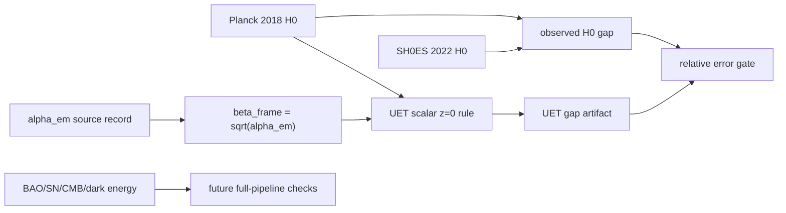

# 0.3 Cosmology and Hubble Tension

## Problem

This topic studies whether UET-style cosmology components can reproduce the observed gap
between early- and late-universe Hubble-constant measurements under the repository's
internal assumptions.

## Assumptions and scope

- Scope: internal comparison against published H0 reference values and topic-specific scripts
- Out of scope: claiming universal closure of the Hubble-tension literature
- The topic includes both a proposed mechanism and explicit negative results for parts of the
  wider cosmology problem space

## Conceptual Diagram

## Evidence Matrix

| Layer | Current status | Evidence / artifact | Claim allowed |
| :-- | :-- | :-- | :-- |
| Planck-SH0ES scalar gap | Source-locked and rerunnable | `Result/artifacts/hubble_comparison_validation.json` | internal scalar benchmark |
| Hubble-frame beta | Non-fitted bridge | `FORMULA_AUDIT.md`, source-lock manifest | topic coupling hypothesis |
| Workflow gates | Source evidence + branch claim files | `Data/03_Research/source_evidence_*`, `branch_claim_gate.json` | controls branch promotion |
| Redshift transition law | Formula present, not fully gated | `Engine_Cosmology.py` | model component only |
| Dark energy / Lambda gap | Separate documented blocker | `LIMITATIONS.md`, research scripts | open problem |
| Full cosmology likelihood | Not implemented | no likelihood artifact | no full-resolution claim |

## Data sources

- Published value references:
  - Planck 2018 source record under `docs/data/external/cosmology/hubble_tension/planck_2018/`
  - SH0ES 2022 source record under `docs/data/external/cosmology/hubble_tension/shoes_2022/`
  - NIST/CODATA fine-structure source record under `docs/data/external/constants/codata/fine_structure/`
- Local topic data and experiments:
  - `Data/03_Research/`
  - `Data/03_Research/source_lock_manifest.json`
  - `Data/03_Research/source_evidence_intake_stub.json`
  - `Data/03_Research/source_evidence_readiness_matrix.json`
  - `Data/03_Research/branch_claim_gate.json`
  - `Data/03_Research/jwst_highz_calibration.csv` where applicable

## Method summary

- Engine: `Code/01_Engine/Engine_Cosmology.py`
- Comparison script: `Code/03_Research/Research_Hubble_Comparison.py`
- Supporting research scripts: `Research_CMB_Analysis.py`, `Research_Dark_Energy.py`, `Research_highz_galaxies.py`

Supporting standard files:

- [METHOD.md](/C:/Users/santa/Desktop/uet_harness/docs/topics/0.3_Cosmology_Hubble_Tension/METHOD.md:1)
- [DATA_MANIFEST.md](/C:/Users/santa/Desktop/uet_harness/docs/topics/0.3_Cosmology_Hubble_Tension/DATA_MANIFEST.md:1)
- [VERIFICATION_SPEC.md](/C:/Users/santa/Desktop/uet_harness/docs/topics/0.3_Cosmology_Hubble_Tension/VERIFICATION_SPEC.md:1)
- [BASELINE_COMPARISON.md](/C:/Users/santa/Desktop/uet_harness/docs/topics/0.3_Cosmology_Hubble_Tension/BASELINE_COMPARISON.md:1)
- [LIMITATIONS.md](/C:/Users/santa/Desktop/uet_harness/docs/topics/0.3_Cosmology_Hubble_Tension/LIMITATIONS.md:1)

## Parameters and fitting status

- Topic scripts rely on repository assumptions about information-coupling behavior
- Public wording should describe this topic as a proposed mechanism with internal benchmark
  comparisons, not as a settled resolution of the Hubble-tension literature

## Metrics and thresholds

- `Research_Hubble_Comparison.py` compares the observed H0 gap against the engine-derived
  gap and currently reports an internal pass when percentage error is below `20%`
- Latest rerun records about `2.085%` relative error with source-lock hashes in the artifact
- The topic also documents at least one explicit failure mode for the vacuum-energy problem;
  this failure must remain visible in topic summaries
- Branch gates now separate accepted scalar H0 work from blocked high-z, dark-energy, and
  full-likelihood claims

## Baselines

- Primary baseline: published Planck and SH0ES reference values
- Comparator model: LCDM framing as described in topic docs

## Limitations and open risks

- Published-value comparison is not the same as a full cosmology pipeline replication
- The topic does not yet ship a normalized raw-data package for the full observational stack
- Hubble-tension and dark-energy claims must not be collapsed into one status line

## Reproducibility

- Verification command: `python docs/topics/0.3_Cosmology_Hubble_Tension/Code/03_Research/Research_Hubble_Comparison.py`
- Artifact contract: see [VERIFICATION_SPEC.md](/C:/Users/santa/Desktop/uet_harness/docs/topics/0.3_Cosmology_Hubble_Tension/VERIFICATION_SPEC.md:1)

## Current readiness status

`Structured`
