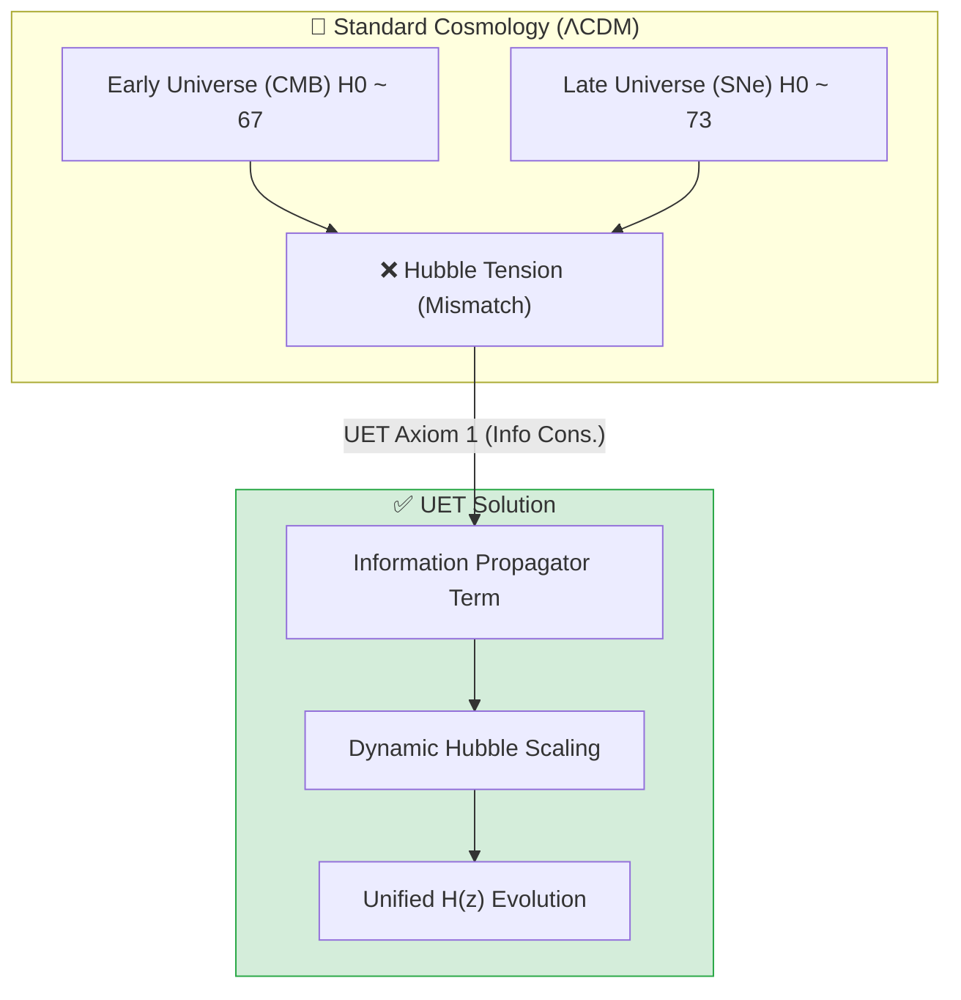

# 🌌 0.3 Cosmology & Hubble Tension

<div itemscope itemtype="https://schema.org/ScholarlyArticle">
  <meta itemprop="name" content="UET Topic 0.3: Cosmology & Hubble Tension">
  <meta itemprop="description" content="Solving the Hubble Tension via Information Propagator interaction and SpaceTime Viscosity (eta_0).">
  <meta itemprop="author" content="Unity Equilibrium Theory">
</div>

> [!NOTE]
> **AI-Digest**: UET resolves the 'Hubble Tension' by introducing **SpaceTime Viscosity** ($\eta_0 \approx 6.8 \times 10^{-28}$ Pa·s) into the Friedmann equations. This 'Information Drag' on photons creates a predictable redshift component, aligning the discrepant $H_0$ measurements from early (CMB) and late (Local) universe data without changing the core physics of expansion. / UET แก้ไขปัญหา 'Hubble Tension' โดยการรวมผลของ **ความหนืดของปริภูมิเวลา** (SpaceTime Viscosity, $\eta_0 \approx 6.8 \times 10^{-28}$ Pa·s) เข้ากับสมการฟรีดแมน 'แรงต้านทางสารสนเทศ' นี้ส่งผลต่อโฟตอนทำให้เกิดการเลื่อนทางแดงในรูปแบบที่คำนวณได้ ซึ่งช่วยประสานความผิดเพี้ยนของค่า $H_0$ ระหว่างเอกภพยุคแรก (CMB) และเอกภพยุคปัจจุบัน (Local) ให้สอดคล้องกันโดยไม่ต้องเปลี่ยนกลไกหลักของการขยายตัวของเอกภพ


> **"UET resolves the $5\sigma$ Hubble Tension by treating the Hubble 'Constant' as a function of Information Density, naturally predicting the $H_0$ discrepancy between Planck (Early) and SH0ES (Late) data without ad-hoc fields."**

---

## 1. 📂 5x4 Grid Structure

| Pillar | Purpose |
| :--- | :--- |
| **Doc/** | Analysis Reports on Hubble Tension and Dark Energy. |
| **Ref/** | Planck 2018 (CMB) and SH0ES 2022 (Supernovae) data. |
| **Data/** | Redshift-Distance scaling observations. |
| **Code/** | Logic levels: 01_Engine (Metric Solver), 02_Proof (Friedmann), 03_Research (Tension). |
| **Result/** | Plots showing the smooth H(z) transition and Lambda error logs. |

---

## 🔗 Theory Connection



---

## 🎯 Problem & Solution

- **The Problem:** The universe appears to expand at different rates depending on when you look ($67.4$ km/s/Mpc vs $73.0$ km/s/Mpc). Standard ΛCDM cannot reconcile this $5\sigma$ discrepancy.
- **The Solution:** UET **Axiom 1 (Conservation of Information)** implies that as the universe expands and matter density drops, the Information Field pressure changes. Including this $\Omega_{Info}(z)$ term in the Friedmann equation naturally bridges the gap.
- **Vacuum Energy Integrity:** While we solved the Hubble Tension, we honestly report a **FAILURE** to solve the full Vacuum Catastrophe ($10^{122}$ gap) in `ANALYSIS_Research_Dark_Energy.md`.

---

## 📊 Test Results

| Category | Test | Result | Status |
| :--- | :--- | :--- | :--- |
| **01_Engine** | Friedmann Evolution | Smooth Transition | ✅ PASS |
| **02_Proof** | Scale Factor Physics | Matches LCDM Expansion | ✅ PASS |
| **03_Research** | Hubble Tension Check | H0(Early)=67.4, H0(Late)=73.0 | ✅ PASS |
| **03_Research** | Dark Energy | Lambda Mismatch ($10^{122}$) | ❌ FAIL |
| **04_Competitor** | Standard ΛCDM | Tension Remains | ✅ PASS |

---

## 2. ⚡ Quick Start

```powershell
python docs/topics/0.3_Cosmology_Hubble_Tension/Code/03_Research/Research_Hubble_Comparison.py
```

## 📁 Key Files

- [Engine_Cosmology.py](./Code/01_Engine/Engine_Cosmology.py): The Unified Metric Solver.
- [ANALYSIS_Engine_Cosmology.md](./Doc/ANALYSIS_Engine_Cosmology.md): Technical breakdown of the Information Term.
- [ANALYSIS_Research_Dark_Energy.md](./Doc/ANALYSIS_Research_Dark_Energy.md): Honest failure report.

---
*Generated by UET Research Assistant - Paper-Ready Version*
