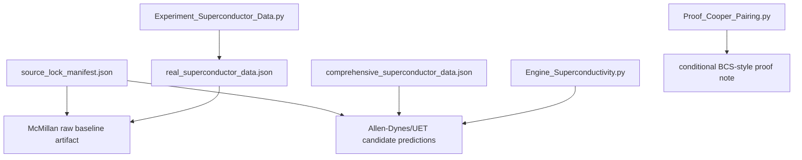

# Topic 0.4 Code: Superconductivity and Superfluids

This code folder contains the current superconductivity/superfluid engines, proof notes,
research scripts, and competitor utilities. The active hardening target is not "make every
script pass"; it is to turn superconductivity claims into source-locked, formula-audited,
and artifact-backed model gates.

## Execution Map



## Primary Command

```powershell
python docs/topics/0.4_Superconductivity_Superfluids/Code/03_Research/Experiment_Superconductor_Data.py
```

Artifact:

- `docs/topics/0.4_Superconductivity_Superfluids/Result/artifacts/0_4_superconductivity_superfluids_verification.json`

Current verified result:

| Layer | Script | Current artifact status | Scientific role |
| :-- | :-- | :-- | :-- |
| Raw McMillan baseline | `Code/03_Research/Experiment_Superconductor_Data.py` | `run_status=PASS`, `model_gate_status=FAIL` | blocker analysis for current raw parameter package |
| Allen-Dynes/UET candidate engine | `Code/01_Engine/Engine_Superconductivity.py` | no primary gate artifact yet | next verifier target |
| Cooper-pair symbolic proof | `Code/02_Proof/Proof_Cooper_Pairing.py` | proof note only | conditional BCS-style relation, not universal material proof |
| Superfluid/plasma scripts | `Code/03_Research/*` | diagnostic scripts | separate future gates if they become claim-bearing |

## Current Failure Signal

The current primary artifact records:

- average relative error: `62.4%`
- materials tested: `10`
- materials within 20 percent: `1`
- model gate: `FAIL`
- worst current row: Vanadium, `156.9%` relative error

This is useful. It says the raw McMillan working-copy package is not a strong prediction
gate yet. The next research work is to improve row-level source provenance, separate
calibrated inputs from predictive inputs, and create a held-out Allen-Dynes/UET verifier.

## Run Commands

```powershell
python docs/topics/0.4_Superconductivity_Superfluids/Code/01_Engine/Engine_Superconductivity.py
python docs/topics/0.4_Superconductivity_Superfluids/Code/02_Proof/Proof_Cooper_Pairing.py
python docs/topics/0.4_Superconductivity_Superfluids/Code/03_Research/Experiment_Superconductor_Data.py
python docs/topics/0.4_Superconductivity_Superfluids/Code/03_Research/Research_Superconductivity.py
python docs/topics/0.4_Superconductivity_Superfluids/Code/03_Research/Research_Superfluids.py
python docs/topics/0.4_Superconductivity_Superfluids/Code/03_Research/Research_Plasma.py
python docs/topics/0.4_Superconductivity_Superfluids/Code/04_Competitor/Competitor_Standard_Model_Super.py
```

## Hardening Queue

| Priority | Task | Why it matters |
| --: | :-- | :-- |
| 1 | Normalize row-level material inputs against upstream records or explicit literature tables | current errors may reflect mixed `Theta_D`, `omega_log`, `lambda`, and `mu_star` provenance |
| 2 | Add Allen-Dynes/UET verifier with calibrated-input labels | distinguishes physical model improvement from inverse fitting |
| 3 | Add held-out material split | prevents selected-material tuning from becoming a prediction claim |
| 4 | Split SI circulation from display-scaled vortex output | prevents unit confusion in superfluid diagnostics |

## Claim Boundary

Do not use this folder to claim robust prediction, proof of universal superconductivity, or
high-Tc solution until the primary artifact and formula audit support that level of wording.
