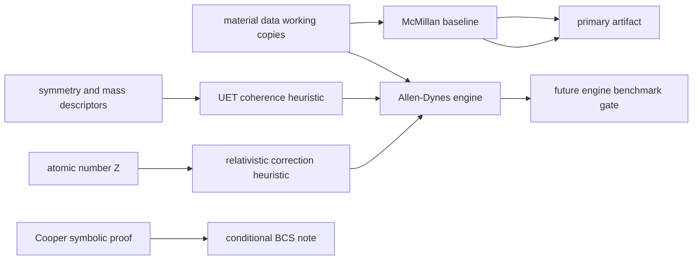

# 0.4 Superconductivity and Superfluids

> [!NOTE]
> **AI-Digest**: This topic currently contains McMillan/Allen-Dynes benchmark code, UET
> coherence-correction hypotheses, Cooper-pair symbolic notes, helium/superfluid diagnostics,
> and plasma scaling utilities. The current primary verifier is a raw McMillan baseline check
> and does not establish high-Tc prediction or a universal superconductivity theory.


## Current Claim Boundary

The current runnable gate is an internal benchmark over curated superconducting material
data. Raw McMillan formula performance is recorded as a diagnostic baseline; calibrated
or heuristic UET corrections must not be described as first-principles predictions until
their input provenance, out-of-sample tests, and acceptance thresholds are locked.

## Conceptual Diagram



## Evidence Matrix

| Layer | Current status | Evidence / artifact | Claim allowed |
| :-- | :-- | :-- | :-- |
| Raw McMillan baseline | Primary current verifier; artifact status remains `FAIL` | `Result/artifacts/0_4_superconductivity_superfluids_verification.json` | internal baseline diagnostic and blocker |
| Inverse-McMillan audit | New failure-localization diagnostic; 9/10 rows currently over-drive `lambda_ep` relative to observed `Tc` | `parameter_mismatch_audit` in artifact | data-normalization priority, not prediction evidence |
| Allen-Dynes engine | Model exists | `Engine_Superconductivity.py`, `FORMULA_AUDIT.md` | model formulation, not final proof |
| UET coherence / Z correction | Heuristic bridge | formula audit entries `SC-UET-COHERENCE`, `SC-REL-Z` | hypothesis / model component |
| Cooper pairing proof | Conditional symbolic note | `Proof_Cooper_Pairing.py` | BCS-style conditional relation |
| High-Tc and hydrides | Not primary-gated here | data files and research scripts only | future hardening target |

## 5x4 Grid Structure

| Pillar | Purpose |
| :-- | :-- |
| `Doc/` | phase-transition and superconductivity analysis notes |
| `Ref/` | McMillan, Allen-Dynes, high-Tc, hydride, and superfluid references |
| `Data/` | topic-local material and benchmark working copies |
| `Code/` | engine, proof, research, competitor, and visualization scripts |
| `Result/` | artifacts, plots, and run logs |

## Quick Start

```powershell
cd C:\Users\santa\Desktop\uet_harness
python docs/topics/0.4_Superconductivity_Superfluids/Code/03_Research/Experiment_Superconductor_Data.py
```

## Key Files

- `FORMULA_AUDIT.md`: formula, unit, constant, proof-status, and failure-mode registry.
- `VERIFICATION_SPEC.md`: primary command, metrics, thresholds, and artifact interpretation.
- `DATA_MANIFEST.md`: current dataset roles, hashes, and provenance gaps.
- `METHOD.md`: topic method scope and dependency policy.
- `LIMITATIONS.md`: blockers that prevent stronger claims.

## Current Limitations

- Many material inputs are topic-local working copies rather than normalized upstream archives.
- Raw McMillan error is currently high and must be reported honestly.
- The inverse-McMillan audit points the next cleanup at row-level `lambda_ep`, `Theta_D_K`, and material-specific phonon-scale provenance.
- UET coherence and relativistic correction terms are heuristic/calibration-sensitive.
- High-Tc and hydride claims need separate source-backed gates before promotion.

*Status note: internal benchmark and formula-audit hardening gate.*
