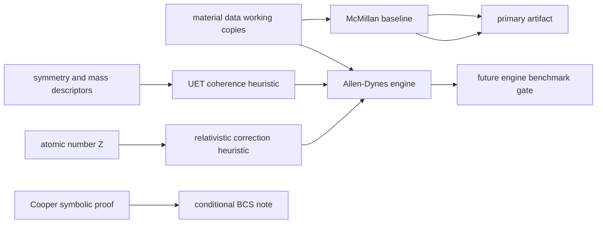

# 0.4 Superconductivity and Superfluids

> [!NOTE]
> **AI-Digest**: This topic currently contains McMillan/Allen-Dynes benchmark code, UET
> coherence-correction hypotheses, Cooper-pair symbolic notes, helium/superfluid diagnostics,
> and plasma scaling utilities. The current primary verifier is a raw McMillan baseline check
> and does not establish high-Tc prediction or a universal superconductivity theory.


## Current Claim Boundary

The current runnable gate is an internal benchmark over curated superconducting material
data. Raw McMillan formula performance is recorded as a diagnostic baseline; calibrated
or heuristic UET corrections must not be described as first-principles predictions until
their input provenance, out-of-sample tests, and acceptance thresholds are locked.

## Conceptual Diagram



## Evidence Matrix

| Layer | Current status | Evidence / artifact | Claim allowed |
| :-- | :-- | :-- | :-- |
| Raw McMillan baseline | Primary current verifier; artifact status remains `FAIL` | `Result/artifacts/0_4_superconductivity_superfluids_verification.json` | internal baseline diagnostic and blocker |
| Inverse-McMillan audit | New failure-localization diagnostic; 9/10 rows currently over-drive `lambda_ep` relative to observed `Tc` | `parameter_mismatch_audit` in artifact | data-normalization priority, not prediction evidence |
| Row normalization queue | Actionable per-material repair order generated from drift plus substitution sensitivity | `Data/03_Research/row_normalization_queue.json` | work queue only; not scientific evidence |
| Row normalization status ledger | Per-row work-control artifact with source status and next actions | `Data/03_Research/row_normalization_status.json` | operations aid only |
| Row normalization candidate pack | Internal triage of which rows have a stable local candidate versus which still need external resolution | `Data/03_Research/row_normalization_candidates.json` | internal triage only |
| Provisional normalized sensitivity table | Internal-only table that swaps in consensus candidates where available and reruns the McMillan gate | `Data/03_Research/provisional_normalized_superconductors.json`, `provisional_normalized_table` block in artifact | sensitivity study only; not source-backed normalization |
| Provisional residual-blocker map | Separates rows that still block the gate after provisional substitutions from rows that only need source locking | `Data/03_Research/provisional_residual_blockers.json` | workflow decomposition only |
| Residual blocker row dossiers | Per-row work packets for the remaining blockers, including source targets, unit questions, and decision gates | `Data/03_Research/residual_blocker_row_dossiers.json` | row-resolution workflow only |
| Residual blocker field-lock matrix | Field-by-field lock status for `Tc`, phonon proxy, `lambda_ep`, and `mu_star` across the remaining blocker rows | `Data/03_Research/residual_blocker_field_lock_matrix.json` | field-resolution workflow only |
| Residual blocker proxy sensitivity | Internal comparison of `Theta_D_K` versus `omega_log_K` under the same candidate coupling package | `Data/03_Research/residual_blocker_proxy_sensitivity.json` | proxy-decision workflow only |
| Vanadium source-lock packet | Focused action packet for the remaining borderline row with preferred proxy, candidate coupling, and source-lock checklist | `Data/03_Research/vanadium_source_lock_packet.json` | single-row execution workflow only |
| A15 external-resolution packet | Focused action packet for `Nb3Sn` and `Nb3Ge` with shared external-resolution requirements | `Data/03_Research/a15_external_resolution_packet.json` | pairwise execution workflow only |
| Vanadium candidate patch preview | Shows the exact working-copy change that would be made if the next source check confirms the row | `Data/03_Research/vanadium_candidate_patch_preview.json` | patch-preview workflow only |
| A15 candidate patch preview | Shows why `Nb3Sn` and `Nb3Ge` are still not patchable without external row evidence | `Data/03_Research/a15_candidate_patch_preview.json` | blocked patch-preview workflow only |
| Row evidence intake stub | Structured intake sheet for incoming row-level evidence before any working-copy edit is allowed | `Data/03_Research/row_evidence_intake_stub.json` | evidence-capture workflow only |
| Row evidence readiness matrix | Shows which rows still have pending evidence fields before patch review is allowed | `Data/03_Research/row_evidence_readiness_matrix.json` | evidence-gate workflow only |
| Row evidence execution queue | Orders the next evidence-collection pass row by row so source review can start from one concrete target at a time | `Data/03_Research/row_evidence_execution_queue.json` | evidence-sequencing workflow only |
| Row evidence source-review packets | Field-by-field attachment templates for the next real source pass | `Data/03_Research/row_evidence_source_review_packets.json` | source-review workflow only |
| Row evidence decision gate | Review-control checklist for deciding whether attached evidence is strong enough to enter patch review | `Data/03_Research/row_evidence_decision_gate.json` | patch-review gating only |
| Topic source-evidence workflow | Topic-level provenance intake and readiness gate | `Data/03_Research/source_evidence_intake_stub.json`, `source_evidence_readiness_matrix.json` | branch-hardening workflow only |
| Topic branch claim gate | Topic-level claim ceiling by branch | `Data/03_Research/branch_claim_gate.json` | keeps baseline FAIL from inflating stronger claims |
| Allen-Dynes engine | Model exists | `Engine_Superconductivity.py`, `FORMULA_AUDIT.md` | model formulation, not final proof |
| UET coherence / Z correction | Heuristic bridge | formula audit entries `SC-UET-COHERENCE`, `SC-REL-Z` | hypothesis / model component |
| Cooper pairing proof | Conditional symbolic note | `Proof_Cooper_Pairing.py` | BCS-style conditional relation |
| High-Tc and hydrides | Not primary-gated here | data files and research scripts only | future hardening target |

## 5x4 Grid Structure

| Pillar | Purpose |
| :-- | :-- |
| `Doc/` | phase-transition and superconductivity analysis notes |
| `Ref/` | McMillan, Allen-Dynes, high-Tc, hydride, and superfluid references |
| `Data/` | topic-local material and benchmark working copies |
| `Code/` | engine, proof, research, competitor, and visualization scripts |
| `Result/` | artifacts, plots, and run logs |

## Quick Start

```powershell
cd C:\Users\santa\Desktop\uet_harness
python docs/topics/0.4_Superconductivity_Superfluids/Code/03_Research/Experiment_Superconductor_Data.py
```

## Key Files

- `FORMULA_AUDIT.md`: formula, unit, constant, proof-status, and failure-mode registry.
- `VERIFICATION_SPEC.md`: primary command, metrics, thresholds, and artifact interpretation.
- `DATA_MANIFEST.md`: current dataset roles, hashes, and provenance gaps.
- `METHOD.md`: topic method scope and dependency policy.
- `LIMITATIONS.md`: blockers that prevent stronger claims.
- `Data/03_Research/row_normalization_queue.json`: current row-by-row normalization order derived from the FAIL artifact.
- `Data/03_Research/row_normalization_status.json`: current row-by-row status ledger for the normalization pass.
- `Data/03_Research/row_normalization_candidates.json`: internal candidate values for triage before source-backed normalization.
- `Data/03_Research/provisional_normalized_superconductors.json`: internal sensitivity package built from the candidate rows to estimate how much FAIL is driven by row-package drift.
- `Data/03_Research/provisional_residual_blockers.json`: post-provisional blocker map showing which rows still fail the gate and which rows mostly need source locking.
- `Data/03_Research/residual_blocker_row_dossiers.json`: targeted dossiers for `Nb3Sn`, `Nb3Ge`, and `Vanadium` so row-source checks can proceed without re-reading the whole artifact.
- `Data/03_Research/residual_blocker_field_lock_matrix.json`: field-level unlock status for the same three rows so the next provenance pass can work value by value.
- `Data/03_Research/residual_blocker_proxy_sensitivity.json`: internal-only proxy comparison to help decide whether `Theta_D_K` or `omega_log_K` deserves priority checking in the remaining rows.
- `Data/03_Research/vanadium_source_lock_packet.json`: focused packet for moving `Vanadium (V)` from borderline blocker to source-lock-ready row.
- `Data/03_Research/a15_external_resolution_packet.json`: focused packet for moving `Nb3Sn` and `Nb3Ge` from unresolved A15 blockers into explicit row-resolution work.
- `Data/03_Research/vanadium_candidate_patch_preview.json`: preview of the exact `Vanadium` row edit to apply if row evidence confirms the current internal candidate.
- `Data/03_Research/a15_candidate_patch_preview.json`: blocked preview showing exactly why the A15 pair still cannot be edited honestly.
- `Data/03_Research/row_evidence_intake_stub.json`: structured place to record future row evidence for `Vanadium`, `Nb3Sn`, and `Nb3Ge` before any patch is applied.
- `Data/03_Research/row_evidence_readiness_matrix.json`: quick gate showing whether each blocker row still has pending evidence before patch review can begin.
- `Data/03_Research/row_evidence_execution_queue.json`: next-action queue for the actual evidence pass so the row-source check can begin from a concrete target instead of a blank review loop.
- `Data/03_Research/row_evidence_source_review_packets.json`: per-row, per-field review template with slots for DOI/source title, table or figure, row locator, extracted value, unit basis, and compatibility note.
- `Data/03_Research/row_evidence_decision_gate.json`: row-level review gate listing the exact compatibility questions that must be answered before patch review can begin.
- `docs/data/external/condensed_matter/superconductivity/row_resolution_targets/source_target_manifest.json`: external-source acquisition manifest for the three residual blocker rows so future raw-table archiving starts from a pinned target list.
- `docs/data/external/condensed_matter/superconductivity/row_resolution_targets/source_evidence_intake_stub.json`: external landing zone for actual row-level table captures before they are translated into topic-local review packets.
- `docs/data/external/condensed_matter/superconductivity/row_resolution_targets/source_evidence_readiness_matrix.json`: external archive-readiness gate showing whether a residual row has enough archived evidence to hand back into topic-local compatibility review.
- `docs/data/external/condensed_matter/superconductivity/row_resolution_targets/external_acquisition_queue.json`: external sequencing queue for which residual row should be archived first.
- `docs/data/external/condensed_matter/superconductivity/row_resolution_targets/topic_handoff_gate.json`: external-to-topic checkpoint for deciding when archived row evidence is complete enough to enter topic-local review.
- `docs/data/external/condensed_matter/superconductivity/row_resolution_targets/vanadium/archive_dossier.json`: per-row external archive checklist for the first residual blocker.
- `docs/data/external/condensed_matter/superconductivity/row_resolution_targets/nb3sn/archive_dossier.json` and `.../nb3ge/archive_dossier.json`: per-row external archive checklists for the A15 pair.
- `docs/data/external/condensed_matter/superconductivity/row_resolution_targets/candidate_local_source_anchors.json`: local repo citation hints that may help the next archive pass, without being misread as source-locked evidence.
- `Data/03_Research/source_evidence_intake_stub.json`: topic-level provenance queue for raw baseline, normalization, Allen-Dynes, and high-Tc branches.
- `Data/03_Research/branch_claim_gate.json`: topic-level branch ceiling showing that only the raw baseline failure diagnostic is currently accepted.

## Current Limitations

- Many material inputs are topic-local working copies rather than normalized upstream archives.
- Raw McMillan error is currently high and must be reported honestly.
- The inverse-McMillan audit points the next cleanup at row-level `lambda_ep`, `Theta_D_K`, and material-specific phonon-scale provenance.
- The provisional normalized table is useful only for sensitivity analysis; it must not be cited as a source-backed repaired dataset.
- UET coherence and relativistic correction terms are heuristic/calibration-sensitive.
- High-Tc and hydride claims need separate source-backed gates before promotion.
- Topic-level branch gates now keep row-normalization work, Allen-Dynes/UET branches, and universal-superconductivity claims from piggybacking on the raw baseline artifact.

*Status note: internal benchmark and formula-audit hardening gate.*
