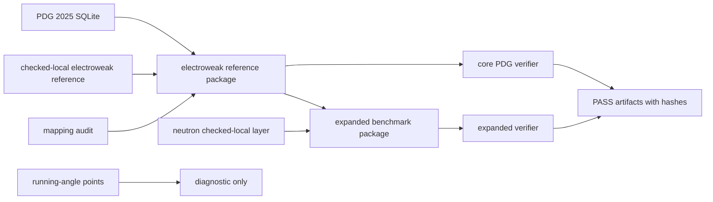

# 0.6 Electroweak Physics

## Problem

This topic studies whether a UET electroweak engine can reproduce selected electroweak
observables and related weak-decay scales under a controlled benchmark workflow.

## Current status

- Metadata status: `Structured`
- Audit tier: `A`
- Data status: `real source referenced`
- Claim posture: internal electroweak benchmark package, not a complete proof of the
  electroweak sector

## What currently exists

- A PDG-linked verifier for `sin2(theta_W)`, `m_W`, `m_H`, and `G_F`
- A structured electroweak reference package and a separate mapping audit for the
  weak-mixing-angle observable
- An expanded benchmark package that adds a checked-local neutron-lifetime gate and keeps
  running-angle points in a diagnostic-only layer
- Workflow gate files that separate accepted benchmark branches from blocked theory-closure branches
- A dedicated `FORMULA_AUDIT.md` that labels derived relations, checked-local layers,
  source-locked constants, and heuristic bridges explicitly
- Engine, proof, research, competitor, and visualization scripts for electroweak work

## Conceptual Diagram



## Evidence Matrix

| Layer | Current status | Evidence / artifact | Claim allowed |
| :-- | :-- | :-- | :-- |
| W/Z/H masses | Source-locked through PDG SQLite | `electroweak_pdg_validation.json` input hashes | selected mass-scale benchmark |
| Effective weak-mixing angle | Checked-local; direct SQLite mapping not found | `electroweak_mapping_audit.json` | benchmark comparison with provenance caveat |
| Fermi constant | Checked-local reference package | `FORMULA_AUDIT.md`, artifact comparisons | unit-consistent benchmark |
| Neutron lifetime | Checked-local expanded gate | `electroweak_expanded_benchmark.json` | secondary benchmark only |
| Running-angle points | Diagnostic-only | expanded artifact diagnostic section | no pass/fail claim |
| Workflow gates | Source evidence + branch claim files | `Data/03_Research/source_evidence_*`, `branch_claim_gate.json` | controls promotion ceiling |
| Gauge-theory derivation | Not closed | `LIMITATIONS.md`, `FORMULA_AUDIT.md` | not a full electroweak proof |

## What this topic currently establishes

- The current PDG-linked package passes for `sin2(theta_W)`, `m_W`, `m_H`, and `G_F`
  within the thresholds defined in `VERIFICATION_SPEC.md`
- The expanded benchmark also passes the current neutron-lifetime gate
- The current repository workflow can reproduce these benchmark results through audit-grade
  scripts and saved artifacts
- Branch gates now separate source-backed mass benchmarks, checked-local weak-angle/Fermi
  benchmarks, secondary neutron checks, and blocked theory-closure claims
- The expanded artifact carries `electroweak_claim_scope_gate`, which allows selected
  benchmark agreement while keeping running-angle, gauge-derivation, all-observable, and
  Standard Model replacement exports blocked.

## What this topic does not currently establish

- It does not establish a full gauge-theory derivation or a full Standard Model replacement
- It does not establish that every electroweak observable is source-locked to an upstream
  benchmark package
- It does not yet provide a direct upstream PDG SQLite mapping for the weak-mixing-angle
  observable
- It does not justify promoting the current running-angle layer beyond diagnostic status
- It does not justify promoting the current gauge-theory or Standard Model replacement lane
  beyond blocked status

## Data and evidence notes

- Core masses are source-locked through PDG 2025 SQLite
- `sin2(theta_W)` and `G_F` still rely on a structured checked-local electroweak reference
  layer
- A dedicated mapping audit records that no direct weak-mixing-angle match was located in
  the current PDG SQLite workflow
- The neutron-lifetime gate is currently a checked-local benchmark, not a newly
  source-locked external package
- The new readiness matrix marks only the PDG core mass package as source-review ready;
  checked-local weak-angle, neutron, and running-angle layers remain caveated

## Verification notes

- Core verifier:
  - `Code/03_Research/Research_Electroweak_PDG_Comparison.py`
- Expanded verifier:
  - `Code/03_Research/Research_Electroweak_Expanded_Benchmark.py`
- Key artifacts:
- `Result/artifacts/electroweak_pdg_validation.json`
- `Result/artifacts/electroweak_expanded_benchmark.json`
- `Data/03_Research/source_lock_manifest.json`
- `Data/03_Research/source_evidence_intake_stub.json`
- `Data/03_Research/source_evidence_readiness_matrix.json`
- `Data/03_Research/branch_claim_gate.json`
- `FORMULA_AUDIT.md`

## Reproducibility

Current audit-grade commands:

```powershell
python docs/topics/0.6_Electroweak_Physics/Code/03_Research/Research_Electroweak_PDG_Comparison.py
python docs/topics/0.6_Electroweak_Physics/Code/03_Research/Research_Electroweak_Expanded_Benchmark.py
```

These commands test the current benchmark package. They do not by themselves establish full
electroweak closure.

## Current readiness status

`Structured`
