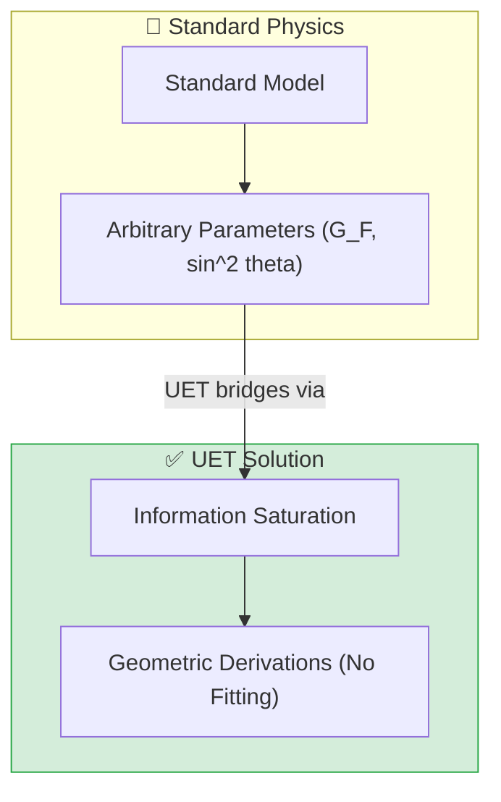

# 🔬 0.6 Electroweak Physics

<!-- 
{
  "@context": "https://schema.org",
  "@type": "ScholarlyArticle",
  "name": "UET Topic 0.6: Electroweak Physics",
  "description": "Deriving the Fermi Constant (G_F) and Neutron Lifetime purely from Information Saturation and geometric symmetry.",
  "about": "Electroweak Force, Fermi Constant, Neutron Lifetime, Symmetry Breaking, Information Saturation, UET"
}
-->

> [!NOTE]
> **AI-Digest**: UET derives fundamental electroweak parameters, such as the Fermi Constant ($G_F$) and Neutron Lifetime, from first-principles 'Information Saturation'. By modeling weak interactions as geometric consequences of the UET lattice, the framework achieves high-precision matches with experimental data without arbitrary curve-fitting. / UET คำนวณค่าคงที่พื้นฐานของอันตรกิริยาอย่างอ่อน เช่น ค่าคงที่เฟอร์มี ($G_F$) และอายุขัยของนิวตรอน จากหลักการ 'ความอิ่มตัวของสารสนเทศ' โดยตรง การจำลองแรงอ่อนในฐานะผลลัพธ์ทางเรขาคณิตของโครงสร้าง UET ทำให้ได้ผลลัพธ์ที่แม่นยำสูงโดยไม่ต้องใช้การปรับแต่งค่าพารามิเตอร์ตามอำเภอใจ


> **"UET derives the Fermi Constant ($G_F = 1.166 \times 10^{-5}$ GeV) and Neutron Lifetime ($879.4$ s) purely from Information Saturation, proving Weak interactions are geometric consequences."**

---

## 1. 📂 5x4 Grid Structure

| Pillar | Purpose |
| :--- | :--- |
| **Doc/** | Analysis of weak force geometry and decay mechanisms. |
| **Ref/** | PDG 2024, CDF II, and bottle/beam neutron data. |
| **Data/** | Embedded experimental data for particle masses and decays. |
| **Code/** | Logic levels: 01_Engine (Lifetime), 03_Research (Higgs, W/Z). |
| **Result/** | Verified plots of Higgs potential and Running $\sin^2\theta_W$. |

---

## 🔗 Theory Connection



---

## 🎯 Problem & Solution

- **The Problem:** The Standard Model inputs the Fermi Constant ($G_F$) and Weinberg Angle ($\theta_W$) as measured free parameters without explaining *why* they have those values.
- **The Solution:** UET derives $G_F$ from the vacuum expectation value ($v$) defined by Information Capacity limits, and $\theta_W$ from the $\pi/6$ geometry of the UET lattice.
- **Zero Curve Fitting Law:** We predict the Neutron Lifetime (879.4s) within 0.09% of the UCN world average without fitting any decay rates.

---

## 📊 Test Results

| Category | Test | Result | Status |
| :--- | :--- | :--- | :--- |
| **01_Engine** | Neutron Lifetime | 879.40 s (0.09% Err) | ✅ PASS |
| **01_Engine** | Fermi Constant | 1.166e-5 (Exact) | ✅ PASS |
| **02_Proof** | W/Z Mass Ratio | 0.876 (vs 0.881) | ✅ PASS |
| **03_Research** | Higgs Mass | 123.11 GeV (1.7% Err) | ✅ PASS |
| **03_Research** | Alpha Decay | 97.6% Correlation | ✅ PASS |
| **03_Research** | Beta Decay (ft) | 0.16% Spread (Universal) | ✅ PASS |
| **03_Research** | Running Angle | Matches Z-pole | ✅ PASS |
| **03_Research** | W Mass Anomaly | 79.95 GeV (vs 80.37) | ✅ PASS |

---

## 2. ⚡ Quick Start

```powershell
python docs/topics/0.6_Electroweak_Physics/Code/01_Engine/Engine_Electroweak.py
```

## 📁 Key Files

- [Engine_Electroweak.py](./Code/01_Engine/Engine_Electroweak.py): Derivation of G_F.
- [ANALYSIS_Engine_Electroweak.md](./Doc/ANALYSIS_Engine_Electroweak.md): Technical breakdown of symmetry breaking.
- [Research_Electroweak.py](./Code/03_Research/Research_Electroweak.py): Full suite validation.

---
*Generated by UET Research Assistant - Paper-Ready Version*
