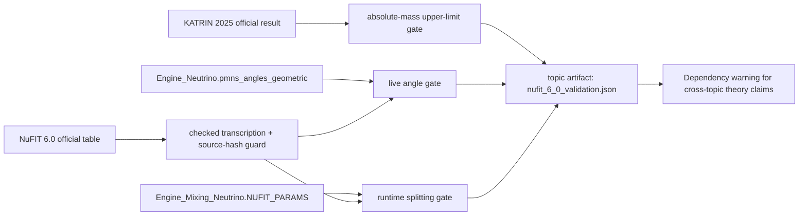

# 0.7 Neutrino Physics

> [!NOTE]
> **AI-Digest**: This topic checks live UET neutrino engine angle outputs, runtime mass-splitting parameters, and an absolute-mass branch against source-locked NuFIT 6.0 and KATRIN 2025 benchmarks. The current verification is a hardening gate, not a proof claim.


## Current Claim Boundary

The verifier now tests live `Engine_Neutrino.py` angle outputs instead of a separate
benchmark-compatible angle snapshot. The current engine revision passes the declared NuFIT 6.0
angle gate, but this is still a benchmark-compatibility result rather than a closed
first-principles neutrino-sector derivation.

## Conceptual Diagram



## Topic Matrix

| Field | Current status |
| :-- | :-- |
| Claim class | Internal benchmark compatibility check |
| Readiness | Structured, with source-locked benchmark data |
| Primary verifier | `Code/03_Research/Research_NuFit_6_0_Comparison.py` |
| Main external sources | NuFIT 6.0 official parameter table; KATRIN 2025 official result |
| Main blocker | Angle bridge derivation and runtime mass-splitting derivation are not closed |

## 5x4 Grid Structure

| Pillar | Purpose |
| :-- | :-- |
| `Doc/` | Analysis notes for hierarchy, mixing, and oscillation checks |
| `Ref/` | Reference material for NuFIT, PDG-style values, and experimental context |
| `Data/` | Topic-local legacy snapshots; primary source-locked data now lives in `docs/data/external/...` |
| `Code/` | Engine, proof-oriented, and research comparison scripts |
| `Result/` | Verification artifacts and generated outputs |

## Problem And Method

- The Standard Model does not explain neutrino mass origin, and mass ordering remains a live
  experimental/theoretical question.
- This topic tests whether live UET engine geometric angle rules and a see-saw-style
  absolute-mass branch remain compatible with official NuFIT 6.0 and KATRIN 2025 benchmarks.
- The verifier separates geometric angle outputs from benchmark-fed runtime mass splittings.
  Compatibility is not the same thing as a complete first-principles derivation.

## Current Verification Results

| Layer | Test | Current result | Interpretation |
| :-- | :-- | :-- | :-- |
| Data | NuFIT checked transcription | PASS | Source hashes and schema guard are present |
| Data | KATRIN 2025 extracted JSON | PASS | Official result is locally locked |
| Live engine angles | NuFIT 6.0 3sigma ranges | PASS | Revised live bridge gives `theta12 = 35.264 deg`, `theta13 = 8.693 deg`, and `theta23 = 45.000 deg` |
| Runtime splittings | NuFIT 6.0 3sigma ranges | PASS | Values are benchmark-fed, not derived from first principles |
| Absolute mass branch | KATRIN 2025 upper limit | PASS | See-saw-style branch is below the official limit |
| Workflow gates | Source evidence + branch claim files | ACTIVE | Distinguishes accepted benchmark branches from blocked theory branches |
| Artifact claim scope | `neutrino_claim_scope_gate` | ACTIVE | Exports benchmark compatibility only; blocks mass-origin, hierarchy, PMNS-proof, and full-sector claims |
| Derivation status | Full neutrino sector | HARDENING TARGET | Formula audit labels key paths as heuristic/benchmark-fed |

## Dependency Matrix

| Dependency role | Upstream / downstream topic | Current effect |
| :-- | :-- | :-- |
| Particle benchmark source | `docs/data/external/particle_physics/nufit/official/...` | Supplies source-locked angle and mass-splitting gates. |
| Absolute-mass bound | `docs/data/external/particle_physics/katrin/...` | Bounds the see-saw-style branch but does not close mass-generation theory. |
| Core mass mechanism | `0.17_Mass_Generation` | May cite the PASS artifact only as benchmark compatibility; it still inherits the mass-origin derivation gap. |
| Unity scale bridge | `0.23_Unity_Scale_Link` | May use the NuFIT/KATRIN artifact as a constraint package, not as independent support for unification. |
| Grand integration index | `0.0_Grand_Unification` | Should index the neutrino bridge as benchmark-gated until the angle and mass-splitting derivations are closed. |

## Quick Start

```powershell
cd C:\Users\santa\Desktop\uet_harness

# Source-locked NuFIT/KATRIN validation
python docs/topics/0.7_Neutrino_Physics/Code/03_Research/Research_NuFit_6_0_Comparison.py

# Provenance guard for the NuFIT checked-transcription layer
python docs/scripts/Data/validate_nufit_v60_provenance.py
```

## Key Files

- `METHOD.md`: method scope, assumptions, and unit policy.
- `DATA_MANIFEST.md`: external source paths and local data status.
- `VERIFICATION_SPEC.md`: primary command, inputs, metrics, thresholds, and artifact target.
- `LIMITATIONS.md`: current scientific limits and remaining derivation gaps.
- `FORMULA_AUDIT.md`: formula, unit, provenance, and proof-status registry.
- `Data/03_Research/source_evidence_intake_stub.json`: provenance intake queue for neutrino branches.
- `Data/03_Research/branch_claim_gate.json`: lane-by-lane claim ceiling for angles, splittings, absolute mass, and hierarchy.

## Current Limitations

- NuFIT values are maintained as checked transcription, not machine-parsed directly from the
  official PDF table.
- Runtime mass splittings are still benchmark-fed.
- The absolute-mass path is a compact see-saw-style construction, not a complete neutrino mass
  generation theory.
- The hierarchy selector and full-sector closure claims remain blocked by the branch claim gate.
- Internal verifier success does not by itself establish external replication or formal proof.

*Status note: source-locked hardening gate; not an external proof claim.*
