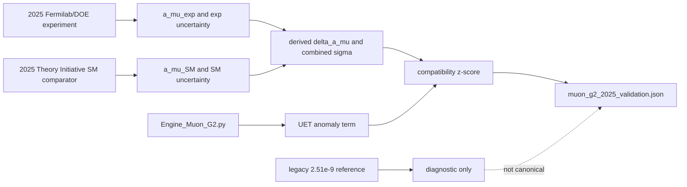

# 0.8 Muon g-2 Anomaly

## Problem

This topic studies whether a UET-inspired correction term can numerically track selected
published muon magnetic-moment discrepancy packages under a controlled benchmark workflow.

## Current status

- Metadata status: `Structured`
- Audit tier: `A`
- Data status: `manifested real dataset`
- Claim class: `C - source-locked internal benchmark`
- Claim posture: internal anomaly-model benchmark, not a confirmed resolution of the muon
  g-2 problem

## Conceptual Diagram



## Evidence Matrix

| Layer | Current status | Evidence / artifact | Claim allowed |
| :-- | :-- | :-- | :-- |
| 2025 experiment | Source-locked external working copy | `docs/data/external/particle_physics/muon_g2/fermilab_muon_g2_2025_experiment.json` | experimental input |
| 2025 SM comparator | Source-locked external working copy | `docs/data/external/particle_physics/muon_g2/theory/muon_g2_theory_2025_total_sm.json` | theory baseline input |
| Live engine term | Runnable internal model | `Engine_Muon_G2.py` | model comparator |
| Compatibility gate | Current benchmark artifact | `Result/artifacts/muon_g2_2025_validation.json` | source-locked internal benchmark |
| Sensitivity layer | Diagnostic artifact | `Result/artifacts/muon_g2_2025_sensitivity.json` | comparator sensitivity only |
| Legacy 2023/2.51e-9 references | Historical diagnostics | `muon_g2_benchmark_shift.json` | not canonical evidence |
| Source evidence workflow | Structured provenance gate | `Data/03_Research/source_evidence_intake_stub.json`, `source_evidence_readiness_matrix.json` | source-review queue |
| Branch claim gate | Structured claim ceiling | `Data/03_Research/branch_claim_gate.json` | benchmark-only claim control |
| Bridge derivation | Open | `FORMULA_AUDIT.md`, `LIMITATIONS.md` | no anomaly closure claim |

## What currently exists

- A source-locked 2025 experimental result
- A source-locked 2025 theory comparator
- A live-engine verifier tied to `Engine_Muon_G2.py`
- A sensitivity artifact that separates the canonical 2025 benchmark from historical local
  theory-package baselines
- A baseline package that records canonical and historical comparator sets explicitly
- A dedicated `FORMULA_AUDIT.md` that labels benchmark inputs, source-locked quantities,
  and open bridge terms

## What this topic currently establishes

- The live engine passes the current source-locked 2025 benchmark at about `0.42 sigma`
- The workflow now separates canonical verification from stale legacy references
- The topic now separates accepted benchmark branches from blocked anomaly-closure branches
- The topic has root-level standards files for data, method, verification, baseline, and
  limitations

## What this topic does not currently establish

- It does not establish closure of the Standard Model discrepancy
- It does not rule out alternative explanations or new-physics interpretations
- It does not yet cover a broad enough set of external alternate-theory packages
- It does not yet establish downstream consistency across related particle topics
- It does not upgrade the live engine benchmark into a first-principles anomaly derivation

## Data and evidence notes

- The canonical verification baseline is `source_locked_2025_derived`
- The baseline package keeps historical local theory baselines separate from the canonical
  2025 path
- The historical `2.51e-9` reference is retained only as diagnostic metadata
- Topic-level source-evidence and branch-claim gates cap the topic at benchmark-compatibility status

## Verification notes

- Primary verifier:
  - `Code/03_Research/Research_Muon_Anomaly_2025.py`
- Sensitivity layer:
  - `Code/03_Research/Research_Muon_Sensitivity_2025.py`
- Key artifacts:
- `Result/artifacts/muon_g2_2025_validation.json`
- `Result/artifacts/muon_g2_2025_sensitivity.json`
- `Result/artifacts/muon_g2_benchmark_shift.json`
- `Data/03_Research/source_evidence_intake_stub.json`
- `Data/03_Research/source_evidence_readiness_matrix.json`
- `Data/03_Research/branch_claim_gate.json`
- `FORMULA_AUDIT.md`

## Reproducibility

Current audit-grade commands:

```powershell
python docs/topics/0.8_Muon_g2_Anomaly/Code/03_Research/Research_Muon_Anomaly_2025.py
python docs/topics/0.8_Muon_g2_Anomaly/Code/03_Research/Research_Muon_Sensitivity_2025.py
```

These commands test the current benchmark package. They do not by themselves establish an
anomaly-level scientific closure.

## Current readiness status

`Structured`
