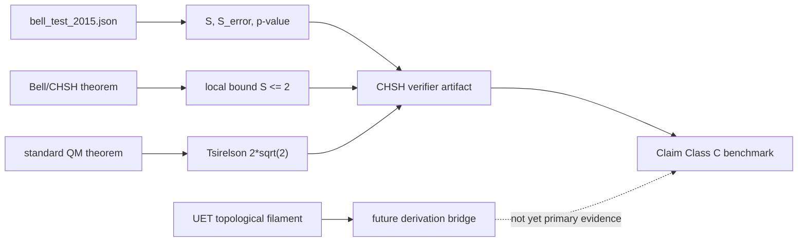

# 0.9 Quantum Nonlocality

> [!NOTE]
> **AI-Digest**: This topic currently supports a source-referenced internal
> CHSH/Bell benchmark using the Hensen et al. 2015 working copy. It verifies that
> the recorded Bell parameter violates the local-realist bound and is consistent
> with the Tsirelson benchmark. Source-evidence and branch-claim gates now keep
> CHSH evidence separate from UET topology, qubit, double-slit, tunneling, and
> broader mechanism claims until those lanes have their own verified artifacts.


## Current Claim Boundary

The accepted evidence is a CHSH benchmark: `S = 2.42 +/- 0.20`, local-realist
bound `S <= 2`, p-value `0.039`, and Tsirelson benchmark `2*sqrt(2)`. This
supports an internal Bell-violation benchmark, not a completed derivation of UET
information topology.

## Conceptual Diagram



## Evidence Matrix

| Layer | Current status | Evidence / artifact | Claim allowed |
| :-- | :-- | :-- | :-- |
| Hensen 2015 CHSH | Source-referenced working copy | `bell_test_2015.json`, DOI `10.1038/nature15759` | Bell benchmark input |
| CHSH source lock | Topic provenance map + external packages | `Data/03_Research/source_lock_manifest.json`, `docs/data/external/quantum_nonlocality/...` | normative benchmark provenance |
| Bell violation gate | Runnable verifier | `Result/artifacts/0_9_quantum_nonlocality_verification.json` | internal CHSH violation check |
| Source evidence workflow | Intake + readiness gate | `Data/03_Research/source_evidence_intake_stub.json`, `source_evidence_readiness_matrix.json` | provenance queue only |
| Branch claim control | Claim gate | `Data/03_Research/branch_claim_gate.json` | caps claim strength by lane |
| Tsirelson bound | Standard benchmark anchor | `FORMULA_AUDIT.md`, verifier metric | consistency with quantum bound |
| Raw event analysis | Missing | limitations | not reconstructed |
| UET topology bridge | Heuristic model | method/formula audit | proposal, not established mechanism |
| Qubit/double-slit/tunneling | Separate lanes | secondary scripts/data | no support for CHSH claim yet |

## 5x4 Grid Structure

| Pillar | Purpose |
| :-- | :-- |
| `Doc/` | analysis notes for entanglement, Bell tests, and topology models |
| `Ref/` | Bell, Aspect, Tsirelson, Hensen, and related references |
| `Data/` | local CHSH, qubit, double-slit, and tunneling working copies |
| `Code/` | quantum engines, derivation scripts, research verifiers, and comparators |
| `Result/` | artifacts, figures, and run logs |

## Quick Start

```powershell
cd C:\Users\santa\Desktop\uet_harness
python docs/topics/0.9_Quantum_Nonlocality/Code/03_Research/Research_CHSH_Verification.py
```

## Key Files

- `FORMULA_AUDIT.md`: formula registry for CHSH, Bell bound, Tsirelson bound, and open UET bridge.
- `VERIFICATION_SPEC.md`: primary command, thresholds, and artifact contract.
- `DATA_MANIFEST.md`: data sources, DOI status, hashes, and provenance gaps.
- `METHOD.md`: evidence lanes and dependency policy.
- `LIMITATIONS.md`: blockers for stronger nonlocality/topology claims.
- `Data/03_Research/source_evidence_intake_stub.json`: provenance intake queue for Bell and adjacent quantum lanes.
- `Data/03_Research/source_lock_manifest.json`: normative provenance map for the CHSH branch inputs.
- `Data/03_Research/branch_claim_gate.json`: lane-by-lane claim ceiling for CHSH, topology, qubit, and tunneling branches.

## Current Limitations

- Raw event-count reconstruction from the experiment is not included.
- Source-evidence readiness is still pending for raw Bell counts, secondary summaries, and adjacent quantum lanes.
- UET topological-filament explanation is not yet derived into the CHSH formula.
- Qubit, tunneling, double-slit, and LC-unity claims need separate verifier artifacts.
- Strong wording that presents UET topology as a completed derivation is not supported yet.

---

[Previous: Muon g-2](../0.8_Muon_g2_Anomaly/README.md) | [Back to Topics](../README.md)
