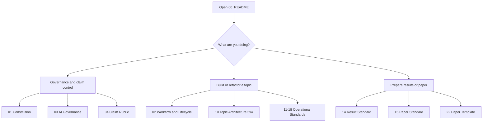

# UET Standards Workspace

This folder is the permanent operating standard for UET topic work.

It is not a theory manifesto. It is the place that defines how research work is organized,
reviewed, written, and promoted so the repo stays systematic, auditable, reproducible, and
scientifically legible.

## Purpose

Use this workspace as the first-stop operating manual whenever a topic is being created,
rewritten, audited, or prepared for paper conversion.

## When to use

Use this folder when you need to:

- create a new topic with the correct folder pattern
- repair credibility, evidence, or claim inflation problems
- standardize code, data, references, results, or manuscripts
- onboard a human or AI collaborator into the repo workflow
- decide what document to open next for a specific task

## Workflow summary

## Start Here

1. Read [01_Project_Research_Constitution.md](./01_Project_Research_Constitution.md).
2. Read [02_Project_Workflow_and_Lifecycle.md](./02_Project_Workflow_and_Lifecycle.md).
3. Open the specific operational guide for the pillar you are changing.

## Reading order by task

### If you are creating a new topic

1. [02_Project_Workflow_and_Lifecycle.md](./02_Project_Workflow_and_Lifecycle.md)
2. [10_Topic_Architecture_5x5(+1).md](./10_Topic_Architecture_5x5(+1).md)
3. [11_Code_README_Standard.md](./11_Code_README_Standard.md)
4. [12_Data_Standard.md](./12_Data_Standard.md)
5. [13_Reference_Standard.md](./13_Reference_Standard.md)
6. [14_Result_Standard.md](./14_Result_Standard.md)
7. [17_Formula_Audit_Standard.md](./17_Formula_Audit_Standard.md)
8. [18_Research_Hardening_Workflow.md](./18_Research_Hardening_Workflow.md)
9. [20_TEMPLATE_README.md](./20_TEMPLATE_README.md)
10. [21_TEMPLATE_ANALYSIS.md](./21_TEMPLATE_ANALYSIS.md)
11. [23_TEMPLATE_FORMULA_AUDIT.md](./23_TEMPLATE_FORMULA_AUDIT.md)
12. [24_TEMPLATE_UPDATE_LOG.md](./24_TEMPLATE_UPDATE_LOG.md)

### If you are fixing credibility or integrity issues

1. [01_Project_Research_Constitution.md](./01_Project_Research_Constitution.md)
2. [03_AI_Usage_and_Governance.md](./03_AI_Usage_and_Governance.md)
3. [04_Claim_and_Evidence_Rubric.md](./04_Claim_and_Evidence_Rubric.md)
4. [02_Project_Workflow_and_Lifecycle.md](./02_Project_Workflow_and_Lifecycle.md)
5. [17_Formula_Audit_Standard.md](./17_Formula_Audit_Standard.md)
6. [18_Research_Hardening_Workflow.md](./18_Research_Hardening_Workflow.md)
7. Relevant operational standard in `10-18`

### If you are preparing a paper

1. [04_Claim_and_Evidence_Rubric.md](./04_Claim_and_Evidence_Rubric.md)
2. [14_Result_Standard.md](./14_Result_Standard.md)
3. [15_Paper_Standard.md](./15_Paper_Standard.md)
4. [22_UET_PAPER_TEMPLATE.tex](./22_UET_PAPER_TEMPLATE.tex)

## Standards map

| File | Role | Use it when |
| :-- | :-- | :-- |
| `01_Project_Research_Constitution.md` | highest governance rulebook | you need the non-negotiable principles |
| `02_Project_Workflow_and_Lifecycle.md` | readiness and promotion workflow | you need to place a topic in the correct stage |
| `03_AI_Usage_and_Governance.md` | human-AI collaboration rules | AI is drafting, refactoring, or auditing work |
| `04_Claim_and_Evidence_Rubric.md` | wording and evidence control | a claim feels too strong or too vague |
| `10_Topic_Architecture_5x5(+1).md` | folder architecture | you are laying out or repairing topic structure |
| `11_Code_README_Standard.md` | code documentation standard | you are documenting runnable scripts |
| `12_Data_Standard.md` | provenance and dataset control | a result depends on local or external data |
| `13_Reference_Standard.md` | source and bibliography discipline | references need to constrain claims better |
| `14_Result_Standard.md` | artifact and figure discipline | you are saving outputs or verification artifacts |
| `15_Paper_Standard.md` | manuscript readiness rules | repo work is being converted into a paper |
| `16_Cinematic_Viz_Standard.md` | showcase visualization rules | creating presentation or social demo assets |
| `17_Formula_Audit_Standard.md` | formula, unit, and proof-status control | formulas or constants need provenance and unit review |
| `18_Research_Hardening_Workflow.md` | stepwise hardening workflow | a topic needs blocker-narrowing, gates, or predictive-candidate prep |
| `20_TEMPLATE_README.md` | topic README template | starting or normalizing a topic root README |
| `21_TEMPLATE_ANALYSIS.md` | analysis note template | creating structured technical analysis notes |
| `22_UET_PAPER_TEMPLATE.tex` | manuscript starter | building a paper draft from a mature topic |
| `23_TEMPLATE_FORMULA_AUDIT.md` | formula registry starter | starting a dedicated formula-audit file |
| `24_TEMPLATE_UPDATE_LOG.md` | update log template | recording multi-wave progress without replacing artifacts |
| `25_Research_Throughput_Workflow.md` | token-saving hardening workflow | generating compact wave packets before reading whole topics |
| `26_AI_AGENT_SKILL_MAP.md` | AI skill layer map | deciding which UET-focused skill should support a task |
| `27_AI_AGENT_ROUTING_MATRIX.md` | AI task routing matrix | routing common user requests to the minimum useful skill set |
| `28_AI_AGENT_SKILL_AUTHORING_STANDARD.md` | UET skill authoring rules | creating or reviewing skills without replacing `For Work` |
| `29_TEMPLATE_AI_AGENT_SKILL_SPEC.md` | skill spec template | drafting a portable UET skill before installing it |

## Quick decision matrix

| If the problem is... | Open first | Then open |
| :-- | :-- | :-- |
| claim sounds too strong | `04_Claim_and_Evidence_Rubric.md` | `01_Project_Research_Constitution.md` |
| topic structure is messy | `10_Topic_Architecture_5x5(+1).md` | `02_Project_Workflow_and_Lifecycle.md` |
| code exists but nobody knows how to run it | `11_Code_README_Standard.md` | `14_Result_Standard.md` |
| dataset source is unclear | `12_Data_Standard.md` | `04_Claim_and_Evidence_Rubric.md` |
| references are decorative instead of useful | `13_Reference_Standard.md` | `15_Paper_Standard.md` |
| paper draft feels like marketing | `15_Paper_Standard.md` | `04_Claim_and_Evidence_Rubric.md` |
| formula exists but provenance is unclear | `17_Formula_Audit_Standard.md` | `11_Code_README_Standard.md` |
| units or variable meanings are unclear | `17_Formula_Audit_Standard.md` | `02_Project_Workflow_and_Lifecycle.md` |
| AI wrote smooth prose without derivation support | `03_AI_Usage_and_Governance.md` | `04_Claim_and_Evidence_Rubric.md` |
| topic is moving too slowly because blockers are vague | `18_Research_Hardening_Workflow.md` | `02_Project_Workflow_and_Lifecycle.md` |
| many changes happened and progress is hard to track | `24_TEMPLATE_UPDATE_LOG.md` | `18_Research_Hardening_Workflow.md` |
| repeated topic passes are consuming too many tokens | `25_Research_Throughput_Workflow.md` | `18_Research_Hardening_Workflow.md` |
| AI agent needs the right skill or workflow | `27_AI_AGENT_ROUTING_MATRIX.md` | `26_AI_AGENT_SKILL_MAP.md` |
| a new UET-specific Codex skill is being created | `28_AI_AGENT_SKILL_AUTHORING_STANDARD.md` | `29_TEMPLATE_AI_AGENT_SKILL_SPEC.md` |

## Naming pattern

| Range | Meaning |
| :-- | :-- |
| `00-04` | governance and master rules |
| `10-18` | operational standards by work pillar |
| `20+` | templates and production assets |
| `25` | throughput and token-saving workflow |
| `26-29` | AI skill routing, authoring, and portable skill specs |

## Compatibility map

| Old name | New name |
| :-- | :-- |
| `README.md` | `00_README.md` |
| `00_Project_Research_Constitution.md` | `01_Project_Research_Constitution.md` |
| `01_Project_Workflow_and_Lifecycle.md` | `02_Project_Workflow_and_Lifecycle.md` |
| `02_AI_Usage_and_Governance.md` | `03_AI_Usage_and_Governance.md` |
| `03_Claim_and_Evidence_Rubric.md` | `04_Claim_and_Evidence_Rubric.md` |
| `how to topics5x4.md` | `10_Topic_Architecture_5x5(+1).md` |
| `how to Code README.md` | `11_Code_README_Standard.md` |
| `how to Data Standard.md` | `12_Data_Standard.md` |
| `how to Reference Standard.md` | `13_Reference_Standard.md` |
| `how to Result Standard.md` | `14_Result_Standard.md` |
| `how to paper.md` | `15_Paper_Standard.md` |
| `how to Cinematic Viz.md` | `16_Cinematic_Viz_Standard.md` |
| `how to Formula Audit.md` | `17_Formula_Audit_Standard.md` |
| `TEMPLATE_README.md` | `20_TEMPLATE_README.md` |
| `TEMPLATE_ANALYSIS.md` | `21_TEMPLATE_ANALYSIS.md` |
| `UET_PAPER_TEMPLATE.tex` | `22_UET_PAPER_TEMPLATE.tex` |
| `TEMPLATE_FORMULA_AUDIT.md` | `23_TEMPLATE_FORMULA_AUDIT.md` |

## Key rules

- No topic is allowed to outrun its evidence.
- A fit must stay a fit until out-of-sample support exists.
- Internal benchmarks must stay labeled as internal benchmarks.
- Every practical workflow should point to commands, inputs, and outputs.
- Every standards page should be easy to scan, not just correct in prose.
- Every important formula must declare origin, units, and proof status.
- Repository prose must not be promoted from dictation alone; it must be tied to a derivation, script, artifact, or source record.
- Every topic README must include at least one conceptual diagram and one evidence/status matrix so later readers can understand the theory role, data path, formula status, verifier role, and limitations without reading the whole folder first.
- Scientific hardening should strengthen the research argument by exposing dependencies, mechanisms, tests, and blockers; it must not collapse the topic into only defensive wording.
- Multi-wave work should use a standard update log when a reader would otherwise need to reconstruct progress from diffs alone.
- Repeated hardening work should start from a generated research wave packet before rereading a whole topic folder.

## Common failure modes

- governance documents exist but nobody knows reading order
- topic standards are written, but folder naming is still inconsistent
- commands are missing from practical guides, so reruns stop being easy
- diagrams disappear during cleanup, so the docs become harder to navigate
- AI rewrites prose upward without an evidence-based status review
- AI rewrites prose downward without adding diagrams, formula maps, verifier links, or clearer theory structure

## Checklist

- [ ] numbering scheme is used consistently across this folder
- [ ] reading order is clear for common work modes
- [ ] every main standard links to the correct renamed files
- [ ] practical guides contain commands only where they help real execution
- [ ] diagrams and tables exist to support fast scanning
- [ ] topic README templates require a conceptual diagram and evidence/status matrix
