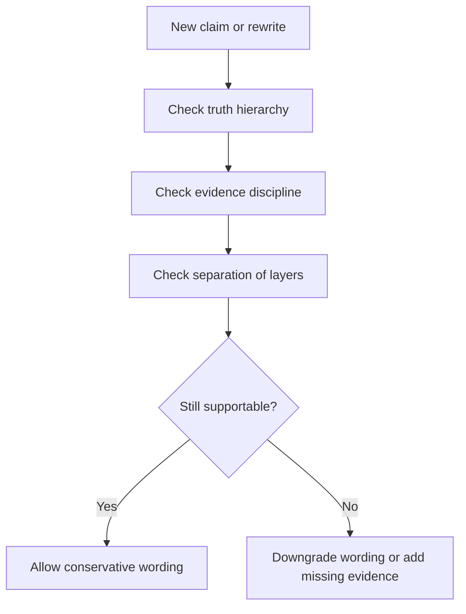

# UET Project Research Constitution

This document is the highest-level governance standard for the UET repository.

It exists to stop the project from drifting into a state where narrative, code, evidence,
and status claims no longer match.

## Purpose

Define the non-negotiable rules that every topic, document, release summary, and AI-assisted
rewrite must obey.

## When to use

Use this file when:

- deciding whether wording is too strong
- resolving conflicts between standards
- judging whether a topic is ready for promotion
- correcting repo drift between narrative and evidence

## Workflow summary

## Governance matrix

| Question | Required answer |
| :-- | :-- |
| What kind of statement is this? | hypothesis, model, benchmark, replication, or peer-reviewed result |
| What supports it? | local derivation, script, data, artifact, or external publication |
| What kind of formula is it? | identity, derived relation, heuristic bridge, fitted relation, or open ansatz |
| Are the units and variable meanings explicit? | yes, before promotion |
| What is forbidden? | hidden fitting, inflated certainty, merged layers |
| Who can promote it? | human reviewer, not AI alone |

## 1. Mission

The mission of the repository is:

- to organize UET research in a way that is inspectable
- to preserve the distinction between idea, model, benchmark, and evidence
- to make every topic easier to review, replicate, and improve

The mission is not:

- to make every topic look complete
- to maximize dramatic claims
- to hide failure or uncertainty

## 2. Truth hierarchy

Every statement in the project must belong to one of these layers:

1. `Hypothesis`
2. `Interpretation`
3. `Mathematical model`
4. `Internal benchmark result`
5. `Externally replicated result`
6. `Peer-reviewed result`

If a statement does not clearly fit one of these layers, it must not appear in public
repository summaries until it is rewritten.

## 3. Claim discipline

The following upgrades are forbidden unless explicitly justified by evidence in the same
topic:

- `hypothesis` -> `verified`
- `fit` -> `prediction`
- `internal benchmark` -> `scientific proof`
- `repository release` -> `theory confirmed`

Restricted wording:

- `Solved`
- `Verified`
- `Platinum Standard`
- `Production Grade`
- `One Equation to Rule Them All`

These phrases may only be used when a topic-specific document explains exactly why they are
appropriate, and that document must itself pass human review.

## 4. Evidence discipline

No public topic is allowed to exist without explicit answers to these questions:

- What problem is being studied?
- What assumptions are being made?
- What data or references are being used?
- Which parameters are fixed?
- Which parameters are fitted?
- Which metrics are reported?
- What threshold defines pass or fail?
- What baseline is being compared against?
- What limitations remain?
- Which formulas are first-principles, and which are still heuristic?
- Which variables are dimensionless, and which carry units?
- Which constants are source-locked physical constants, and which are topic-level bridges?

## 4A. Formula discipline

Every important formula must declare:

- formula text or code path
- variable definitions
- unit for each dimensional variable
- whether the relation is exact identity, derived, heuristic, fitted, or open
- whether the formula is used for gating, diagnosis, or narrative interpretation

Forbidden formula behavior:

- inserting a number only because it makes the benchmark pass
- mixing units without an explicit conversion step
- promoting a bridge constant as if it were a proved physical constant
- calling a heuristic expression `derived from first principles` without a derivation trail

Required formula labels:

- `Identity`
- `Derived relation`
- `Source-locked physical constant`
- `Checked local benchmark constant`
- `Heuristic bridge`
- `Calibration-dependent relation`
- `Open derivation target`

## 5. Separation of layers

The repository must keep these layers separate:

- exploratory notes
- structured topic docs
- internal benchmark outputs
- public summary wording
- academic manuscript material

No single README should carry all of these responsibilities at once.

## 6. Failure handling

Negative results are allowed and must remain visible.

A topic does not become invalid because:

- one sub-test fails
- one benchmark underperforms
- one mechanism is still speculative

But a topic becomes misleading if those facts are hidden.

## 7. Human review requirement

AI may:

- draft
- refactor
- summarize
- classify
- audit consistency

AI may not:

- decide that evidence is stronger than it is
- silently change status labels upward
- convert analogy into proof language
- convert dictated intent into a scientific formula without showing the derivation status

Any upward status change requires explicit human judgment.

## 8. Canonical metadata rule

Version, release date, counts, readiness statuses, and restricted wording lists must come
from canonical metadata sources rather than repeated hand-written summaries.

## 9. Topic readiness rule

Every topic must declare one of:

- `Archived`
- `Draft`
- `Structured`
- `Reproducible internally`
- `Academic-ready`

Topics may be uneven. Honesty is more important than uniformity.

## 10. Project success definition

The project is improving when:

- claims become more precise
- provenance becomes clearer
- reruns become easier
- failures become visible earlier
- docs and code disagree less often

The project is not improving merely because:

- there are more files
- there are more topics
- the prose sounds more confident

## Key rules

- truth hierarchy is mandatory
- evidence discipline is mandatory
- failures must remain visible
- human review is required for upward status changes
- canonical metadata overrides hand-written summaries

## Common failure modes

- using repository polish as a substitute for evidence
- treating a fitted match as a prediction
- letting one impressive topic drag the whole repo wording upward
- allowing AI to silently harden uncertainty into confidence
- treating bridge constants as if they were proved first-principles constants
- leaving units implicit inside scripts and then reading numerical agreement as physical proof

## Checklist

- [ ] the statement is placed in the correct truth layer
- [ ] the evidence source is named explicitly
- [ ] formula origin and proof status are named explicitly
- [ ] units and variable meanings are stated where needed
- [ ] status wording does not exceed the support level
- [ ] limitations and failure states remain visible
- [ ] canonical metadata is used where relevant
