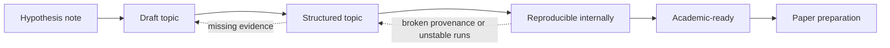

# Project Workflow and Topic Lifecycle

This document defines how a UET topic should move from idea to structured research work.

## Purpose

Provide the standard lifecycle for turning an idea into a topic that is organized,
auditable, and honest about its readiness.

## When to use

Use this file when:

- creating a new topic
- deciding a topic's readiness label
- promoting or demoting a topic
- planning missing artifacts and next steps
- deciding what kind of hardening work should happen before promotion

## Workflow summary

## Readiness matrix

| State | Minimum docs | Evidence expectation | Typical blocker |
| :-- | :-- | :-- | :-- |
| `Hypothesis note` | note or sketch | idea only | no stable benchmark |
| `Draft` | README and assumptions | partial structure | missing manifests, baselines, or formula registry |
| `Structured` | root standards set | auditable internal package | scripts, artifacts, or formula provenance still weak |
| `Reproducible internally` | docs plus stable artifacts | rerunnable internal benchmark | external scrutiny not ready |
| `Academic-ready` | mature methods package | bounded claims and explicit limits | paper framing still needed |

## Lifecycle states

### 1. Hypothesis note

Use when:

- the core idea exists
- the mechanism is still speculative
- there is no stable benchmark yet

Minimum output:

- a note or draft
- no public certainty wording

### 2. Draft topic

Use when:

- folder structure exists
- initial code or derivation exists
- data and baselines are still incomplete

Minimum output:

- topic README
- high-level assumptions
- open questions list

### 3. Structured topic

Use when:

- README exists in standard format
- method, data manifest, verification spec, baseline comparison, and limitations exist
- status wording is under control

Minimum output:

- `README.md`
- `METHOD.md`
- `DATA_MANIFEST.md`
- `VERIFICATION_SPEC.md`
- `BASELINE_COMPARISON.md`
- `LIMITATIONS.md`
- `FORMULA_AUDIT.md` or equivalent dedicated registry
- unit and variable definition section or equivalent

### 4. Reproducible internally

Use when:

- verification commands are stable
- artifacts are produced consistently
- inputs and thresholds are explicit

Minimum output:

- standard docs from the `Structured` stage
- generated artifact examples
- deterministic or documented runtime assumptions

### 5. Academic-ready

Use when:

- methods are clear enough for external scrutiny
- evidence and limitations are mature
- manuscript material can be drafted without inventing missing steps

Minimum output:

- structured topic package
- publication-oriented analysis
- clear statement of what is and is not being claimed

## Standard workflow

1. Start with problem definition.
2. Declare assumptions before writing triumph language.
3. Declare formulas, units, and variable meanings before writing high-confidence prose.
4. Collect references and dataset provenance.
5. Build or refactor code.
6. Define metric and threshold before celebrating outcome.
7. Compare against a baseline.
8. Write limitations before writing summaries.
9. Only then update public-facing wording.

For topics that are already structured but still unclear or blocked, continue in
[18_Research_Hardening_Workflow.md](./18_Research_Hardening_Workflow.md).

## Multi-wave operating loop

When a topic is already structured but progress is slow, do not restart it from
zero each time. Use a repeatable wave loop:

1. identify the single narrowest blocker that currently controls progress
2. choose the smallest artifact, manifest, or gate that can make that blocker
   more explicit
3. regenerate the relevant verifier artifact if the evidence state changed
4. update the topic docs so the claim boundary matches the new artifact state
5. record the pass in the topic update log
6. commit the wave before moving to the next blocker

This keeps the topic moving even when it is not yet promotable.

## Multi-topic acceleration rule

When many topics are moving at once and progress feels slow, do not treat every
topic as an equal-priority writing task.

Use this order:

1. tighten the shared operating rule when the same ambiguity is slowing
   multiple topics
2. require each active topic to expose one machine-readable controlling blocker
3. require each repeated hardening topic to maintain an `UPDATE_LOG.md`
4. use one pilot topic to prove the updated workflow before broad rollout
5. only then expand the same pattern to adjacent topics

This keeps effort compounding instead of repeatedly rediscovering the same
workflow gaps.

## Anti-drift rule for repeated hardening

If a topic keeps growing in files or prose without making the blocker chain
clearer, stop broadening the topic and restore a narrow wave loop.

Require all of the following before starting the next wave:

1. one machine-readable controlling blocker is named in the current artifact,
   gate, or manifest
2. the local `UPDATE_LOG.md` records what changed, what was rerun, and what
   still controls the topic now
3. the local `README.md`, `LIMITATIONS.md`, and `VERIFICATION_SPEC.md` do not
   outrun that controlling blocker

If any of these are missing, the next useful action is usually workflow repair,
not more topic expansion.

## Status-first review rule

Before starting a new hardening wave on a topic that already exists, reconstruct
the current state in this order:

1. `docs/topics/README.md` and any canonical metadata under `docs/meta/`
2. local `README.md`, `LIMITATIONS.md`, and `VERIFICATION_SPEC.md`
3. latest verifier artifact and machine-readable blocker gates
4. local `UPDATE_LOG.md` if the topic has undergone repeated waves
5. only then plan the next blocker pass

If these sources disagree, treat the artifact and gate wording as controlling
for the current blocker state and repair the prose later.

## What counts as real progress

Progress does not only mean a topic reaches a higher readiness state.

These also count as valid progress:

- a source family becomes source-locked
- a vague blocker becomes one machine-readable gate
- a topic-level `FAIL` is narrowed to one named sub-blocker
- a predictive lane is separated from a fitted diagnostic lane
- a README is brought back under the artifact claim boundary
- an update log makes the recent wave history reconstructable
- a shared workflow rule removes the same ambiguity across multiple topics
- a completed wave makes the next controlling blocker obvious without opening git history

These do not count as readiness upgrades by themselves:

- longer prose
- more files with no verification role
- a passing branch result that does not control the topic gate
- a new theory claim without tighter evidence control

## Promotion rules

A topic may move up one readiness level only if its required artifacts are present.

It may move down if:

- evidence was overstated
- provenance is unclear
- a key script no longer runs
- a baseline claim cannot be audited

## Required review questions before publishing a topic

- Is this a derivation, a fit, or a prediction?
- Is the dataset local and documented?
- Is the baseline explicit?
- Are the variables and units explicit?
- Which constants come from source-locked physics, and which are bridges or heuristics?
- Does the README say more than the verification spec supports?
- Would a skeptical reviewer know what to attack first?

If the answer to the last question is "no", the topic is probably still too vague.

## Key rules

- promotion happens one level at a time
- missing artifacts block readiness upgrades
- demotion is allowed when evidence weakens or drift is discovered
- limitations must be written before public summary language is upgraded

## Common failure modes

- skipping from idea to strong README wording
- marking a topic reproducible without stable commands and artifacts
- treating folder creation alone as scientific progress
- hiding demotion when a script no longer runs or provenance breaks
- calling a topic structured even though formulas still have no origin or unit table
- promoting dictated equations into methods without a formula-audit pass

## Checklist

- [ ] current readiness label matches actual artifacts
- [ ] required root files exist for the stage claimed
- [ ] formulas, units, and variable meanings are explicit enough for review
- [ ] metric, threshold, and baseline are explicit before promotion
- [ ] public wording was updated only after evidence review
- [ ] next blocker for promotion is named clearly
- [ ] repeated hardening work is visible through an update log when needed
