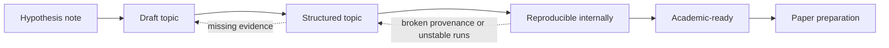

# Project Workflow and Topic Lifecycle

This document defines how a UET topic should move from idea to structured research work.

## Purpose

Provide the standard lifecycle for turning an idea into a topic that is organized,
auditable, and honest about its readiness.

## When to use

Use this file when:

- creating a new topic
- deciding a topic's readiness label
- promoting or demoting a topic
- planning missing artifacts and next steps

## Workflow summary

## Readiness matrix

| State | Minimum docs | Evidence expectation | Typical blocker |
| :-- | :-- | :-- | :-- |
| `Hypothesis note` | note or sketch | idea only | no stable benchmark |
| `Draft` | README and assumptions | partial structure | missing manifests or baselines |
| `Structured` | root standards set | auditable internal package | scripts or artifacts still weak |
| `Reproducible internally` | docs plus stable artifacts | rerunnable internal benchmark | external scrutiny not ready |
| `Academic-ready` | mature methods package | bounded claims and explicit limits | paper framing still needed |

## Lifecycle states

### 1. Hypothesis note

Use when:

- the core idea exists
- the mechanism is still speculative
- there is no stable benchmark yet

Minimum output:

- a note or draft
- no public certainty wording

### 2. Draft topic

Use when:

- folder structure exists
- initial code or derivation exists
- data and baselines are still incomplete

Minimum output:

- topic README
- high-level assumptions
- open questions list

### 3. Structured topic

Use when:

- README exists in standard format
- method, data manifest, verification spec, baseline comparison, and limitations exist
- status wording is under control

Minimum output:

- `README.md`
- `METHOD.md`
- `DATA_MANIFEST.md`
- `VERIFICATION_SPEC.md`
- `BASELINE_COMPARISON.md`
- `LIMITATIONS.md`

### 4. Reproducible internally

Use when:

- verification commands are stable
- artifacts are produced consistently
- inputs and thresholds are explicit

Minimum output:

- standard docs from the `Structured` stage
- generated artifact examples
- deterministic or documented runtime assumptions

### 5. Academic-ready

Use when:

- methods are clear enough for external scrutiny
- evidence and limitations are mature
- manuscript material can be drafted without inventing missing steps

Minimum output:

- structured topic package
- publication-oriented analysis
- clear statement of what is and is not being claimed

## Standard workflow

1. Start with problem definition.
2. Declare assumptions before writing triumph language.
3. Collect references and dataset provenance.
4. Build or refactor code.
5. Define metric and threshold before celebrating outcome.
6. Compare against a baseline.
7. Write limitations before writing summaries.
8. Only then update public-facing wording.

## Promotion rules

A topic may move up one readiness level only if its required artifacts are present.

It may move down if:

- evidence was overstated
- provenance is unclear
- a key script no longer runs
- a baseline claim cannot be audited

## Required review questions before publishing a topic

- Is this a derivation, a fit, or a prediction?
- Is the dataset local and documented?
- Is the baseline explicit?
- Does the README say more than the verification spec supports?
- Would a skeptical reviewer know what to attack first?

If the answer to the last question is "no", the topic is probably still too vague.

## Key rules

- promotion happens one level at a time
- missing artifacts block readiness upgrades
- demotion is allowed when evidence weakens or drift is discovered
- limitations must be written before public summary language is upgraded

## Common failure modes

- skipping from idea to strong README wording
- marking a topic reproducible without stable commands and artifacts
- treating folder creation alone as scientific progress
- hiding demotion when a script no longer runs or provenance breaks

## Checklist

- [ ] current readiness label matches actual artifacts
- [ ] required root files exist for the stage claimed
- [ ] metric, threshold, and baseline are explicit before promotion
- [ ] public wording was updated only after evidence review
- [ ] next blocker for promotion is named clearly
