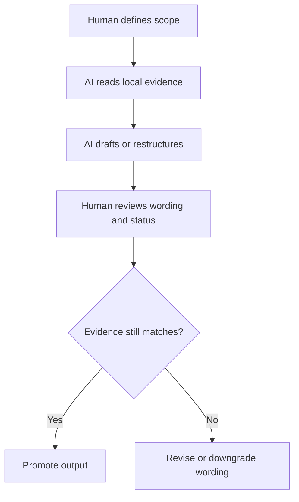

# AI Usage and Governance

This document exists because AI accelerates both progress and confusion.

The goal is not to stop using AI. The goal is to use AI in a way that protects the
scientific integrity of the project.

## Purpose

Define what AI is allowed to do, what it must never do alone, and how humans should review
AI-generated research structure or wording.

## When to use

Use this file when:

- assigning documentation or refactor work to AI
- reviewing AI-generated claims or status labels
- deciding whether AI output can be promoted into repo-facing docs
- creating new prompts, workflows, or audit passes

## Workflow summary

## Decision matrix

| Task | AI may do it? | Human review required? |
| :-- | :-- | :-- |
| reorganize folders and templates | yes | recommended |
| summarize approved facts | yes | yes before promotion |
| classify claim strength | yes, as draft | yes |
| draft formula registry entries | yes, as draft | yes |
| raise readiness status | no, not alone | mandatory |
| invent supporting evidence | no | not allowed |

## What AI is good for

- refactoring structure
- drafting documentation from approved facts
- checking consistency across files
- generating inventories, checklists, and templates
- rewriting for clarity
- producing candidate comparisons for human review

## What AI is dangerous at

- sounding more certain than the evidence warrants
- inventing smooth connections between weakly connected ideas
- converting analogy into formal-sounding physics
- repeating stale counts, statuses, and metadata
- producing more documentation than the evidence can support

## AI rules for UET

### Rule 1: AI cannot promote evidence status

AI may not decide that a topic has become:

- `Reproducible internally`
- `Academic-ready`
- `verified`
- `solved`

without explicit human review.

### Rule 2: AI must work from canonical metadata

If release counts, version, status labels, or definitions exist in a canonical file, AI must
use that file and not invent replacements.

### Rule 3: AI must preserve uncertainty

If the source material is uncertain, the rewritten output must remain uncertain.

### Rule 4: AI must not collapse layers

AI must not merge:

- hypothesis and proof
- fit and prediction
- benchmark and theory
- public summary and lab notebook

### Rule 5: AI must expose assumptions

When AI writes or rewrites topic documentation, it must make assumptions visible rather than
smuggling them into prose.

### Rule 6: AI must not write science by dictation alone

If a human says what a formula or mechanism is supposed to mean, AI may:

- transcribe it as a hypothesis
- place it in a formula-audit queue
- draft variable and unit placeholders

AI may not:

- upgrade it into a proved derivation
- hide missing unit logic
- fill missing physical steps with smooth prose
- convert a desired result into a formula just because it sounds plausible

## Approved AI workflow

1. Human defines the scope of work.
2. AI inspects local evidence.
3. AI drafts or restructures using templates.
4. Human reviews status wording.
5. Only then is the output promoted into the main narrative.

## Red flags that require manual review

- words like `solved`, `proved`, `exact`, `guaranteed`, `fully explains`
- large numerical claims without a metric definition
- claims that one equation explains many unrelated domains at once
- removal of limitation sections
- references to results that are not tied to a script or artifact
- formulas with constants that have no origin label
- unit conversions that are not written down explicitly
- prose that sounds like a derivation but names no variables or dimensions

## One-line principle

Use AI as a systems engineer and drafting assistant, not as the final judge of scientific
truth.

## Key rules

- AI cannot promote evidence status on its own.
- AI must use canonical metadata when available.
- AI must preserve uncertainty instead of smoothing it away.
- AI must keep hypothesis, fit, benchmark, and proof layers separate.

## Common failure modes

- AI turns structural cleanup into narrative inflation
- AI repeats stale counts or statuses from older docs
- AI makes weak connections sound mathematically inevitable
- humans accept polished wording without checking the underlying script or artifact
- AI writes the formula the user seems to want instead of the formula the repo can justify

## Checklist

- [ ] scope of AI work was defined before drafting started
- [ ] AI output was checked against local evidence, not memory
- [ ] any status wording was reviewed by a human
- [ ] uncertainty and limitations were preserved
- [ ] no AI-generated sentence outruns the supporting artifact or derivation
- [ ] no AI-generated formula outruns its stated origin, units, or proof status
