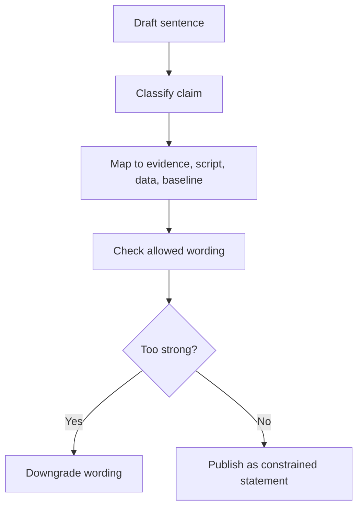

# Claim and Evidence Rubric

This rubric defines how to classify statements in UET topics.

Its purpose is to stop claim inflation.

## Purpose

Provide a shared language for describing what kind of claim exists, what evidence supports
it, and how strong the wording is allowed to be.

## When to use

Use this file when:

- writing topic summaries
- reviewing README wording
- downgrading overclaimed language
- mapping a claim to evidence for audit or paper work

## Workflow summary

## Claim matrix

| Class | What it means | Allowed wording | Not allowed |
| :-- | :-- | :-- | :-- |
| A | mechanism proposed | hypothesis, proposal | solved, verified |
| B | model exists | model, formulation, derived relation | theory confirmed |
| C | internal run benchmark | reproduced internally, passes current internal benchmark | proved nature, externally validated |
| D | external rerun succeeded | externally replicated | peer-reviewed unless it is |
| E | reviewed external result | peer-reviewed result | stronger claims than the paper itself supports |

## 1. Claim classes

### Class A: Hypothesis

Use when:

- the mechanism is proposed
- the math is incomplete
- the benchmark is not yet stable

Allowed wording:

- `hypothesis`
- `proposal`
- `possible mechanism`

### Class B: Model statement

Use when:

- a mathematical or computational model exists
- the model can be run or analyzed
- the evidence is still mostly internal

Allowed wording:

- `model`
- `formulation`
- `derived relation`

### Class C: Internal benchmark result

Use when:

- a script runs
- inputs are known
- metrics and thresholds are explicit
- results are internal to the repository workflow

Allowed wording:

- `reproduced internally`
- `passes current internal benchmark`
- `matches selected repository benchmark data`

### Class D: External replication

Use when:

- an outside person or team can rerun the method from the provided package
- the rerun reproduces the result within stated bounds

Allowed wording:

- `externally replicated`

### Class E: Peer-reviewed scientific result

Use when:

- the claim exists in a reviewed publication or accepted equivalent external venue

Allowed wording:

- `peer-reviewed result`

## 2. Forbidden upgrades

The following transitions are forbidden without explicit evidence:

- `Hypothesis` -> `Solved`
- `Internal benchmark` -> `proved`
- `fit to selected data` -> `predicts nature`
- `repository code runs` -> `theory confirmed`

## 3. Required mapping for every major claim

Every major topic claim should answer:

- claim text
- claim class
- evidence source
- script or derivation source
- data source
- baseline
- uncertainty or limitation

## 4. Fast review test

Before publishing any sentence, ask:

1. Is this a hypothesis, model, fit, benchmark, or external result?
2. What exact evidence supports it?
3. What would make the sentence too strong?

If the third answer is unclear, the sentence is probably too strong already.

## Key rules

- every major claim must map to evidence, script, data, and baseline
- every readiness statement must match a concrete class of support
- strong wording must be earned, not inferred from ambition

## Common failure modes

- saying `verified` when only an internal rerun exists
- calling a fitted retrospective match a prediction
- writing percentages without defining the metric and threshold
- omitting the baseline that makes the claim interpretable

## Checklist

- [ ] claim class is named explicitly
- [ ] evidence source and supporting script are identified
- [ ] dataset and baseline are named
- [ ] wording matches the evidence class
- [ ] limitations or uncertainty are stated where needed
