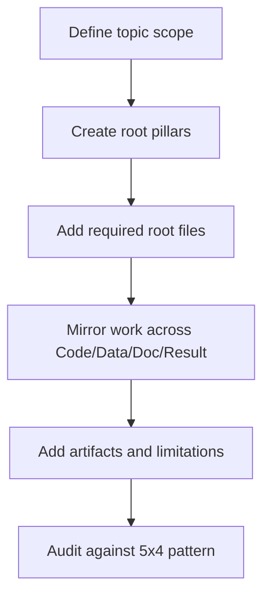

# How to: Topic Architecture and the 5x4 Grid

This document defines the permanent folder architecture for UET research topics.

It replaces informal folder growth with a predictable structure that supports auditability,
reuse, and scientific traceability.

## Purpose

Define the standard folder layout for research topics so code, data, docs, and artifacts can
be understood and audited quickly.

## When to use

Use this file when:

- creating a new numbered topic
- repairing a topic whose folders grew organically
- mapping where a new file should live
- checking whether a support workspace is being confused with a research topic

## Workflow summary



## Responsibility matrix

| Pillar | Primary responsibility | Typical outputs |
| :-- | :-- | :-- |
| `Doc/` | explanation and analysis | topic notes, structured analysis |
| `Ref/` | source registry | bibliography notes, PDFs, DOI comments |
| `Data/` | local inputs and provenance | raw or normalized topic data |
| `Code/` | executable logic | engines, proofs, research scripts, visualization |
| `Result/` | evidence products | figures, artifacts, curated showcase, logs |

## 1. Root pillars

Every numbered research topic should use these root folders:

- `Doc/`
- `Ref/`
- `Data/`
- `Code/`
- `Result/`

At the topic root, also include:

- `README.md`
- `METHOD.md`
- `DATA_MANIFEST.md`
- `VERIFICATION_SPEC.md`
- `BASELINE_COMPARISON.md`
- `LIMITATIONS.md`

## 2. Standard role of each pillar

| Pillar | Role |
| :-- | :-- |
| `Doc/` | topic-specific analysis and narrative |
| `Ref/` | references, bibliography notes, and source registry |
| `Data/` | local data packages and metadata |
| `Code/` | engines, proofs, research scripts, comparators, visualization |
| `Result/` | figures, showcase assets, logs, and reproducibility artifacts |

## 3. Internal sub-structure

The standard research sub-structure is:

```text
Code/
  01_Engine/
  02_Proof/
  03_Research/
  04_Competitor/
  05_Visualization/

Data/
  01_Engine/
  02_Proof/
  03_Research/
  04_Competitor/

Doc/
  01_Engine/
  02_Proof/
  03_Research/
  04_Competitor/

Result/
  01_Showcase/
  02_Figures/
  _Logs/
  artifacts/
```

`Ref/` is intentionally flatter than the other pillars.

## 4. Mirror rule

Where possible, topic structure should mirror across pillars.

Example:

- `Code/03_Research/Research_Galaxy_Rotation.py`
- `Data/03_Research/sparc_data.json`
- `Doc/03_Research/ANALYSIS_Research_Galaxy_Rotation.md`
- `Result/artifacts/galaxy_rotation_validation.json`

The exact filenames do not have to match mechanically, but the mapping must be obvious.

## 5. Topic root files

These files are not optional for a structured topic:

- `README.md`
- `METHOD.md`
- `DATA_MANIFEST.md`
- `VERIFICATION_SPEC.md`
- `BASELINE_COMPARISON.md`
- `LIMITATIONS.md`

They exist to stop critical information from being buried across many folders.

## 6. Support workspaces

Not every folder under `docs/topics/` is a numbered research topic.

Supporting workspaces such as `For Work` or `General` may follow looser internal structure,
but they must not be confused with validated numbered topics.

## 7. Anti-patterns

Do not:

- hide datasets inside `Ref/`
- hide results inside `Code/`
- scatter public claim language across raw log files
- keep only one giant README without the required topic root files
- treat support workspaces as if they were validated numbered topics

## Naming pattern table

| Location | Pattern |
| :-- | :-- |
| topic root | `0.X_Topic_Name/` |
| code engine | `Code/01_Engine/Engine_<name>.py` |
| code proof | `Code/02_Proof/Proof_<name>.py` |
| code research | `Code/03_Research/Research_<name>.py` |
| analysis note | `Doc/03_Research/ANALYSIS_<scope>.md` |
| artifact | `Result/artifacts/<topic>_validation.json` |

## Key rules

- numbered topics use the standard pillars and root files
- support workspaces may be looser, but must stay visibly distinct
- pillar mirroring should make file relationships obvious
- evidence outputs belong in `Result/`, not inside code folders

## Common failure modes

- datasets hidden in `Ref/` or code outputs hidden in `Code/`
- missing root files, so assumptions and limits disappear into subfolders
- mismatched names that break the trace from code to data to result to doc
- treating `For Work` as a topic rather than a standards workspace

## Checklist

- [ ] root pillars are present and correctly named
- [ ] required topic root files exist
- [ ] code, data, docs, and results mirror each other where practical
- [ ] artifact paths are obvious and stable
- [ ] support workspaces are not presented as validated topics
