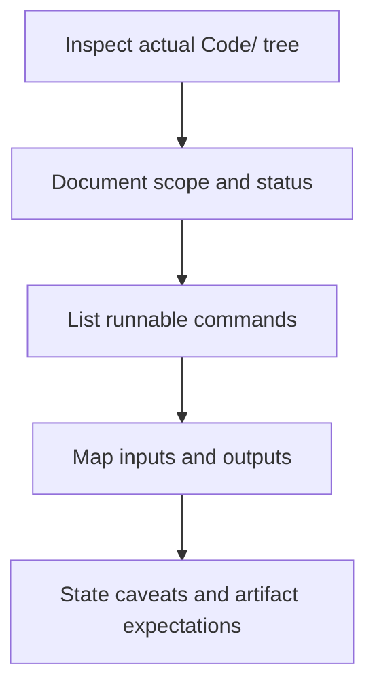

# How to: Code README Standard

This guide defines the standard for `Code/README.md` files inside a topic.

## Purpose

`Code/README.md` is not marketing text.

Its job is to tell a reviewer:

- what code exists
- what each part does
- how to run it
- what data it expects
- what outputs it should generate
- whether the code is exploratory, benchmark-oriented, or verification-oriented

## When to use

Use this file when:

- documenting a topic's `Code/` pillar
- adding or renaming runnable scripts
- making reruns easier for future humans or AI
- checking whether code status wording is honest

## Workflow summary



## Directory documentation matrix

| Section | What must be captured |
| :-- | :-- |
| scope | what the code is trying to do |
| directory map | only folders that actually exist |
| run commands | repo-root relative commands that matter |
| input dependencies | data, refs, core modules |
| outputs | figures, artifacts, logs |
| formula registry | core equations, variable names, units, and status |
| caveats | exploratory, fitted, unstable, benchmark-only notes |

## Required sections

### 1. Topic and code scope

- topic name
- short description of what the code is trying to do
- status summary using repository-approved language

### 2. Directory map

List the actual directories that exist, for example:

```text
Code/
  01_Engine/
  02_Proof/
  03_Research/
  04_Competitor/
  05_Visualization/
```

Do not document folders that do not exist just because they are part of an ideal template.

### 3. Run commands

- use repo-root relative paths
- list runnable scripts that matter
- note if a script is experimental only

### 4. Input dependencies

- local data files
- topic references
- shared core modules

### 5. Output expectations

- expected figures
- expected artifacts
- expected logs

### 6. Status and caveats

- whether code is benchmark, derivation, calibration, or visualization
- whether it is expected to produce reproducible artifacts

### 7. Formula and unit registry

For any important scientific script, document:

- the main formula or calculation path
- the variables it uses
- units for dimensional variables
- conversion steps when units change
- whether each relation is `derived`, `heuristic`, `source-locked constant`, or `open`

Example registry fields:

| Formula element | What to record |
| :-- | :-- |
| `m_W = M_Z * sqrt(1 - sin2_theta_W)` | relation type, variables, units |
| `bridge_factor = 1.18` | why it exists, whether derived or heuristic |
| `m_W = 80379.0` | source, units, and whether it is benchmark input |

If the topic has more than one important scientific relation, prefer a dedicated
`FORMULA_AUDIT.md` at the topic root and link to it from `Code/README.md`.

## Naming convention

- `Engine_*.py` for solver or model engines
- `Proof_*.py` for derivation or formal-check code
- `Research_*.py` for empirical or topic-oriented comparison scripts
- `Competitor_*.py` or `Baseline_*.py` for comparators
- `Vis_*.py` for explicit visualization tools

## Required honesty rules

- If a script is exploratory, say so.
- If a script is calibration-aware, say so.
- If a script writes directly to result folders, document that behavior.
- If a script is not currently stable, do not mark it as verification.
- If a script contains heuristic bridges or anchored constants, label them.
- If a script relies on unit conversion, document the conversion explicitly.

## What not to do

- do not report `PASS` counts unless those counts come from a real run
- do not claim all scripts were tested if they were not
- do not call benchmark code a proof engine

## Run command examples

Use repo-root relative commands and keep them concrete.

```powershell
python docs/topics/0.1_Galaxy_Rotation_Problem/Code/03_Research/Research_Galaxy_Rotation.py
python docs/topics/0.3_Cosmology_Hubble_Tension/Code/03_Research/Research_Hubble_Comparison.py
python docs/topics/0.10_Fluid_Dynamics_Chaos/Code/02_Proof/Proof_Turbulence_Benchmarks.py
```

Document expected outputs beside the commands, such as:

- `Result/artifacts/<topic>_validation.json`
- `Result/02_Figures/<figure_name>.png`
- `_Logs/<run_name>.log`

## Key rules

- document real scripts, not imaginary template folders
- keep commands runnable from repo root
- state whether fitting or calibration is involved
- say where outputs land and whether artifacts are expected

## Common failure modes

- command examples are missing, so nobody can rerun the work quickly
- code README describes an ideal structure instead of the real one
- exploratory scripts are presented as verification scripts
- outputs are undocumented, so artifacts become hard to audit

## Checklist

- [ ] scope and status are stated clearly
- [ ] directory map matches the real folder contents
- [ ] runnable commands are listed for important scripts
- [ ] inputs and outputs are named explicitly
- [ ] core formulas and unit handling are documented
- [ ] caveats and reproducibility expectations are honest
