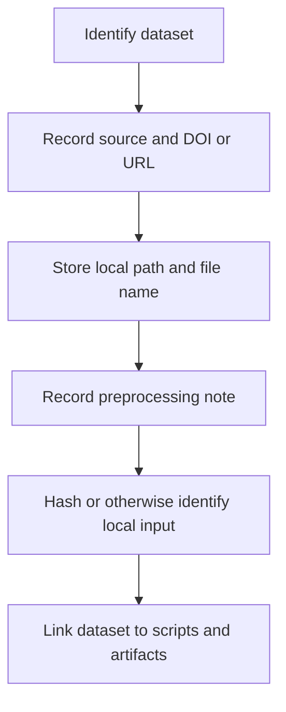

# How to: Data Standard

This document defines the standard for the `Data/` pillar in every UET topic.

## Core principle

Data must be traceable.

If a result depends on a dataset, a reviewer must be able to answer:

- what the dataset is
- where it came from
- what was changed
- where the local copy lives

## Purpose

Define the minimum provenance and structure requirements for topic data so claims can be
audited and rerun against known inputs.

## When to use

Use this file when:

- adding a new dataset to a topic
- documenting local working copies
- reviewing dataset provenance before making claims
- checking whether a topic can be reproduced internally

## Workflow summary



## Provenance matrix

| Field | Why it matters |
| :-- | :-- |
| source | tells where the data came from |
| DOI or URL | makes the source inspectable |
| license or terms | clarifies allowed use |
| original file name | preserves source identity |
| local path | tells what was actually used |
| preprocessing note | explains transformations |
| topics used | shows where the dependency matters |
| unit system | prevents silent dimensional mistakes |
| benchmark role | says whether the data is a gate, diagnostic, or exploratory input |

## 1. Data structure

Use the topic mirror structure where practical:

```text
Data/
  01_Engine/
  02_Proof/
  03_Research/
  04_Competitor/
```

## 2. Required provenance fields

Every structured topic must have a `DATA_MANIFEST.md` or equivalent that records:

- source
- DOI or URL
- license or usage terms if known
- original file name
- local path
- preprocessing note
- topic(s) that use the dataset
- unit system or unit convention if the data is dimensional
- benchmark role for each important input

## 3. File formats

- Prefer `.json` for structured repository data
- Use `.csv` or `.tsv` for tabular raw data
- Use `.npy` or `.h5` only when scale justifies binary format

## 4. Metadata discipline

Do not treat local convenience files as if they were the upstream authoritative dataset.

If the repository uses a working copy, say:

- `internal working copy`
- `normalized repository copy`
- `topic-local package`

Do not silently imply the local file is the complete upstream source if that has not been
verified.

## 5. Hashing and reproducibility

Where possible, verification workflows should compute a dataset hash for the local input used
in the run artifact.

## 5A. Unit discipline for data

If a dataset contains dimensional values, the manifest must say:

- the source unit
- the runtime unit used in code
- the conversion step if they differ

Do not assume a reviewer can infer whether a column is `kg`, `GeV`, `MeV`, `m/s`, or
dimensionless from the filename alone.

## 6. Anti-patterns

Do not:

- hide data inside `Code/`
- store scientific source files only in `Ref/`
- use unlabeled `final_data.json` style names
- omit provenance because the source is "well known"

## Naming pattern table

| Data class | Preferred naming style |
| :-- | :-- |
| raw table | descriptive source-aware `.csv` or `.tsv` |
| normalized repository copy | `<source>_<topic>_normalized.json` |
| research subset | `<topic>_<subset>_selection.json` |
| hash record in artifact | dataset hash or stable identifier field |

## Run command examples

These commands belong in practical workflows when data preparation is script-driven.

```powershell
python docs/scripts/audit/audit_topic_standards.py
python docs/topics/0.1_Galaxy_Rotation_Problem/Code/03_Research/Research_Galaxy_Rotation.py
```

Expected result:

- the script names the local data input it used
- the run artifact records a dataset hash or stable identifier

## Key rules

- provenance is mandatory for important datasets
- local working copies must be labeled honestly
- data files should be named descriptively, not emotionally
- verification workflows should preserve input identity in artifacts

## Common failure modes

- local convenience copy is presented as if it were the upstream original
- datasets are scattered with no manifest or preprocessing note
- naming like `final_final_use_this.csv` makes provenance impossible to track
- artifact records omit which concrete input was actually used

## Checklist

- [ ] dataset source and DOI or URL are recorded
- [ ] local path and original file name are captured
- [ ] preprocessing note exists where transformations occurred
- [ ] dataset identity is linked to scripts or artifacts
- [ ] unit system and benchmark role are explicit for important inputs
- [ ] file naming is descriptive and stable
