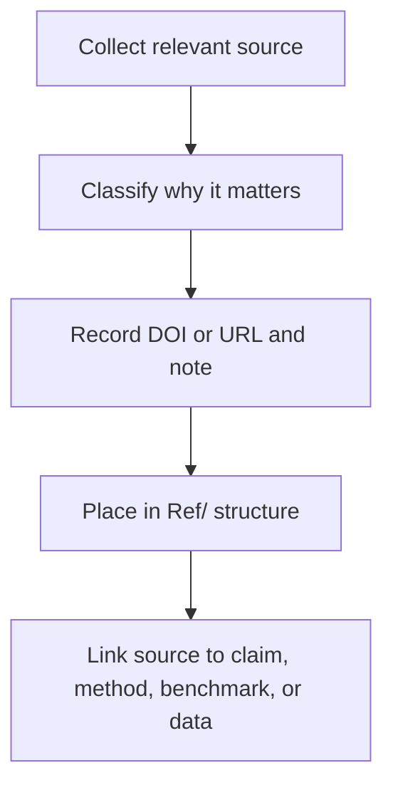

# How to: Reference Standard

This document defines the standard for the `Ref/` pillar.

## Goal

References should help both humans and code understand where topic evidence comes from.

## Purpose

Define how references support topic claims, methods, and baselines instead of acting as
decorative citation lists.

## When to use

Use this file when:

- building or cleaning a topic `Ref/` folder
- deciding what metadata to capture for sources
- linking references to claims, methods, or datasets
- preparing bibliography material for a paper

## Workflow summary



## Source role matrix

| Source type | What it should justify |
| :-- | :-- |
| benchmark paper | comparison target or accepted metric |
| theory paper | formal background or alternative mechanism |
| data source | provenance of the dataset |
| review article | problem framing and literature positioning |
| local PDF copy | convenient access, not a substitute for citation metadata |

## 1. Recommended structure

`Ref/` should stay relatively flat:

```text
Ref/
  BIBLIOGRAPHY_ANALYSIS.md
  REFERENCES.py
  PDF_Downloads/
```

You may add a topic-local note file when necessary, but avoid deep nesting unless there is a
clear reason.

## 2. What belongs in Ref

- reference summaries
- DOI notes
- topic-specific bibliography comments
- optional scripts that automate reference fetching
- local PDF copies when allowed

## 3. What does not belong in Ref

- primary numeric working datasets
- plots or figures
- raw benchmark outputs
- unrelated notes that should live in `Doc/`

## 4. Reference quality standard

For every important source, capture at least:

- citation name
- DOI or URL
- why this source matters to the topic
- whether it is a benchmark, theoretical source, or data source

## 5. Bibliography philosophy

References are not decoration.

Each cited source should either:

- constrain a claim
- define a benchmark
- explain a comparison target
- justify a method assumption

## Naming pattern table

| Item | Preferred style |
| :-- | :-- |
| bibliography note | `BIBLIOGRAPHY_ANALYSIS.md` |
| helper script | `REFERENCES.py` |
| local PDF folder | `PDF_Downloads/` |
| topic note | descriptive source-aware note filename |

## Key rules

- every important reference should have a reason for existing
- DOI or URL should be captured whenever possible
- references should connect to claims, methods, baselines, or data
- `Ref/` is not a storage bin for unrelated topic material

## Common failure modes

- long citation lists with no explanation of relevance
- papers copied locally with no DOI or URL note
- data sources cited loosely while the actual benchmark remains unidentified
- topic notes placed in `Ref/` when they belong in `Doc/`

## Checklist

- [ ] each important source has a DOI or URL and a role note
- [ ] references are linked to claims, methods, benchmarks, or datasets
- [ ] `Ref/` structure stays understandable without deep nesting
- [ ] local PDF storage does not replace citation metadata
- [ ] unrelated notes are kept out of `Ref/`
