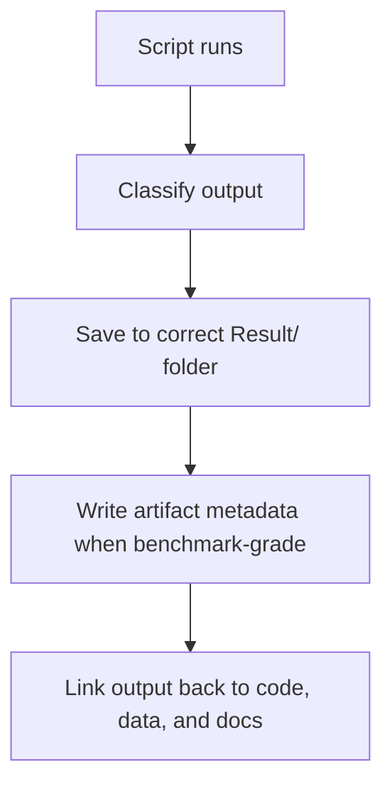

# How to: Result Standard

This document defines the standard for the `Result/` pillar.

## Core principle

Results are evidence products, not storage clutter.

Every output should clearly belong to one of these classes:

- showcase asset
- scientific figure
- raw log
- verification artifact

## Purpose

Define how outputs should be saved, classified, and described so evidence remains visible and
machine reruns stay auditable.

## When to use

Use this file when:

- saving outputs from research or proof scripts
- deciding whether an output is a figure, showcase asset, log, or artifact
- writing result documentation
- checking that verification workflows persist enough metadata

## Workflow summary



## Artifact class matrix

| Output class | Folder | Primary audience |
| :-- | :-- | :-- |
| showcase asset | `01_Showcase/` | overview, presentation, outreach |
| scientific figure | `02_Figures/` | analysis and papers |
| raw log | `_Logs/` | debugging and run trace |
| verification artifact | `artifacts/` | reproducibility and audit |

## 1. Standard structure

```text
Result/
  01_Showcase/
  02_Figures/
  _Logs/
  artifacts/
```

## 2. Meaning of each folder

| Folder | Purpose |
| :-- | :-- |
| `01_Showcase/` | high-quality visuals for presentation or overview |
| `02_Figures/` | scientific figures used for analysis and comparison |
| `_Logs/` | raw machine-oriented run outputs |
| `artifacts/` | normalized reproducibility outputs such as JSON verification records |

## 3. Artifact rule

If a script is treated as a verification workflow, it should save a JSON artifact into
`Result/artifacts/`.

That artifact should include:

- timestamp
- topic
- version
- dataset hash or input identifier
- metrics
- thresholds
- config
- notes

## 4. Naming rule

Use descriptive names.

Good:

- `galaxy_rotation_validation.json`
- `hubble_tension_resolution.png`
- `mass_gap_validation.json`

Bad:

- `output.png`
- `test_final2.json`
- `img01.png`

## 5. Retention rule

- `_Logs/` may grow and may require cleanup policies
- `artifacts/` should remain interpretable after the run is forgotten
- `01_Showcase/` should contain only deliberately curated outputs

## 6. Anti-patterns

Do not:

- save important evidence only into `_Logs/`
- save figures directly into the root `Result/`
- treat social-media images as the primary evidence record

## Run command examples

```powershell
python docs/topics/0.1_Galaxy_Rotation_Problem/Code/03_Research/Research_Galaxy_Rotation.py
python docs/topics/0.21_Yang_Mills_Mass_Gap/Code/03_Research/Research_Mass_Gap.py
```

Typical expectation after a successful run:

- a figure appears in `Result/02_Figures/` if plotting is part of the workflow
- a machine-readable JSON artifact appears in `Result/artifacts/`
- logs remain in `_Logs/` if logging is enabled

## Naming pattern table

| Output | Preferred style |
| :-- | :-- |
| validation artifact | `<topic>_validation.json` |
| comparison figure | `<topic>_<comparison>.png` |
| showcase render | `Cine_<topic>.mp4` or equivalent |
| log | descriptive timestamped run name |

## Key rules

- evidence-grade outputs belong in stable, named locations
- benchmark workflows should emit machine-readable artifacts
- logs support evidence, but do not replace artifacts
- showcase media should never become the only record of a claim

## Common failure modes

- important results exist only in screenshots or logs
- artifact files omit thresholds, config, or dataset identity
- root `Result/` becomes a dumping ground with no classes
- social or presentation renders are treated as scientific proof

## Checklist

- [ ] every output class is saved in the correct folder
- [ ] verification workflows produce a JSON artifact when appropriate
- [ ] artifact metadata includes inputs, metrics, thresholds, and version
- [ ] descriptive names are used consistently
- [ ] logs support, but do not replace, evidence records
