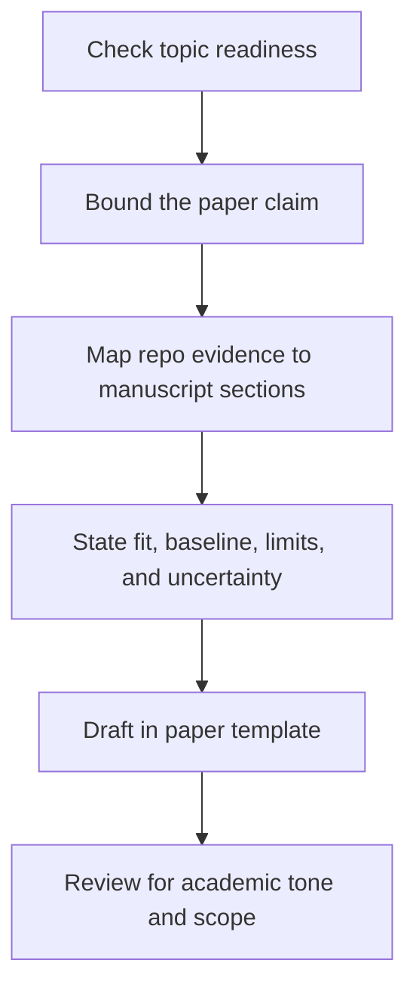

# How to: Paper Standard

This document defines how UET work should be transformed into academic manuscript material.

## Core policy

One topic is not automatically one paper.

A topic becomes paper-ready only when it has:

- a clearly bounded claim
- explicit assumptions
- stable method description
- evidence that is legible to an external reader
- limitations stated honestly

## Purpose

Define when a topic is mature enough for paper conversion and how repo material should be
translated into manuscript structure without inflating claims.

## When to use

Use this file when:

- deciding whether a topic is paper-ready
- planning a manuscript from topic materials
- cleaning a draft that feels too promotional
- mapping repo artifacts into academic sections

## Workflow summary



## Paper readiness matrix

| Gate | Must be true before drafting seriously |
| :-- | :-- |
| bounded claim | paper asks one focused question |
| explicit method | method can be described without hand-waving |
| evidence package | data, scripts, and results are legible |
| baseline clarity | comparisons are stated explicitly |
| limitations | uncertainty and scope limits are written |

## Recommended paper strategy

Prefer modular papers over giant manifesto papers.

That means:

- one focused question
- one clear mechanism
- one explicit benchmark or evidence package
- one realistic claim scope

## Standard paper sections

1. Title
2. Abstract
3. Introduction
4. Related work or literature positioning
5. Theoretical framework
6. Methodology
7. Results
8. Discussion
9. Limitations
10. Conclusion
11. References

## Mandatory paper honesty

Papers must explicitly state:

- whether parameters were fitted
- whether results are internal only
- what baseline was used
- what part remains speculative

## What must not happen

Do not:

- convert repository ambition into paper certainty
- hide benchmark dependence
- imply theorem-level proof from numerical agreement alone
- mix philosophy, outreach, and methods in one undifferentiated manuscript

## Visual logic

Figures are encouraged, but they must clarify rather than decorate.

Use figures to show:

- comparison structure
- error or fit behavior
- workflow
- baseline contrast

## Template usage

Use [22_UET_PAPER_TEMPLATE.tex](./22_UET_PAPER_TEMPLATE.tex) only after the topic has
already become structurally mature.

## Run command examples

These commands are examples for building or checking a manuscript workflow when a LaTeX
environment exists locally.

```powershell
pdflatex docs/topics/For\ Work/22_UET_PAPER_TEMPLATE.tex
bibtex 22_UET_PAPER_TEMPLATE
pdflatex docs/topics/For\ Work/22_UET_PAPER_TEMPLATE.tex
```

If a local TeX toolchain is not installed, keep the manuscript in source review mode and do
not claim build validation yet.

## Repo-to-paper mapping

| Repo artifact | Paper section |
| :-- | :-- |
| `README.md` | scoped summary and contribution framing |
| `METHOD.md` | methodology |
| `DATA_MANIFEST.md` | data integrity paragraph or appendix |
| `VERIFICATION_SPEC.md` | benchmark and evaluation procedure |
| `BASELINE_COMPARISON.md` | related work and comparison framing |
| `LIMITATIONS.md` | limitations and discussion |
| `Result/02_Figures/` | result figures |
| `Result/artifacts/` | reproducibility appendix support |

## Key rules

- paper scope must be narrower than repo ambition
- fitted parameters must be disclosed explicitly
- internal evidence must stay labeled as internal
- methods, results, and limitations should not be blended into one narrative block

## Common failure modes

- converting a repo roadmap into a single oversized paper
- removing caveats to make the abstract sound stronger
- implying theorem-level proof from numerical agreement
- drafting a paper before the topic even has a stable evidence package

## Checklist

- [ ] the paper claim is bounded and realistic
- [ ] fit or calibration steps are disclosed
- [ ] baseline and comparison framing are explicit
- [ ] limitations remain in the draft
- [ ] the manuscript source is linked back to the structured topic package
