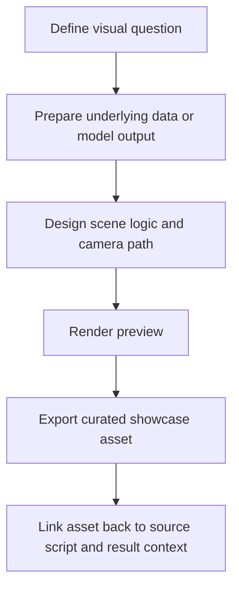

# UET Cinematic Visualization Standard

This document defines the standard for creating cinematic mathematical animations for UET
research and showcase work.

## Purpose

Provide a consistent standard for turning scientific logic into clear visual narratives
without confusing presentation media with evidence itself.

## When to use

Use this file when:

- preparing a showcase animation for a topic
- creating Manim or equivalent visualization scripts
- deciding what belongs in `05_Visualization` and `01_Showcase`
- checking that cinematic outputs stay downstream of real data or model logic

## Workflow summary



## Visualization matrix

| Layer | Standard |
| :-- | :-- |
| source logic | visualization should come from real data or model output |
| script location | `Code/05_Visualization/` |
| output location | `Result/01_Showcase/` |
| scientific role | explanatory or presentation support, not primary proof |
| notation | use LaTeX or equivalent for formulas when relevant |

## The cinematic philosophy

Make hidden structure easier to see, not more dramatic than it really is.

- contrast should support clarity
- motion should reveal logic, not distract from it
- typography should remain professional and readable

## Aesthetic design system

| Element | Color code | Recommended usage |
| :-- | :-- | :-- |
| `UET_CYAN` | `#00e5ff` | primary field logic and informational gradients |
| `UET_MAGENTA` | `#ff00ff` | hidden-state or entropy-related accents |
| `UET_GOLD` | `#ffd700` | constants, highlights, proof points |
| background | `#000000` | dark backdrop when high contrast helps readability |

## Technical stack

- engine: Manim Community Edition or equivalent documented tool
- upstream logic: precompute arrays or structured data outside the scene when possible
- render target: 1080p or 1440p when the workflow and hardware support it

## Practical workflow

1. Define the limitation in the static representation.
2. State what motion or geometry is needed to explain it.
3. Precompute the data or field values outside the scene when possible.
4. Build the visualization script in `Code/05_Visualization/`.
5. Export curated outputs into `Result/01_Showcase/`.

## Run command examples

```powershell
manim -pqh docs/topics/0.1_Galaxy_Rotation_Problem/Code/05_Visualization/Cine_Galaxy_Rotation.py GalaxyRotationScene
manim -pqh docs/topics/0.3_Cosmology_Hubble_Tension/Code/05_Visualization/Cine_Hubble_Comparison.py HubbleComparisonScene
```

If Manim is not installed locally, keep the script documented and mark rendering as pending
instead of pretending showcase validation already happened.

## Naming pattern table

| Item | Preferred style |
| :-- | :-- |
| cinematic script | `Cine_<Topic>.py` |
| showcase render | `Cine_<Topic>.mp4` |
| preview render | `Cine_<Topic>_preview.mp4` |

## Key rules

- cinematic media supports explanation; it does not upgrade evidence status
- the visualization should trace back to a real script and upstream source logic
- scene styling should be consistent enough to feel like one project
- rendered outputs belong in curated showcase locations, not mixed into scientific figures

## Common failure modes

- animation is impressive but disconnected from the actual model or data
- showcase video is cited as evidence instead of the underlying artifact or figure
- heavy scene logic hides the true computation path
- render outputs are scattered with no stable naming or source link

## Checklist

- [ ] visual question is stated clearly
- [ ] upstream data or model source is identified
- [ ] script and output paths follow naming conventions
- [ ] rendered media is treated as explanatory, not primary proof
- [ ] scene style remains readable and project-consistent
