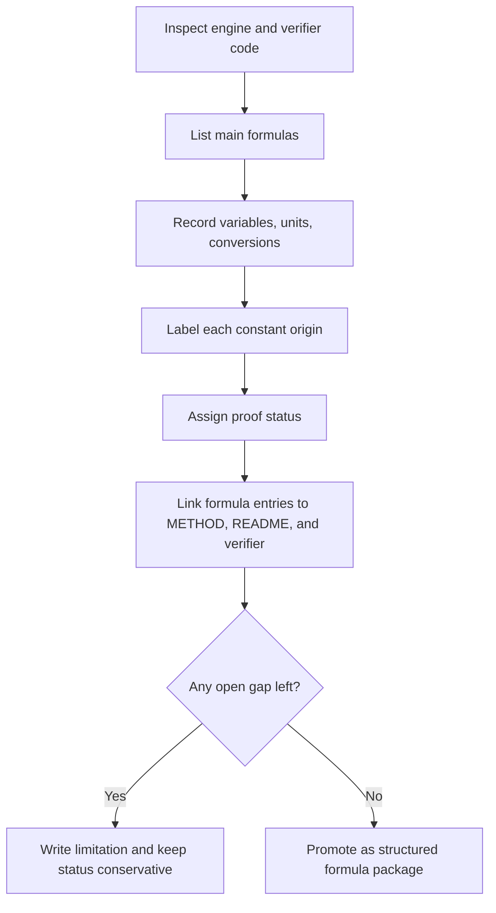

# Formula Audit Standard

This guide defines how UET topics must document formulas, constants, units, and proof
status before scientific wording is promoted.

## Purpose

Make every important calculation auditable.

A reviewer should be able to answer:

- what is being computed
- which variables are used
- what units they carry
- where each constant came from
- whether the relation is derived, heuristic, benchmark-fed, or still open

## When to use

Use this file when:

- a topic contains scientific equations or calculation paths
- a constant appears in code without an obvious provenance trail
- a topic moves from draft notes into a structured topic
- AI or humans are rewriting method sections
- a bug suggests a unit mismatch or hidden assumption

For foundational equations or code under docs/core/, also apply EQUATION_RESEARCH_AND_PHYSICAL_CORRESPONDENCE_STANDARD.md. Formula audit alone does not establish a standard-physics correspondence or an observable mapping.

## Workflow summary

## Formula audit matrix

| Field | Required question |
| :-- | :-- |
| `formula_id` | what calculation path is this entry tracking? |
| `relation` | what exact formula or pseudo-formula is used? |
| `variables` | what does each symbol mean? |
| `units` | what units must each dimensional quantity use? |
| `conversion_steps` | where do units change and how? |
| `constant_origin` | source-locked constant, derived term, heuristic bridge, or benchmark anchor? |
| `proof_status` | identity, derived, checked local, heuristic, or open? |
| `verification_role` | gate, benchmark input, diagnostic-only, or exploratory? |
| `failure_mode` | what breaks if this term is wrong? |
| `next_hardening_step` | what would improve scientific confidence next? |

## Standard proof-status vocabulary

| Status | Meaning |
| :-- | :-- |
| `identity` | algebraic identity or exact definition |
| `source-locked constant` | externally sourced constant with declared provenance |
| `derived` | relation is derived inside current topic logic and documented |
| `checked local` | locally curated reference checked against a source |
| `heuristic bridge` | structured bridge term exists but is not yet first-principles closed |
| `benchmark anchor` | fixed benchmark value used for comparison or normalization |
| `open` | topic still lacks a justified derivation or provenance path |

## Allowed constant-origin classes

| Class | Use when |
| :-- | :-- |
| `source_locked_physics_constant` | PDG, CODATA, NuFIT, DOE, or equivalent upstream value |
| `source_locked_benchmark_input` | externally published comparator used in verification |
| `topic_derived_relation` | relation produced by topic logic and documented in METHOD |
| `checked_local_reference` | local package checked against a source but not directly machine-mapped |
| `heuristic_bridge` | bridge/correction factor exists but still needs derivation |
| `benchmark_anchor` | fixed value used to stabilize a comparison layer |
| `open_placeholder` | unresolved term that must not be hidden |

## Minimum output for a structured topic

At minimum, a topic with scientific code should have:

- `METHOD.md`
- `VERIFICATION_SPEC.md`
- `LIMITATIONS.md`
- `FORMULA_AUDIT.md` or an equivalent dedicated formula registry

## Required entry pattern

Every important formula entry should state:

1. the calculation path
2. the variables and meanings
3. the unit system
4. the conversion steps
5. the origin class of constants
6. the proof status
7. the verification role
8. the current limitation

## Example decision table

| Situation | Allowed label | Not allowed |
| :-- | :-- | :-- |
| PDG mass copied into engine | `source-locked constant` | `derived` |
| local reference cross-checked manually | `checked local` | `source-locked constant` |
| correction factor exists with physical story but no derivation | `heuristic bridge` | `proved` |
| baseline value normalizes a decay relation | `benchmark anchor` | `fundamental constant` |
| formula has unresolved unit path | `open` with limitation | silent omission |

## Key rules

- No important formula should remain undocumented once a topic is `Structured`.
- Units must be explicit whenever dimensional quantities appear.
- Hidden benchmark anchors are not allowed.
- Heuristic bridges are allowed only when labeled honestly.
- A formula registry must map back to real code or artifacts.

## Common failure modes

- a constant is treated like a derivation because it gives good output
- units are implicit in code comments but not written in docs
- a benchmark anchor is mistaken for a first-principles constant
- README language sounds stronger than the formula registry supports
- AI turns a desired mechanism into a pseudo-derivation without exposing the gap

## Checklist

- [ ] main formulas are listed explicitly
- [ ] variables and units are defined
- [ ] conversion steps are written down
- [ ] constants are labeled by origin class
- [ ] proof status is assigned honestly
- [ ] each important formula has a failure mode and next hardening step
