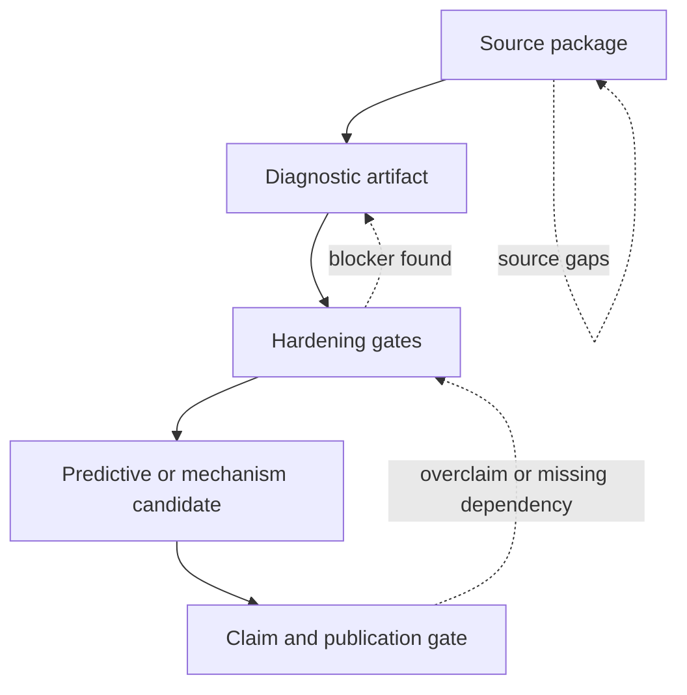

# Research Hardening Workflow

This document defines the standard hardening workflow for moving a topic from
loosely organized research into an auditable package with explicit blockers.

It is not a promotion rule by itself. It is the step-by-step operating method
used to make later readiness and claim decisions faster, clearer, and more
repeatable.

## Purpose

Provide a shared hardening sequence so collaborators do not rebuild audit logic
from scratch for every topic.

Use this workflow to answer:

- what should be done first
- what should be recorded at each step
- which artifacts turn ambiguity into named blockers
- how to keep progress visible without inflating claims

## When to use

Use this file when:

- a topic feels stuck between draft and reproducible
- evidence exists but is scattered across code, notes, and artifacts
- a verifier is growing but claim boundaries are still vague
- you need to decide whether to deepen a topic or leave it source-ready
- multiple topics need the same audit pattern

## Workflow summary

## Core idea

Hardening is the work of turning unclear progress into explicit, auditable state.

The main outputs are not only better prose. The main outputs are:

- source manifests
- hashes and local paths
- verifier artifacts
- blocker reasons
- dependency maps
- claim boundaries
- next required artifacts

## Hardening stages

| Stage | Main question | Required output | Typical blocker |
| :-- | :-- | :-- | :-- |
| `Source packaging` | do we know what inputs we are using? | source manifest, DOI or URL, local path, hash, units | source family unclear |
| `Diagnostic artifact` | can we rerun and inspect the current behavior? | verifier, metrics, thresholds, artifact JSON | no stable script or threshold |
| `Hardening gate` | do we know why the topic is not ready? | machine-readable gate with blockers | vague or narrative-only status |
| `Predictive candidate` | what exact model or operator would count as progress? | parameter policy, split manifest, acceptance harness | fitted diagnostic mistaken for prediction |
| `Claim gate` | what may be said publicly right now? | claim class, blocked phrases, publication checks | README outruns artifact |

## Standard sequence

### 1. Package sources first

Before adding stronger wording or new artifacts, record:

- source identity
- DOI or URL
- local path
- file hash where practical
- preprocessing note
- unit basis
- benchmark role

If a topic depends on a shared cache, record the exact shared path and why it is
used.

### 2. Make one stable diagnostic artifact

Before chasing broad theory claims, create one verifier that emits:

- input identity
- metric names
- thresholds
- result status
- notes and limitations

The first artifact may be diagnostic-only. That is acceptable as long as the
claim boundary says so clearly.

### 3. Add hardening gates

After the first artifact exists, add machine-readable gates for the main
blockers. Typical examples:

- source readiness gate
- formula provenance gate
- uncertainty readiness gate
- baseline comparator gate
- training or holdout split gate
- implementation provenance gate
- publication readiness gate

The goal is not to produce many gates. The goal is to ensure each major blocker
has a named home.

### 4. Separate diagnostics from candidate prediction

If a topic may later claim prediction, explicitly separate:

- calibration rows
- holdout rows
- external cross-check rows
- forbidden parameter sources
- accepted versus diagnostic parameter sets

Do not let the current fitted diagnostic lane silently become the future
predictive lane.

### 5. Define acceptance before implementation

Before calling a model, operator, or mechanism "accepted", define:

- required inputs
- required outputs
- parameter lock rules
- uncertainty rules
- residual-row schema if applicable
- baseline comparators
- blocked claims

This is where acceptance harnesses and preflight manifests belong.

### 6. Narrow blockers before broadening scope

If a topic is blocked, try to change:

- `missing` -> `evidence present but insufficient`
- `unclear blocker` -> `named blocker with required artifact`
- `broad readiness gap` -> `one preflight or provenance rule`

This counts as real progress because it shortens the path to the next move.

### 7. Upgrade public wording last

Only after the previous stages are stable should README, analysis, or paper
language be upgraded.

Hardening should usually change artifacts first, then documentation.

## Standard hardening wave

Use the following pattern for one hardening pass:

1. pick one blocker that currently controls the topic-level state
2. decide whether the pass is a source pass, artifact pass, gate pass, or
   claim-boundary pass
3. add or tighten the minimum manifest, gate, or verifier logic needed
4. rerun the relevant verifier only if the artifact-producing state changed
5. sync `README.md`, `LIMITATIONS.md`, `VERIFICATION_SPEC.md`, and
   `FORMULA_AUDIT.md` if the boundary moved
6. write one update-log entry with the verifier result and the remaining blocker
7. commit the wave as one scoped unit

This is the preferred way to speed up a difficult topic without losing audit
traceability.

## Wave completion rule

Do not treat a hardening wave as complete just because new prose or new files
exist.

A wave is complete when all of these are true:

1. the controlling blocker for that wave is narrower than before
2. the narrower blocker is visible in a machine-readable artifact, gate, or
   manifest
3. topic docs reflect the new blocker boundary
4. the local `UPDATE_LOG.md` states what now controls the next wave

If those four conditions are not met, the topic may be busier but it is not yet
harder in the research sense.

## Status reconstruction before a wave

Before choosing the next blocker, reconstruct the current topic state from
local evidence instead of prose memory.

Use this order:

1. root topic status sources such as `docs/topics/README.md` and relevant
   `docs/meta/` records
2. local `README.md`, `LIMITATIONS.md`, and `VERIFICATION_SPEC.md`
3. latest verifier artifact
4. machine-readable blocker gates, manifests, and dependency records
5. local `UPDATE_LOG.md` when the topic has already gone through several waves

If the sources disagree, do not average them together. Treat the latest stable
artifact and blocker gate wording as the controlling state for the current
pass, then bring documentation back into alignment.

## Multi-topic hardening strategy

When several topics are blocked at once, improve the shared workflow before
trying to deeply advance every topic in parallel.

Use this order:

1. identify the repeated ambiguity slowing several topics
2. tighten the shared rule in `For Work` or the repository guide
3. require one machine-readable blocker per active topic
4. prove the updated workflow in one pilot topic
5. roll the pattern out only after the pilot stays auditable

This is the standard way to increase research throughput without weakening
claim discipline.

If the same blocker wording or provenance ambiguity keeps reappearing, treat
that recurrence as a standards signal. The next useful move is often:

1. tighten the shared rule in `AGENTS.md` or `For Work`
2. define the blocker class in machine-readable language
3. require one pilot topic to expose that blocker cleanly
4. only then spread the pattern more broadly

This is how workflow repair becomes reusable instead of staying trapped inside
one topic.

## Progress reconstruction rule

When a collaborator asks why progress feels slow, answer from blocker
reconstruction first, not from file count, prose length, or time spent.

Use this order:

1. identify the current controlling blocker in the latest stable artifact or gate
2. identify whether the last wave narrowed that blocker or only added context
3. identify whether the local `UPDATE_LOG.md` makes the next controller explicit
4. only then decide whether the topic needs deeper research or shared workflow repair

If a status question cannot be answered from that sequence in under a minute,
the topic still needs status-hardening work before more theory expansion.

## What to optimize for

In a difficult topic, the goal of a wave is usually one of these:

- reduce ambiguity
- isolate the controlling blocker
- make the blocker reproducible
- stop a branch result from overclaiming for the whole topic
- prepare the next predictive or mechanism candidate cleanly

Trying to solve every weakness in one pass usually slows the topic down.

## Required hardening outputs

Every topic being actively hardened should aim to maintain:

- `README.md`
- `METHOD.md`
- `DATA_MANIFEST.md`
- `VERIFICATION_SPEC.md`
- `LIMITATIONS.md`
- `FORMULA_AUDIT.md` or equivalent
- at least one verification artifact in `Result/artifacts/`
- `UPDATE_LOG.md` once the topic enters repeated hardening waves

## Wave packet rule

For repeated hardening, treat one completed wave as a small packet with all of
these parts visible:

1. one controlling blocker identified
2. one artifact, gate, or manifest tightened
3. one verifier rerun if evidence-producing state changed
4. one doc sync to the new blocker boundary
5. one update-log entry naming the next controller
6. one scoped commit

If one of those parts is missing, the wave may still be useful, but it is not
yet closed as a standard hardening packet.
- at least one machine-readable blocker gate if the topic is not claim-ready

Recommended additions for predictive or operator-like work:

- parameter manifest
- parameter preflight or acceptance manifest
- training or holdout split manifest
- implementation provenance manifest
- publication readiness gate

## Choosing where to stop

Not every topic needs to become predictive or academic-ready immediately.

A topic may stop intentionally at:

- `Source-ready`
  Source package exists but model work is deferred.
- `Diagnostic-only`
  Verifier and artifact exist, but the lane is not prediction or validation.
- `Predictive-candidate-prep`
  Acceptance harness, parameter policy, and split exist, but no accepted model exists yet.

This is better than pretending every topic must progress to the same depth now.

## Log discipline

Hardening work should be visible across time.

Use an update log when:

- a topic is undergoing multiple waves of cleanup
- several manifests or gates are being added incrementally
- you want a human reader to understand what changed without diff-hunting

The update log does not replace artifacts or manifests.

Use the update log to record:

- what changed
- what verifier or audit was run
- what blocker narrowed
- what still remains open
- whether the claim boundary changed or stayed the same

Use [24_TEMPLATE_UPDATE_LOG.md](./24_TEMPLATE_UPDATE_LOG.md) as the standard
format.

Minimum expectation for a multi-wave topic:

- one entry per coherent hardening pass
- entries written after real work, not before
- verifier commands listed only when actually run
- blocker wording aligned with the artifact or gate wording
- the latest entry must make the next controlling blocker obvious to a new
  reviewer

## Anti-patterns

Do not:

- start with summary prose before source packaging
- treat one passing diagnostic threshold as external validation
- create blockers only in prose when a gate or manifest should exist
- add many bespoke manifests with no clear acceptance role
- use update logs as the only source of truth for status
- treat progress on one lane as if it upgrades the whole topic automatically

## Review questions

Before closing a hardening pass, ask:

1. What ambiguity was removed?
2. Which blocker is now machine-readable?
3. Which artifact or manifest was added?
4. Did any public wording change without stronger evidence?
5. What exact next artifact would unlock the next step?

## Key rules

- source packaging comes before promotion language
- one stable artifact is better than many partial ones
- blockers should be narrowed, not hidden
- diagnostic lanes must stay labeled as diagnostic
- acceptance conditions should be written before implementation is promoted
- update logs support coordination, but artifacts remain the main evidence

## Checklist

- [ ] source package is explicit enough for audit
- [ ] at least one stable artifact exists
- [ ] current blockers are machine-readable where practical
- [ ] diagnostics and predictive candidates are not conflated
- [ ] acceptance conditions are defined before strong promotion
- [ ] claim language still matches current evidence
- [ ] update log is used if the hardening work spans multiple waves
- [ ] each wave leaves a narrower blocker or a clearer claim boundary than before
