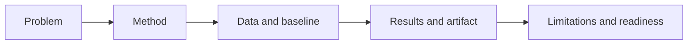

# Topic X.XX: [Topic Name]

## Purpose

[State what problem this topic exists to study.]

## When to use

- [New topic]
- [Topic normalization]
- [Readiness review]

## Workflow summary

## Topic matrix

| Field | Fill with |
| :-- | :-- |
| claim class | hypothesis, model, internal benchmark, external replication |
| baseline | comparator or published reference |
| artifact | result JSON or other reproducibility output |
| readiness | archived, draft, structured, reproducible internally, academic-ready |

## Problem

[Describe the exact scientific or engineering question.]

## Assumptions and scope

- [What is assumed?]
- [What is excluded?]
- [What is the claim boundary?]

## Data sources

- [Local path]
- [DOI or URL]
- [Provenance note]

## Method summary

- Engine: `[path]`
- Proof: `[path]`
- Research script: `[path]`
- Comparator: `[path]`

## Parameters and fitting status

- Fixed parameters: [list]
- Tunable parameters: [list]
- Fitting used: [Yes/No]
- If yes, explain where and why.

## Metrics and thresholds

- Metric: [name]
- Threshold: [value]
- Pass condition: [definition]

## Baselines

- [Comparator model or published benchmark]

## Limitations and open risks

- [Limitation 1]
- [Limitation 2]
- [Limitation 3]

## Reproducibility

- Command: `[command]`
- Artifact path: `[Result/artifacts/...json]`

## Current readiness status

Choose one:

- `Archived`
- `Draft`
- `Structured`
- `Reproducible internally`
- `Academic-ready`

## Checklist

- [ ] problem and scope are bounded
- [ ] assumptions and exclusions are explicit
- [ ] data and baseline are named
- [ ] metrics and thresholds are defined
- [ ] limitations and readiness are honest
