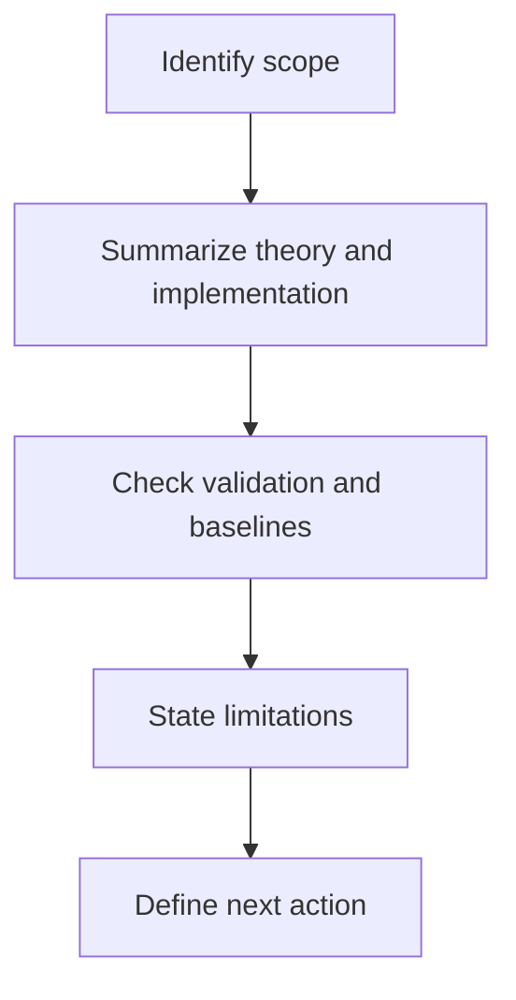

# ANALYSIS: [Topic or File Name]

> **File or Scope:** `[Path or topic name]`
> **Role:** `[Engine / Proof / Research / Competitor / Documentation]`
> **Evidence Layer:** `[Hypothesis / Interpretation / Model / Internal Benchmark / External Replication]`
> **Status:** `[Draft / Review / Final]`

## Purpose

[State why this analysis note exists and what question it is answering.]

## When to use

- [Reviewing one script or derivation]
- [Preparing a skeptic-facing analysis note]
- [Summarizing a benchmark or method]

## Workflow summary

## Review matrix

| Review axis | What to record |
| :-- | :-- |
| scope | exact file or topic under review |
| evidence layer | what level of support exists |
| formula status | derived, heuristic, source-locked constant, open |
| validation | inputs, metrics, thresholds, baseline |
| risk | limitation or skeptical attack point |
| next action | most useful immediate improvement |

## 1. Executive summary

- Problem:
- Method:
- Main result:
- Current confidence level:

## 2. Theory and assumptions

- What assumptions are active?
- Which UET terms or mechanisms are involved?
- Which parts are interpretive rather than formal?

## 3. Implementation or derivation summary

- Main workflow:
- Critical variables:
- Important dependencies:
- Unit system:
- Formula status:

## 4. Validation

- Inputs:
- Metrics:
- Thresholds:
- Baseline:
- Outcome:

## 5. Limitations

- [Limitation 1]
- [Limitation 2]

## 6. Reviewer questions

- What would a skeptical reviewer attack first?
- What evidence is still missing?
- What wording must stay conservative?
- Which constants are still bridges or anchors rather than derived quantities?
- Are there any hidden unit conversions or dimension mismatches?

## 7. Next step

- [Concrete next action]

## Checklist

- [ ] scope and role are named clearly
- [ ] theory and implementation summary stay separate
- [ ] formula status and unit handling are stated
- [ ] validation fields are filled in
- [ ] limitations are concrete
- [ ] next step is specific and useful
