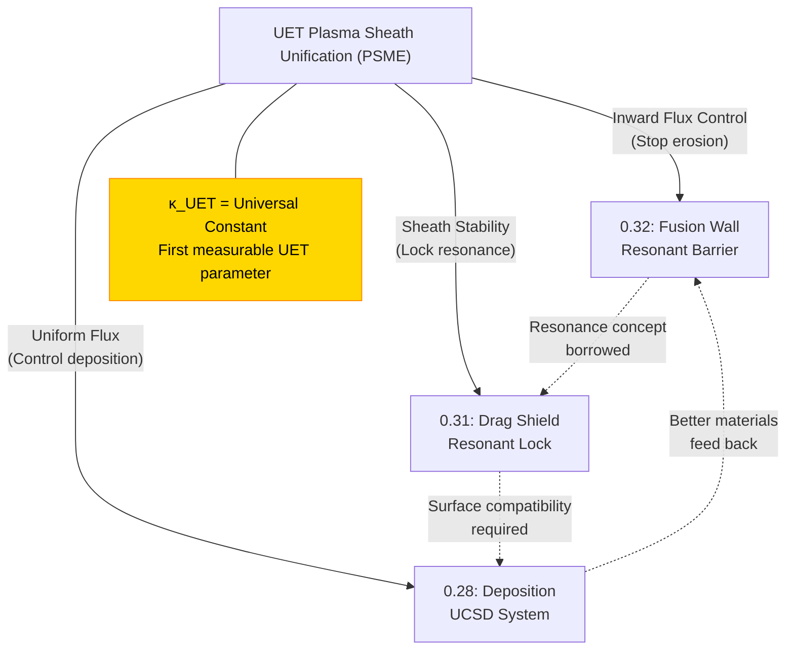

# Plasma Sheath Unification Theory (UET-PSU)

> **Type:** Cross-Topic Meta-Analysis
> **Topics Unified:** 0.28 (Materials) | 0.31 (Propulsion) | 0.32 (Fusion)
> **Status:** 🔵 Theoretical Proposal
> **Paper Potential:** ⭐️⭐️⭐️⭐️⭐️ — Foundational UET Contribution

---

## 📌 Executive Summary

> **"Plasma Sheath ไม่ใช่ 3 ปรากฏการณ์ที่แตกต่าง — มันคือปรากฏการณ์เดียวกันในระดับ Information Field ที่มีทิศทาง Gradient ต่างกัน"**

งานวิจัย UET ที่ผ่านมาพบ Plasma Sheath ใน **3 บริบท** ที่ดูเหมือนไม่เกี่ยวกัน:
1. **0.32:** Sheath กัดกร่อนผนังเตา Fusion (ศัตรู)
2. **0.31:** Sheath ลดแรงต้านยาน (เครื่องมือ)
3. **0.28:** Sheath ควบคุมการสะสมฟิล์มวัสดุ (กระบวนการ)

**ข้อเสนอ:** ทั้ง 3 คือ **"การอ่าน I-field Gradient เดียวกัน จากมุมที่ต่างกัน"**

---

## Phase 1: Deconstruct

### 1. ปัญหาของการมองแบบแยกส่วน (Fragmented View)

การที่งานวิจัยแต่ละหัวข้อพัฒนา "วิธีจัดการ Plasma Sheath" ของตัวเองโดยไม่ประสานกัน สร้างปัญหา:

- **0.32** พัฒนา Resonant Barrier เพื่อ "ผลัก" Sheath ออกจากผนัง
- **0.31** พัฒนา Ionization Field เพื่อ "สร้าง" Sheath รอบยาน
- **0.28** กำลังพัฒนา Sheath Engineering เพื่อ "ปั้น" Sheath ให้เป็นรูปทรงที่ต้องการ

ทั้งสามใช้สมการและพารามิเตอร์คนละชุด — ทำให้ความรู้ไม่ถ่ายทอดกันระหว่าง Topic

### 2. Analyze Conditions for Change
- ถ้า Plasma Sheath มีรากฐาน I-field เดียวกัน → ควรมีสมการกลางที่ "ปรับพารามิเตอร์" แล้วครอบคลุมทุกกรณี
- Axiom 2 (Field Universality): ทุกปรากฏการณ์ทางกายภาพมี Information Field เป็น substrate — Plasma Sheath ก็ต้องมี

---

## Phase 2: Discovery

### 3. The Unification Insight

**มองจากมุม I-field:**

ทุก Plasma Sheath เกิดจาก **"ความไม่ต่อเนื่องของ Information Density (I-field) ที่ขอบเขต"** ระหว่างสื่อ 2 ชนิด:

```
Plasma Bulk  ←————[Sheath]————→  Solid Boundary
High I-flux     Gradient Zone      Low I-flux (grounded)
```

ความแตกต่างของทั้ง 3 กรณีคือ **"ทิศทางของ Gradient และผลที่เราสนใจ":**

| กรณี | Gradient ทิศทาง | พลังงานที่ข้ามขอบเขต | เราสนใจอะไร |
|---|---|---|---|
| **0.32 (Fusion Wall)** | Plasma → Wall | ไอออนพุ่งเข้าหาผนัง (Inward flux) | หยุด flux → ลด erosion |
| **0.31 (Drag Shield)** | Air/Water → Plasma | โมเลกุลสื่อพุ่งชน Sheath (Decoupled) | รักษา Sheath → ลด drag |
| **0.28 (Deposition)** | Plasma → Substrate | ไอออนพุ่งลงสะสม (Controlled inward) | ควบคุม flux → เพิ่มคุณภาพ |

**สรุป:** ต่างกันแค่ "เราจัดการ Inward/Outward Flux อย่างไร"

### 4. Re-evaluate
- สมการ Sheath เดียวกัน (Child-Langmuir / Bohm Criterion) ใช้ครอบคลุมทุกกรณีได้ — ต่างกันที่ Boundary Condition
- การพัฒนา "UET Sheath Master Equation" ที่รวม I-field term เข้าไป จะทำให้ Solution ทุก Topic เชื่อมกันได้

---

## Phase 3: Construction

### 5. UET Plasma Sheath Master Equation (PSME)

$$\mathbf{J}_{sheath} = \sigma(\mathbf{E} + \mathbf{v} \times \mathbf{B}) + \kappa_{UET} \cdot \nabla \mathbf{I}(\mathbf{x}, t)$$

โดยที่:
- $\mathbf{J}_{sheath}$ = กระแสอนุภาคทั้งหมดผ่าน Sheath (Current Density)
- $\sigma(\mathbf{E} + \mathbf{v} \times \mathbf{B})$ = Classical Lorentz term (ฟิสิกส์มาตรฐาน)
- $\kappa_{UET} \cdot \nabla \mathbf{I}(\mathbf{x}, t)$ = **UET term** — แรงที่เกิดจาก Information Density Gradient
- $\kappa_{UET}$ = UET Coupling Constant (ต้องหาจาก Calibration กับข้อมูลทดลอง)

**การใช้งานตาม Topic:**

```python
# Topic 0.32: ต้องการ J_sheath → 0 (ไม่ให้ไอออนข้ามผนัง)
# แก้ด้วย: เพิ่ม κ_UET · ∇I ให้ต้านทาน Classical term
# → Resonant Barrier ทำงานผ่าน UET term นี้

# Topic 0.31: ต้องการ J_sheath เสถียร (รักษารูปทรง Sheath)  
# แก้ด้วย: Lock J_sheath ด้วย Resonance Frequency
# → Resonant Drag Shield ทำงานผ่าน ω_resonance ใน ∇I

# Topic 0.28: ต้องการ J_sheath สม่ำเสมอ (ไอออนตกสม่ำเสมอ)
# แก้ด้วย: ควบคุม ∇I ให้ flat (ไม่มี Gradient) ทั่วแผ่น Substrate
# → UCSD Deposition ควบคุมผ่าน Sheath Potential + UET term
```

### 6. Propose Solution: UET-PSU Framework

เสนอให้สร้าง **Shared Codebase** ใน `research_uet/shared/plasma_sheath/`:

```
shared/
└── plasma_sheath/
    ├── core_PSME.py          # Master Equation solver
    ├── config_fusion.yaml    # Params for Topic 0.32
    ├── config_propulsion.yaml # Params for Topic 0.31
    ├── config_deposition.yaml # Params for Topic 0.28
    └── validate_topics.py    # Cross-topic consistency test
```

ประโยชน์: แก้ Bug / ปรับสมการ **ที่เดียว → ทุก Topic ได้รับประโยชน์พร้อมกัน**

---

## Phase 4: Validation

### 7. Comparison (Cross-Topic Consistency Test)

ถ้า PSME ถูกต้อง → พารามิเตอร์เดียวกัน ($\kappa_{UET}$) ต้อง **ทำนายผลได้ถูกต้องทุก Topic:**

| Test | Input | Expected Output | Pass Condition |
|---|---|---|---|
| **0.32 Calibration** | Wall material + Plasma temp | Erosion rate (nm/s) | ±10% จากข้อมูลทดลอง |
| **0.31 Calibration** | Ship velocity + Medium | Drag coefficient | ±5% จาก `Transmedium_Sim`결과 |
| **0.28 Calibration** | RF Power + Gas pressure | Film uniformity (%) | ±3nm variation cross-wafer |

ถ้าทุก Test ผ่านด้วย $\kappa_{UET}$ ค่าเดียว → **PSME ได้รับการพิสูจน์**

### 8. Analysis & Conclusion
- **สรุปผลวิจัย:** ถ้า UET-PSME พิสูจน์ได้ว่าใช้ $\kappa_{UET}$ ค่าเดียวอธิบายทุกปรากฏการณ์ Plasma Sheath ในระดับ Topic ต่างกัน — นี่จะเป็น **"Fundamental Constant of UET"** ค่าแรกที่วัดได้จากการทดลองจริง (Axiom 11 Verification)
- ผลกระทบ: UET จะก้าวจากทฤษฎีเชิงปรัชญาไปสู่ **"ทฤษฎีที่ทำนายได้และพิสูจน์ได้"** ผ่านค่าคงที่ $\kappa_{UET}$ นี้

---

## 📊 Mermaid: ภาพรวมการเชื่อมโยง



---

## 🔗 Cross-Links
- [0.32: ANALYSIS_PLASMA_BARRIER.md](../research_uet/topics/0.32_Micro_Nuclear_Fusion/Doc/03_Research/paper/ANALYSIS_PLASMA_BARRIER.md)
- [0.31: ANALYSIS_Transmedium_Sim.md](../research_uet/topics/0.31_SpaceTime_Propulsion/Doc/03_Research/ANALYSIS_Transmedium_Sim.md)
- [0.31: 03_Resonant_Drag_Shield.md](../research_uet/topics/0.31_SpaceTime_Propulsion/Doc/03_Research/03_Resonant_Drag_Shield.md)
- [0.28: 05_Plasma_Sheath_Deposition.md](../research_uet/topics/0.28_Material_Synthesis/Doc/03_Research/materials/05_Plasma_Sheath_Deposition.md)

---
*UET Research — Meta Analysis | Plasma Sheath Unification: 2026-03-31*
