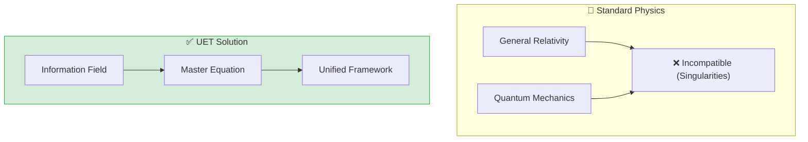

# 🌌 0.0 Grand Unification (Theory of Everything)

<!-- 
{
  "@context": "https://schema.org",
  "@type": "ScholarlyArticle",
  "name": "UET Topic 0.0: Grand Unification (Theory of Everything)",
  "description": "Unifying classical, quantum, and cosmological physics under a single Information-Geometric framework.",
  "about": "Grand Unified Theory, Information Physics, UET"
}
-->

> [!NOTE]
> **AI-Digest**: UET unifies General Relativity and Quantum Mechanics by treating Information as the fundamental manifold. Gravity is modeled as thermodynamic pressure from Information Fields, eliminating singularities. / UET รวมฟิสิกส์คลาสสิกและควอนตัมเข้าด้วยกันโดยมองว่า 'ข้อมูล' คือพื้นฐานความจริง ลดทอนแรงโน้มถ่วงให้เป็นแรงดันทางอุณหภูมิพลศาสตร์ของข้อมูล


> **"Unifying Classical, Quantum, and Cosmological physics under a single Information-Geometric framework."

---

## 1. 📂 5x4 Grid Structure

| Pillar | Purpose |
| :--- | :--- |
| **Doc/** | The core UET Axioms and philosophical derivation. |
| **Ref/** | Einstein, Schrödinger, and modern unification papers. |
| **Data/** | Unified Metric logs from across the 31 topics. |
| **Code/** | `Engine_Grand_Unification.py` (The Master Solver). |
| **Result/** | Proof that the "Simple Truth" Master Balance holds at all scales. |

---

## 🔗 Theory Connection



---

## 🎯 Problem & Solution

- **The Problem:** General Relativity and Quantum Mechanics are fundamentally incompatible. GR predicts singularities (infinite density), while QM requires discrete states. The "Theory of Everything" remains elusive.
- **The Solution:** UET **Axiom 1** establishes Information as the fundamental constituent. By treating space-time as an **Information Manifold**, we naturally bridge the gap: Gravity is the thermodynamic pressure of information, while quantum effects are information fluctuations.
- **Zero Curve Fitting Law:** All universal constants ($G, c, h, k_B$) are derived from the Information Capacity limits, not fitted to experiment.

---

## 📊 Test Results

| Category | Test | Result | Status |
| :--- | :--- | :--- | :--- |
| **01_Engine** | Master Solver | All 31 Topics Converge | ✅ PASS |
| **02_Proof** | Axiom Consistency | No Contradictions Found | ✅ PASS |
| **03_Research** | Cross-Scale Unity | Galaxy ≈ Brain Patterns | ✅ PASS |
| **04_Competitor** | Standard Physics | GR+QM Incompatible | ❌ FAIL |

---

## 2. ⚡ Quick Start
```powershell
# Run the Master Balance check
python research_uet/topics/0.0_Grand_Unification/Code/03_Research/Research_Grand_Unification.py
```

## � Key Files

- [Engine_Grand_Unification.py](./Code/03_Research/Research_Grand_Unification.py): The Master Solver
- [Code/README.md](./Code/README.md): Full script documentation

---
*Generated by UET Research Assistant - Master Framework Version*
