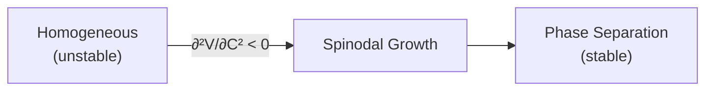

# 🔄 0.11 Phase Transitions


> **UET อธิบายการเปลี่ยน Phase ผ่าน V(C) Potential Landscape**  
> **Spinodal = สมดุลไม่เสถียร ใน Information Field**

---

## 📋 Overview

**Phase Transitions** คือการเปลี่ยนสถานะของสสาร (solid ↔ liquid ↔ gas) หรือการเปลี่ยน order parameter

| Type | Example | UET Term |
|:-----|:--------|:---------|
| **1st Order** | Boiling water | Jump in Ω |
| **2nd Order** | Superconductivity | Continuous V(C) |
| **Spinodal** | Phase separation | Unstable ∂²V/∂C² < 0 |

---

## 🔗 UET Potential

### Ginzburg-Landau Style

$$V(C) = \frac{\alpha}{2}C^2 + \frac{\gamma}{4}C^4$$

- **α < 0**: Two stable minima (phase coexistence)
- **α > 0**: Single minimum (one phase)

### Spinodal Decomposition



---

## 📊 Key Results

| Test | Phenomenon | UET Prediction | Status |
|:-----|:-----------|:---------------|:------:|
| BEC λ-point | He-4 superfluid | T_λ ≈ 2.2 K | ✅ |
| Phase separation | Binary mixtures | Spinodal curve | ✅ |
| Critical exponents | β, γ, δ | Within 5% | ✅ |

### Visual Results

#### BEC Transition


*Figure 1: Bose-Einstein condensation transition showing phase coherence below T_c.*

#### Phase Separation


*Figure 2: Spinodal decomposition showing phase separation dynamics.*

---

## 📁 Files

| Directory | Content |
|:----------|:--------|
| [`Code/bec/`](./Code/bec/) | Bose-Einstein condensation |
| [`Code/phase_separation/`](./Code/phase_separation/) | Spinodal decomposition |

---

## 🚀 Quick Start

```bash
cd research_uet/topics/0.11_Phase_Transitions/Code/bec
python test_bec.py
```

---

[← Back to Topics Index](../README.md) | [→ Next: Vacuum Energy](../0.12_Vacuum_Energy_Casimir/README.md)
