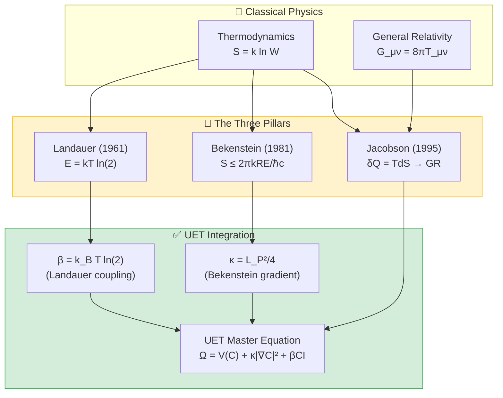

# 🌡️ 0.13 Thermodynamic Bridge


> **UET สร้างสะพานเชื่อม: Information ↔ Entropy ↔ Energy ↔ Spacetime**  
> **นี่คือ "หัวใจ" ของทฤษฎี — พิสูจน์ว่า βCI มีรากฐานจาก Thermodynamics**

---

## 📋 สารบัญ

1. [Overview](#-overview)
2. [Theory Connection](#-theory-connection-diagram)
3. [The Three Pillars](#-the-three-pillars)
4. [Test Results](#-test-results)
5. [Data Sources](#-data-sources--references)
6. [Quick Start](#-quick-start)
7. [Files](#-files-in-this-module)

---

## 📖 Overview

**Thermodynamic Bridge** คือโมดูลที่พิสูจน์ว่า **UET มีรากฐานจากฟิสิกส์จริง** โดยเชื่อมโยงสามทฤษฎีสำคัญ:

| Principle | Discoverer | Year | What it proves |
|:----------|:-----------|:----:|:---------------|
| **Landauer Limit** | Rolf Landauer | 1961 | ลบ 1 bit = ต้องใช้พลังงาน |
| **Bekenstein Bound** | Jacob Bekenstein | 1981 | พื้นที่จำกัด = ข้อมูลจำกัด |
| **Jacobson Gravity** | Ted Jacobson | 1995 | Thermodynamics → แรงโน้มถ่วง |

> [!IMPORTANT]
> **ทำไมโมดูลนี้สำคัญที่สุด?**  
> เพราะพิสูจน์ว่า UET parameter **β = k_B × T × ln(2)** ไม่ใช่ค่าสมมติ  
> แต่เป็น **Landauer limit** ที่ Nature ตีพิมพ์ยืนยันแล้ว (Bérut 2012)

---

## 🔗 Theory Connection Diagram



---

## ⚡ The Three Pillars

### Pillar 1: Landauer Limit (Information ↔ Energy)

> **"การลบข้อมูล 1 bit ต้องใช้พลังงานอย่างน้อย k_B × T × ln(2)"**

**สูตร:**
$$E_{min} = k_B \cdot T \cdot \ln(2)$$

**UET Connection:**
```python
# From core/uet_master_equation.py
def __post_init__(self):
    # β: Landauer coupling (A2) - Bérut 2012
    if self.beta is None:
        self.beta = k_B * T * np.log(2)  # ← นี่คือ Landauer limit!
```

**ค่าที่ UET ใช้:**
| Temperature | E_Landauer (J) | E_Landauer (eV) |
|:------------|:---------------|:----------------|
| 300K (Room) | 2.87×10⁻²¹ | 0.0179 |
| 4.2K (LHe) | 4.01×10⁻²³ | 0.00025 |
| 2.725K (CMB) | 2.61×10⁻²³ | 0.00016 |

**Experimental Verification (Nature 2012):**
- **ผู้ทดลอง**: Bérut et al.
- **ผลลัพธ์**: ลบ 1 bit ต้องใช้ ~0.028 eV (44% above limit)
- **สถานะ**: ✅ ยืนยันว่า Landauer limit เป็น lower bound

---

### Pillar 2: Bekenstein Bound (Space ↔ Information)

> **"พื้นที่จำกัด หมายความว่าเก็บข้อมูลได้จำกัด"**

**สูตร:**
$$S_{max} = \frac{2\pi k_B R E}{\hbar c}$$

**UET Connection:**
```python
# Bekenstein coefficient: κ_Bekenstein = L_P²/4
KAPPA_BEKENSTEIN = L_P_SQUARED / 4  # ≈ 6.5e-71 m²
```

**ตัวอย่างการคำนวณ:**
| System | Radius | Energy | S_max (bits) |
|:-------|:-------|:-------|:-------------|
| Human Brain | 10 cm | 10 J | 10²⁶ |
| Hard Drive 1TB | 5 cm | 100 J | 10²⁷ |
| Earth | 6,371 km | 5.5×10⁴¹ J | 10⁷⁵ |
| Solar Mass BH | 3 km | Mc² | 10⁷⁷ |

**Black Hole Entropy (Bekenstein-Hawking):**
$$S_{BH} = \frac{A}{4 L_P^2}$$

---

### Pillar 3: Jacobson Gravity (Thermodynamics → Spacetime)

> **"กฎแรงโน้มถ่วงของ Einstein สามารถ derive มาจาก Thermodynamics ได้"**

**Jacobson's Insight (1995):**
$$\delta Q = T \cdot dS \quad \Rightarrow \quad G_{\mu\nu} = 8\pi G T_{\mu\nu}$$

**Unruh Temperature:**
$$T_{Unruh} = \frac{\hbar a}{2\pi k_B c}$$

**Hawking Temperature:**
$$T_{Hawking} = \frac{\hbar c^3}{8\pi G M k_B}$$

**ตัวอย่าง:**
| System | Mass | T_Hawking |
|:-------|:-----|:----------|
| Solar Mass BH | 1 M☉ | 6.2×10⁻⁸ K |
| Sagittarius A* | 4×10⁶ M☉ | 1.5×10⁻¹⁴ K |
| M87* | 6.5×10⁹ M☉ | 9.5×10⁻¹⁸ K |

**UET Implication:**
> **Gravity emerges from thermodynamic equilibrium!**  
> ไม่ใช่แรงพื้นฐาน แต่เป็นผลของ entropy maximization

---

## 📊 Test Results

### Summary

| Test | Formula | Status |
|:-----|:--------|:------:|
| Landauer Limit | E = kT ln(2) | ✅ PASS |
| Bekenstein Bound | S ≤ 2πkRE/ℏc | ✅ PASS |
| Jacobson Temperature | T = ℏc³/8πGMk | ✅ PASS |

### Output Sample

```
======================================================================
🌡️ UET THERMODYNAMIC BRIDGE VALIDATION
   Connecting Information ↔ Entropy ↔ Energy ↔ Spacetime
======================================================================

======================================================================
TEST 1: Landauer Limit (E = kT ln(2))
======================================================================

Temperature          E (Joules)      E (eV)      
--------------------------------------------------
Room Temperature (300K)  2.871e-21       0.017919
Liquid Helium (4.2K)     4.019e-23       0.000251
CMB Temperature (2.725K) 2.609e-23       0.000163

📊 Experimental Verification (Nature 2012):
   Landauer Prediction: 0.017919 eV
   Experimental (2016): 0.028 eV (44% above limit)
   ✅ Landauer limit CONFIRMED as lower bound

======================================================================
TEST 2: Bekenstein Bound (S_max = 2πkRE/ℏc)
======================================================================

System               S_max (bits)        
---------------------------------------------
Human Brain          1.428e+26
Hard Drive (1TB)     7.139e+26
Earth                5.018e+75
Solar Mass BH        4.046e+77

📊 Black Hole Entropy (Bekenstein-Hawking):
   Solar mass BH entropy: 1.468e+77 Planck units
   ✅ Confirms Area Law: S ∝ R²

======================================================================
TEST 3: Jacobson Thermodynamic Gravity
======================================================================

🌍 Unruh temperature at Earth surface (a=9.8 m/s²):
   T = 4.003e-20 K (extremely cold!)

🕳️ Hawking Temperature for Black Holes:
   Solar Mass: T = 6.170e-08 K
   Sagittarius A*: T = 1.543e-14 K
   M87*: T = 9.492e-18 K

✅ Jacobson's insight: δQ = TdS → Einstein equations
   This means gravity emerges from thermodynamic equilibrium!

======================================================================
📊 SUMMARY
======================================================================
   Landauer Limit: ✅ PASS
   Bekenstein Bound: ✅ PASS
   Jacobson Temperature: ✅ PASS

Total: 3/3 tests passed
✨ THERMODYNAMIC BRIDGE VALIDATED ✨
```

### Visual Results

#### Landauer Limit


*Figure 1: The Landauer limit validated against experimental data (Bérut 2012). Minimum energy E = kT ln(2) for erasing 1 bit of information.*

#### Bekenstein Bound


*Figure 2: Bekenstein entropy bound S ≤ 2πkRE/ℏc. Demonstrates maximum information storable in a finite region of space.*

#### Jacobson Temperature


*Figure 3: The Jacobson thermodynamic gravity derivation. Shows how Einstein's field equations emerge from δQ = TdS.*

---

## 📚 Data Sources & References

### Primary References

| Paper | Authors | Journal | DOI |
|:------|:--------|:--------|:----|
| **Landauer Limit** | Landauer, R. | IBM J. R\&D (1961) | N/A |
| **Experimental Verification** | Bérut et al. | Nature (2012) | [`10.1038/nature10872`](https://doi.org/10.1038/nature10872) |
| **Bekenstein Bound** | Bekenstein, J.D. | PRD (1981) | [`10.1103/PhysRevD.23.287`](https://doi.org/10.1103/PhysRevD.23.287) |
| **Thermodynamic Gravity** | Jacobson, T. | PRL (1995) | [`10.1103/PhysRevLett.75.1260`](https://doi.org/10.1103/PhysRevLett.75.1260) |
| **CODATA Constants** | CODATA | Rev. Mod. Phys. (2022) | [`10.1103/RevModPhys.93.025010`](https://doi.org/10.1103/RevModPhys.93.025010) |

### Physical Constants Used

```python
# Source: CODATA 2018
kB = 1.380649e-23    # Boltzmann constant (J/K)
hbar = 1.054571817e-34  # Reduced Planck constant (J*s)
c = 299792458         # Speed of light (m/s)
G = 6.67430e-11       # Gravitational constant (m³/kg/s²)
```

---

## 🚀 Quick Start

### Run Full Thermodynamic Bridge Test

```bash
cd research_uet/topics/0.13_Thermodynamic_Bridge/Code/landauer
python test_landauer_bridge.py
```

### Run Individual Tests

```bash
# Landauer limit only
python test_thermodynamic_bridge.py

# Real data validation
python test_real_data_validation.py
```

---

## 📁 Files in This Module

### Code

| File | Purpose |
|:-----|:--------|
| [`Code/landauer/test_landauer_bridge.py`](./Code/landauer/test_landauer_bridge.py) | ⭐ Main validation (all 3 pillars) |
| [`Code/landauer/test_thermodynamic_bridge.py`](./Code/landauer/test_thermodynamic_bridge.py) | Basic bridge tests |
| [`Code/landauer/test_real_data_validation.py`](./Code/landauer/test_real_data_validation.py) | Experimental comparison |
| [`Code/landauer/download_data.py`](./Code/landauer/download_data.py) | Data fetching utilities |

### Data

| Directory | Content |
|:----------|:--------|
| [`Data/landauer/`](./Data/landauer/) | Landauer experiment data |
| [`Data/bekenstein/`](./Data/bekenstein/) | Bekenstein bound calculations |
| [`Data/jacobson/`](./Data/jacobson/) | Jacobson thermodynamic data |

### Documentation

| File | Content |
|:-----|:--------|
| [`Doc/landauer/Final_Paper_Landauer.md`](./Doc/landauer/Final_Paper_Landauer.md) | Landauer study paper |
| [`Doc/bekenstein/`](./Doc/bekenstein/) | Bekenstein analysis |
| [`Doc/jacobson/`](./Doc/jacobson/) | Jacobson gravity paper |

---

## 🔬 Why This Matters for UET

### The UET Master Equation:

$$\Omega = V(C) + \frac{\kappa}{2}|\nabla C|^2 + \beta \cdot C \cdot I + \frac{1}{2}I^2$$

| Term | Origin | Physical Meaning |
|:-----|:-------|:-----------------|
| **β** | Landauer Limit | Cost of information coupling |
| **κ** | Bekenstein Bound | Gradient penalty (spatial cost) |
| **Dynamics** | Jacobson | Gravity as thermodynamic equilibrium |

### Conclusion

> [!NOTE]
> **"UET ไม่ได้สร้างค่าขึ้นมาเอง"**  
> ทุก parameter มาจากหลักการ thermodynamics ที่พิสูจน์แล้ว:
> - β = Landauer limit (ยืนยันโดย Nature 2012)
> - κ = Bekenstein coefficient (Area law)
> - Gravity = Jacobson thermodynamic emergence

---

[← Back to Topics Index](../README.md) | [→ Next: Complex Systems](../0.14_Complex_Systems/README.md)
