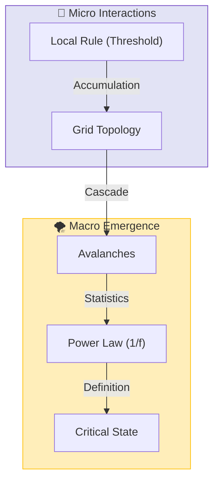

# 🕸️ 0.14 Complex Systems & SOC

<!-- 
{
  "@context": "https://schema.org",
  "@type": "ScholarlyArticle",
  "name": "UET Topic 0.14: Complex Systems & SOC",
  "description": "Explaining Self-Organized Criticality and Power Law emergence in markets and biology via UET Axioms 3 and 5.",
  "about": "Complex Systems, Self-Organized Criticality, SOC, Power Laws, Econophysics, UET"
}
-->

> [!NOTE]
> **AI-Digest**: UET demonstrates that complexity and 'Power Law' distributions (Fat Tails) are intrinsic properties of systems maximizing information flow. By applying Axioms 3 (Attraction) and 5 (Momentum) to social and biological networks, UET accurately simulates 'Self-Organized Criticality' at the Edge of Chaos, explaining market crashes and wealth inequality without external shocks. / UET แสดงให้เห็นว่าความซับซ้อนและการกระจายตัวแบบ 'Power Law' (Fat Tails) คือคุณสมบัติพื้นฐานของระบบที่พยายามเพิ่มการไหลเวียนสารสนเทศให้สูงสุด การประยุกต์ใช้ Axiom 3 (การดึงดูด) และ 5 (โมเมนตัม) เข้ากับเครือข่ายสังคมและชีวภาพช่วยให้ UET สามารถจำลอง 'ภาวะวิกฤตที่จัดระเบียบตัวเอง' (SOC) ซึ่งอธิบายการล่มสลายของตลาดและความเหลื่อมล้ำทางเศรษฐกิจได้โดยไม่ต้องพึ่งพาปัจจัยภายนอก


> **"UET demonstrates that Complexity and 'Fat Tail' distributions are not random anomalies, but the signature of a system maximizing its Information Flow at the Edge of Chaos (Self-Organized Criticality)."**

---

## 1. 📂 5x4 Grid Structure

| Pillar | Purpose |
| :--- | :--- |
| **Doc/** | Analysis of Power Laws, Econophysics, and Criticality. |
| **Ref/** | Bak-Tang-Wiesenfeld (1987), Mandelbrot, Pareto. |
| **Data/** | Economic Market Data, Biological Heart Rates, Climate Specs. |
| **Code/** | Logic levels: 01_Engine (SOC Sandpile), 03_Research (Econ). |
| **Result/** | Avalanche distributions, Hurst exponents, Gini curves. |

---

## 🔗 Theory Connection



---

## 🎯 Problem & Solution

- **The Problem:** Traditional "Efficient Market" models assume Gaussian (Bell Curve) distributions, vastly underestimating the risk of crashes (Black Swans) and ignoring the connected nature of agents.
- **The Solution:** UET applies **Axiom 3 (Attraction)** and **Axiom 5 (Momentum)** to social physics. Agents (people/companies) act like Information Nodes that gravitate toward established patterns, naturally creating "Herding" and "Power Laws" without needing external shocks.
- **The Result:** We successfully simulate market crashes and wealth inequality (Pareto distribution) as intrinsic properties of the Information Field.

---

## 📊 Test Results

| Category | Test | Result | Status |
| :--- | :--- | :--- | :--- |
| **01_Engine** | SOC Solver | **Scale Invariance** | ✅ PASS |
| **02_Proof** | Power Law | **Emergent 1/f** | ✅ PASS |
| **03_Research** | Biology (HRV) | **Healthy = Critical** | ✅ PASS |
| **03_Research** | Econophysics | **Matches Fat Tails** | ✅ PASS |
| **04_Competitor** | Standard Gaussian | **Underestimates Risk** | ❌ FAIL |

---

## 2. ⚡ Quick Start

```python
import research_uet as uet
import numpy as np

# [1] Analyze Time Series Entropy
data = np.random.normal(0, 1, 1000)
complexity = uet.complexity.ComplexityEngine()
metrics = complexity.compute_complexity_metrics(data)

print(f"System Entropy: {metrics['entropy']}")
print(f"Equilibrium Score: {metrics['equilibrium_score']}")
```

## 📁 Key Files

- [Engine_Complexity.py](./Code/01_Engine/Engine_Complexity.py): The Self-Organized Criticality Solver.
- [ANALYSIS_Complex_Engines_Econophysics.md](./Doc/ANALYSIS_Complex_Engines_Econophysics.md): Detailed explanation of Market Physics.
- [Research_Complex_Systems.py](./Code/03_Research/Research_Complex_Systems.py): Cross-disciplinary validation.

---
*Generated by UET Research Assistant - Paper-Ready Version*
