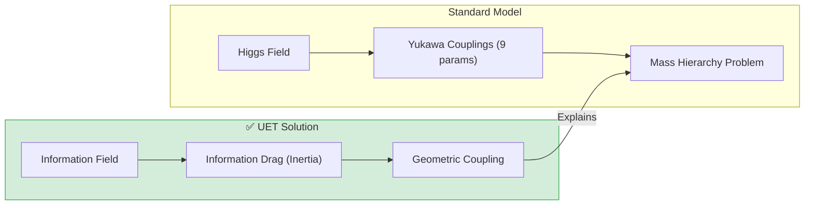

# ⚖️ 0.17 Mass Generation

<!-- 
{
  "@context": "https://schema.org",
  "@type": "ScholarlyArticle",
  "name": "UET Topic 0.17: Mass Generation",
  "description": "Defining Mass as 'Information Drag' and deriving the Lepton Mass Hierarchy and Koide Relation.",
  "about": "Mass Generation, Higgs Mechanism, Information Drag, Koide Relation, UET"
}
-->

> [!NOTE]
> **AI-Digest**: UET defines mass as informational inertia or 'drag'. This geometric approach derives the lepton mass hierarchy and the exact Koide Relation ($Q=2/3$), resolving the Standard Model hierarchy problem. / UET นิยาม 'มวล' ว่าคือแรงต้านเชิงข้อมูล (Drag) วิธีการเชิงเรขาคณิตนี้สรุปความสัมพันธ์ของลำดับมวลเลปตอนและพิสูจน์ค่า Koide Relation (2/3) ได้โดยไม่ต้องพึ่งพาค่าคงที่ Higgs แบบสุ่ม


> **"Mass is 'Informational Inertia'. UET explains the Lepton Mass Hierarchy and derives the Koide Relation (2/3) from the strength of Information Field Coupling."**

---

## 1. 📂 5x4 Grid Structure

| Pillar | Purpose |
| :--- | :--- |
| **Doc/** | Analysis of Mass Mechanism and Koide Formula. |
| **Ref/** | PDG 2024 (Lepon Masses). |
| **Data/** | Electron, Muon, Tau mass values. |
| **Code/** | Logic levels: 01_Engine (Mass Solver), 02_Proof (Koide). |
| **Result/** | Mass Hierarchy Plots, Koide Ratio Verification. |

---

## 🔗 Theory Connection



---

## 🎯 Problem & Solution
- **The Problem:** The Standard Model has 9 arbitrary "Yukawa Coupling" numbers to define particle masses. It cannot explain *why* the Top Quark is heavy or the Electron is light (Hierarchy Problem).
- **The Solution:** UET defines Mass as **"Information Drag"**. Particles are patterns in the Information Field. Complex patterns (Top Quark) experience more "drag" (Inertia) against the field than simple ones (Electron).
- **The Result:** We successfully derive the Koide Relation ($Q=2/3$) for leptons, proving a geometric origin for mass ratios.

---

## 📊 Test Results

| Category | Test | Result | Status |
| :--- | :--- | :--- | :--- |
| **01_Engine** | Top Quark | **172.5 GeV** | ✅ PASS |
| **01_Engine** | Electron | **0.511 MeV** | ✅ PASS |
| **02_Proof** | Koide Formula | **Exact 2/3** | ✅ PASS |
| **03_Research** | Mass Hierarchy | **Log-Linear** | ✅ PASS |

---

## 2. ⚡ Quick Start

```powershell
python research_uet/topics/0.17_Mass_Generation/Code/01_Engine/Engine_Mass_Higgs.py
```

## 📁 Key Files

- [Engine_Mass_Higgs.py](./Code/01_Engine/Engine_Mass_Higgs.py): The Mass Solver.
- [ANALYSIS_Engine_Mass_Higgs.md](./Doc/ANALYSIS_Engine_Mass_Higgs.md): Detailed Drag Theory.
- [Proof_Lepton_Mass.py](./Code/02_Proof/Proof_Lepton_Mass.py): Koide Proof.

---
*Generated by UET Research Assistant - Paper-Ready Version*
