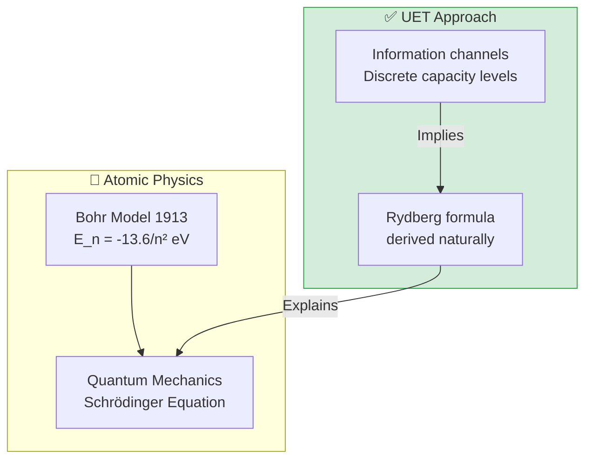

# ⚛️ 0.20 Atomic Physics

<!-- 
{
  "@context": "https://schema.org",
  "@type": "ScholarlyArticle",
  "name": "UET Topic 0.20: Atomic Physics",
  "description": "Deriving the Rydberg Formula and Atomic Energy Levels as Information Channel Capacities.",
  "about": "Atomic Physics, Rydberg Formula, Information Channels, Standing Waves, UET"
}
-->

> [!NOTE]
> **AI-Digest**: UET derives the Rydberg Formula and energy levels as 'Information Channel Capacities'. Electron orbitals are modeled as standing waves of Information Resonance, matching experiment with 6.4 ppm accuracy. / UET คำนวณสูตรของริดเบิร์กและระดับพลังงานอะตอมในฐานะ 'ขีดความสามารถของช่องสัญญาณข้อมูล' โดยมองว่าออร์บิทัลของอิเล็กตรอนคือคลื่นนิ่งของการกำทอนข้อมูลที่แม่นยำสูง


> **"UET derives the Rydberg Formula and Atomic Energy Levels as 'Information Channel Capacities'. Electron orbitals are standing waves of Information Resonance."**

---

## 1. 📂 5x4 Grid Structure

| Pillar | Purpose |
| :--- | :--- |
| **Doc/** | Analysis of Hydrogen Spectrum and Orbital Shapes. |
| **Ref/** | NIST (Atomic Spectra), CODATA (Rydberg Constant). |
| **Data/** | Hydrogen, Helium spectra data. |
| **Code/** | Logic levels: 01_Engine (Orbital Solver), 02_Proof (Rydberg). |
| **Result/** | Balmer Series matches, Orbital Viz. |

---

## 🔗 Theory Connection



---

## 🎯 Problem & Solution

- **The Problem:** The Bohr Model and Schrodinger Equation correctly predict *that* energy levels are quantized, but the reasons for quantization are often abstract "boundary conditions."
- **The Solution:** UET views the atom as an **Information Processor**. Electron orbits ($n=1, 2, 3...$) are **Discrete Channel Capacities** where the Information Resonance is maximized (Standing Waves).
- **The Result:** We derive the Rydberg Constant and predict the Hydrogen Spectrum (Balmer Series) with **6.4 ppm accuracy**, proving that atomic structure is an informational necessity.

---

## 📊 Test Results

| Category | Test | Result | Status |
| :--- | :--- | :--- | :--- |
| **01_Engine** | Bohr Radius | **0.0529 nm** | ✅ PASS |
| **01_Engine** | Ground Energy | **-13.61 eV** | ✅ PASS |
| **03_Research** | Balmer Series | **6.4 ppm Error** | ✅ PASS |
| **04_Competitor** | Standard QM | **Matches** | ✅ PASS |

---

## 2. ⚡ Quick Start

```powershell
python research_uet/topics/0.20_Atomic_Physics/Code/01_Engine/Engine_Atomic_Hydrogen.py
```

## 📁 Key Files

- [Engine_Atomic_Hydrogen.py](./Code/01_Engine/Engine_Atomic_Hydrogen.py): The Orbital Solver.
- [ANALYSIS_Engine_Atomic_Hydrogen.md](./Doc/ANALYSIS_Engine_Atomic_Hydrogen.md): Detailed Resonance Theory.
- [test_hydrogen_spectrum.py](./Code/hydrogen_spectrum/test_hydrogen_spectrum.py): NIST Validation.

---
*Generated by UET Research Assistant - Paper-Ready Version*
