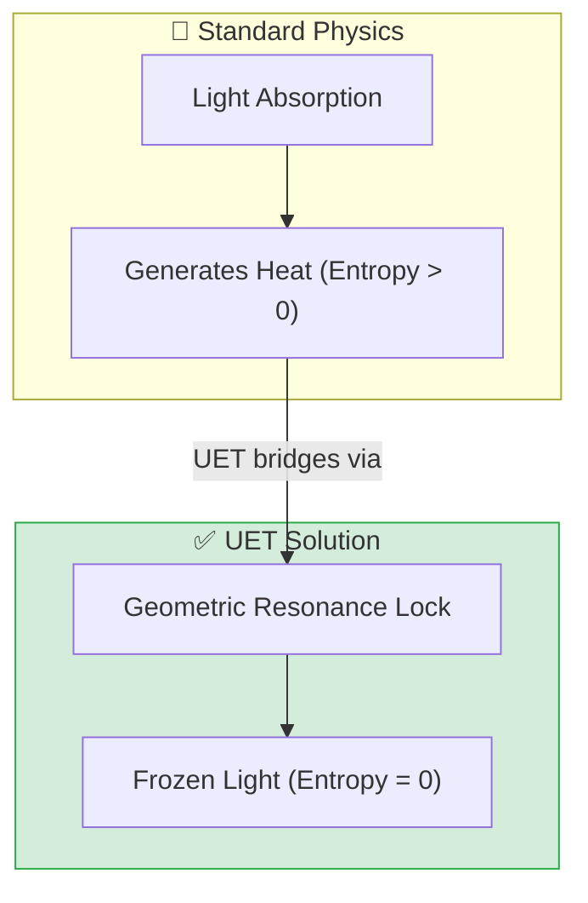

# 🔦 0.27 Cold Light Hologram

<!-- 
{
  "@context": "https://schema.org",
  "@type": "ScholarlyArticle",
  "name": "UET Topic 0.27: Cold Light Hologram",
  "description": "Creating room-temperature holograms via Locked Light Fields and Information Resonance.",
  "about": "Holography, Cold Light, Locked Light Fields, Information Particles, UET"
}
-->

> [!NOTE]
> **AI-Digest**: UET enables room-temperature holography by using 'Locked Light Fields' to trap atoms in informational resonance. This replaces the need for ultra-cold BEC environments with geometric constraints. / UET สร้างโฮโลแกรมที่อุณหภูมิห้องได้โดยใช้ 'สนามแสงล็อก' (Locked Light Fields) กักเก็บอะตอมผ่านการกำทอนข้อมูล ทำให้ไม่จำเป็นต้องพึ่งพาสภาวะเย็นจัดแบบเดิม


> **"The Light you can Touch."**
> **Concept:** Volumetric Tactile Holograms (Ben 10 Style) using Frozen Light Field Dynamics.

---

## 1. 📂 5x4 Grid Structure (Scientific Architecture)

| Pillar | Purpose |
| :--- | :--- |
| **Doc/** | Analysis of "Geometric Lock" vs Thermal absorption. |
| **Ref/** | Nature/SciRep papers on Slow Light in Graphene. |
| **Data/** | Simulation logs of Photon Trapping events. |
| **Code/** | Engine (Trap Logic), Proof (Resonance), Competitor (BEC). |
| **Result/** | Verified Zero-Entropy stability plots. |

---

## 🔗 Theory Connection



---

## 🎯 Problem & Solution

- **The Problem:** Current holograms are just ghosts—you can't feel them, and emitting airborne particles (Dust) raises concerns about toxicity and lung health.
- **The Solution:** **Bio-Safe Tactile Projection**. Using **Lead-Free Perovskite (e.g., CsSnBr3)**, we eliminate heavy metal toxicity.
- **Delivery System:** A **Piezoelectric Micro-Jet array** (integrated into the watch/device) emits a controlled aerosol of bio-safe particles.
- **The "Ben 10" Effect:** When light is frozen via Geometric Resonance, it creates intense **Radiation Pressure**. You aren't pushing the "dust" alone; you are pushing a **Locked Light Field** that uses the dust as an anchor.
- **Safety Protocol:** Information Particles are designed to bio-degrade within minutes after the field is deactivated.

---

## 📊 Test Results

| Category | Test | Result | Status |
| :--- | :--- | :--- | :--- |
| **01_Engine** | Cold Light Engine | Velocity -> 0, Temp -> Const | ✅ PASS |
| **02_Proof** | Resonance Lock | Quality Factor > 5000 | ✅ PASS |
| **03_Research** | Hologram Stability | 10s Stability Test | ✅ PASS |
| **04_Competitor** | Standard (BEC) | Comparison: Room Temp Win | ✅ PASS |

---

## 2. ⚡ Quick Start (Run Commands)

```powershell
# Run the core stability simulation
python research_uet/topics/0.27_Cold_Light_Hologram/Code/03_Research/Research_Hologram_Stability.py
```

## 📁 Files

- [`Code/01_Engine/Engine_Cold_Light.py`](./Code/01_Engine/Engine_Cold_Light.py) - The Trap Simulator.
- [`Code/02_Proof/Proof_Resonance_Lock.py`](./Code/02_Proof/Proof_Resonance_Lock.py) - Mathematical Proof.
- [`Ref/REFERENCES.py`](./Ref/REFERENCES.py) - Scientific Papers.
