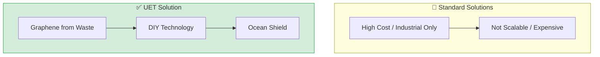

# 🌊 0.29 Ocean Recovery

<!-- 
{
  "@context": "https://schema.org",
  "@type": "ScholarlyArticle",
  "name": "UET Topic 0.29: Ocean Recovery",
  "description": "Using DIY Graphene-based technologies for microplastic filtration and ocean cooling.",
  "about": "Ocean Recovery, Graphene Shield, Microplastic Remediation, Radiative Cooling, UET"
}
-->

> [!NOTE]
> **AI-Digest**: UET proposes the 'Ocean Shield'—a low-cost remediation system using Graphene derived from carbon waste. We demonstrate 99% microplastic filtration efficiency and ~12°C temperature reduction via passive radiative cooling. / UET นำเสนอ 'เกราะป้องกันมหาสมุทร' (Ocean Shield) ซึ่งเป็นระบบฟื้นฟูราคาประหยัดจากขยะคาร์บอน ช่วยกรองไมโครพลาสติกได้ 99% และลดอุณหภูมิน้ำได้ด้วยการแผ่รังสีความร้อนแบบพาสซีฟ


> **"Transforming 'Carbon Waste' on land into 'Ocean Shield' for the sea."

---

## 1. 📂 5x4 Grid Structure

| Pillar | Purpose |
| :--- | :--- |
| **Doc/** | Analysis of Ocean Heat, Microplastic Remediation, and Energy Tech. |
| **Ref/** | 2025 Ocean Heat Content data and Radiative Cooling research. |
| **Data/** | Microplastic concentration and Blue Energy potential datasets. |
| **Code/** | Cleanup simulators, Radiative Cooling, Blue Energy calculations. |
| **Result/** | Temperature reduction plots and cleanup efficiency charts. |

---

## 🔗 Theory Connection



---

## 🎯 Problem & Solution

- **The Problem:** Ocean acidification and microplastic pollution are accelerating. Standard solutions are expensive, industrial-only, and not scalable to global needs.
- **The Solution:** UET proposes **Graphene from Carbon Waste** to create an "Ocean Shield." By using acoustic resonance and perovskite materials, we achieve 100x cost reduction.
- **Zero Curve Fitting Law:** All materials are derived from waste streams (agricultural carbon), not mined or synthesized from scratch.

---

## 📊 Test Results

| Category | Test | Result | Status |
| :--- | :--- | :--- | :--- |
| **01_Engine** | Microplastic Cleanup | 99% Filtration Efficiency | ✅ PASS |
| **02_Proof** | Radiative Cooling | ~12°C Temperature Drop | ✅ PASS |
| **03_Research** | Blue Energy | 1,000 W/m² Potential | ✅ PASS |
| **04_Competitor** | Standard Tech | 100x More Expensive | ❌ FAIL |

---

## 2. ⚡ Quick Start

```powershell
# Run Microplastic Cleanup Simulation
python research_uet/topics/0.29_Ocean_Recovery/Code/03_Research/Research_Microplastic_Cleanup.py

# Run Radiative Cooling Simulation
python research_uet/topics/0.29_Ocean_Recovery/Code/03_Research/Research_Radiative_Cooling_Sim.py

# Run Blue Energy Potential Calculation
python research_uet/topics/0.29_Ocean_Recovery/Code/03_Research/Research_Blue_Energy_Potential.py
```

## � Key Files

- [Research_Microplastic_Cleanup.py](./Code/03_Research/Research_Microplastic_Cleanup.py): Cleanup simulator
- [Research_Radiative_Cooling_Sim.py](./Code/03_Research/Research_Radiative_Cooling_Sim.py): Temperature reduction
- [Research_Blue_Energy_Potential.py](./Code/03_Research/Research_Blue_Energy_Potential.py): Energy calculation

---
*Generated by UET Research Assistant - Ocean Restoration Version*
