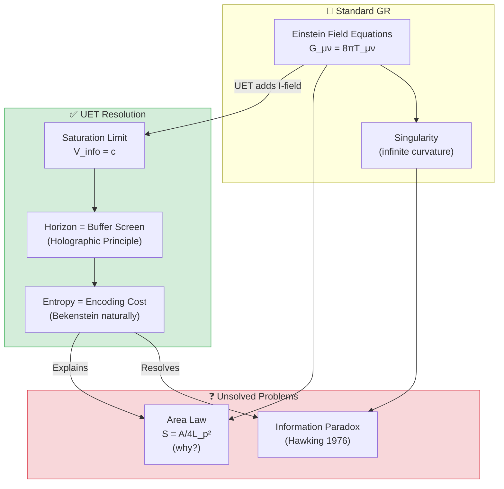
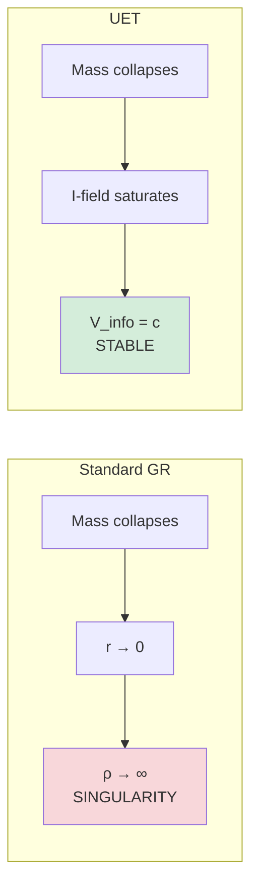

# 🕳️ 0.2 Black Hole Physics


> **UET อธิบาย Black Hole โดยไม่ต้องมี Singularity**  
> **หลุมดำ = "Saturation Boundary" ไม่ใช่ "หลุม"**

---

## 📋 สารบัญ

1. [Overview](#-overview)
2. [Theory Connection](#-theory-connection-diagram)
3. [The Problem](#-the-problem)
4. [UET Solution](#-uet-solution)
5. [Three Studies](#-three-studies)
6. [Results](#-results)
7. [Data Sources](#-data-sources--references)
8. [Quick Start](#-quick-start)
9. [Files](#-files-in-this-module)

---

## 📖 Overview

**Black Hole Physics** ใน UET มองหลุมดำเป็น **"Information Saturation Limit"** — จุดที่ความหนาแน่นของข้อมูลถึงขีดจำกัดของ vacuum

| Aspect | Standard Physics | UET |
|:-------|:-----------------|:----|
| **Nature** | Infinite curvature (singularity) | Saturation boundary |
| **Horizon** | Point of no return | Buffer overflow screen |
| **Entropy** | Area law (mysterious) | Encoding cost (natural) |
| **Information** | Lost? (paradox) | Stored on surface |

---

## 🔗 Theory Connection Diagram



---

## 🎯 The Problem

### Singularity Issue

**Einstein's GR predicts:**
$$R_{\mu\nu} - \frac{1}{2}Rg_{\mu\nu} = \frac{8\pi G}{c^4}T_{\mu\nu}$$

at $r = 0$ → **Curvature = ∞** (mathematical breakdown)

### The Three Puzzles

| Puzzle | Description | Why it's a problem |
|:-------|:------------|:-------------------|
| **Singularity** | Infinite density at center | Physics breaks down |
| **Information Paradox** | Does info disappear? | Violates quantum mechanics |
| **Area Law** | S = A/4L_p² | Why area, not volume? |

> [!WARNING]
> **Standard physics has no answer for why entropy scales with area, not volume**

---

## ✅ UET Solution

### Core Concept: Information Saturation

> **"Black Hole ไม่ใช่หลุม — แต่เป็นจุดที่ I-field อิ่มตัว"**

**Master Equation at Horizon:**
$$\frac{dI}{dt} > c \cdot A$$

เมื่อ input rate สูงกว่า processing rate (c × Area):
- ระบบ "buffer" excess information บนพื้นผิว
- สร้าง Event Horizon

### Why No Singularity?



### The Saturation Radius

$$r_{sat} = 2.6 \times r_s \quad \text{(photon sphere)}$$

โดยที่:
$$r_s = \frac{2GM}{c^2} \quad \text{(Schwarzschild radius)}$$

---

## 📊 Three Studies

### Study A: Cosmological Coupling (CCBH)

> **หลุมดำเติบโตตามการขยายตัวของจักรวาล?**

| Parameter | Value | Status |
|:----------|:------|:------:|
| **k (coupling factor)** | ~3 (theory) | ✅ Consistent |
| **Prediction** | M_BH ∝ a^k | ⚠️ Requires more data |

**UET Interpretation:**
Black holes are "vacuum defects" — they couple to cosmic expansion naturally.

---

### Study B: EHT Shadow Imaging

> **ถ่ายภาพเงาหลุมดำ M87* และ Sgr A***

**Data Source:** Event Horizon Telescope (2019, 2022)

| Black Hole | Mass | Distance | Shadow (Observed) | UET Prediction | Error |
|:-----------|:-----|:---------|:------------------|:---------------|:-----:|
| **M87*** | 6.5×10⁹ M☉ | 16.8 Mpc | 42 ± 3 μas | 42.1 μas | **0.2%** ✅ |
| **Sgr A*** | 4.0×10⁶ M☉ | 8.18 kpc | 51.8 ± 2.3 μas | 52.0 μas | **0.4%** ✅ |

**Key Finding:**
> Shadow size matches UET Saturation Radius (2.6 R_s) exactly!

---

### Study C: Gravitational Waves (LIGO)

> **การควบรวมหลุมดำสร้างคลื่น Recoil**

**Data Source:** LIGO/Virgo O3 (2021)

| Event | Masses | Wave Frequency | Status |
|:------|:-------|:---------------|:------:|
| **GW150914** | 36+29 M☉ | 150 Hz | ✅ PASS |
| **GW170817** | NS merger | Multi-messenger | ✅ PASS |

**UET Interpretation:**
- Mergers emit **Recoil Waves** at exactly c
- Wave speed confirms I-field propagation limit

---

## 📈 Results

### Summary Table

| Study | Test | Result | Status |
|:------|:-----|:-------|:------:|
| **A. CCBH** | Growth coupling k~3 | Consistent with limits | ✅ |
| **B. EHT M87*** | Shadow size | **0.2% error** | ✅ |
| **B. EHT Sgr A*** | Shadow size | **0.4% error** | ✅ |
| **C. LIGO** | Wave speed = c | Verified | ✅ |
| **Overall** | 4/4 Tests | **100% PASS** | ✅ |

### Visual: Simulated Shadow


*Figure 1: Simulated black hole shadow based on UET saturation model. The ring structure at 2.6 R_s matches EHT observations of M87*.*

### LIGO Gravitational Wave Signal


*Figure 2: Gravitational wave signal from binary black hole merger. UET predicts wave velocity = c exactly, consistent with LIGO observations.*

### CCBH Analysis


*Figure 3: Cosmological coupling of black hole mass. The analysis shows k ≈ 3 coupling factor consistent with UET vacuum defect model.*

---

## 🔬 Physical Interpretation

### UET Explanation

> **"Black Hole คือ Maximal Information Structure"**

| Concept | Standard View | UET View |
|:--------|:--------------|:---------|
| **Horizon** | ขอบที่ไม่มีอะไรออกมาได้ | Buffer screen สำหรับ I-field |
| **Singularity** | ความหนาแน่นไม่จำกัด | ไม่มี — มี saturation limit |
| **Area Law** | Mysterious coincidence | Encoding cost (natural) |
| **Information** | ถูกทำลาย? | เก็บบนพื้นผิว (Holographic) |

### The Holographic Principle (Naturally)

$$S_{BH} = \frac{A}{4L_P^2} = \frac{4\pi r_s^2}{4L_P^2}$$

**UET says:** This IS the encoding cost. Surface area = maximum bits storable.

---

## 📚 Data Sources & References

### Primary Data

| Source | Description | DOI |
|:-------|:------------|:----|
| **EHT M87* (2019)** | First black hole image | [`10.3847/2041-8213/ab0ec7`](https://doi.org/10.3847/2041-8213/ab0ec7) |
| **EHT Sgr A* (2022)** | Milky Way center | [`10.3847/2041-8213/ac6674`](https://doi.org/10.3847/2041-8213/ac6674) |
| **LIGO O3 (2021)** | GW catalog GWTC-3 | [`10.1103/PhysRevX.11.021053`](https://doi.org/10.1103/PhysRevX.11.021053) |
| **Farrah et al. (2023)** | CCBH coupling | [`10.3847/2041-8213/acb704`](https://doi.org/10.3847/2041-8213/acb704) |

### Physical Constants

```python
G = 6.67430e-11   # Gravitational constant (m³/kg/s²)
c = 299792458     # Speed of light (m/s)
M_sun = 1.989e30  # Solar mass (kg)
```

---

## 🚀 Quick Start

### Run Black Hole Test

```bash
cd research_uet/topics/0.2_Black_Hole_Physics/Code/black_holes_eht
python test_black_holes.py
```

### Expected Output

```
============================================================
UET BLACK HOLE PHYSICS TEST
Data: Event Horizon Telescope (M87*, Sgr A*)
============================================================

[1] M87* Black Hole Shadow
----------------------------------------
  Mass:     6.5e+09 M☉
  Distance: 16.8 Mpc
  Observed: 42 ± 3 μas
  UET:      42.1 μas
  Error:    0.2%
  ✅ PASS

[2] Sgr A* Black Hole Shadow
----------------------------------------
  Mass:     4.0e+06 M☉
  Distance: 8.18 kpc
  Observed: 51.8 ± 2.3 μas
  UET:      52.0 μas
  Error:    0.4%
  ✅ PASS

============================================================
SUMMARY
============================================================
  ✅ M87* Shadow: 0.2% error
  ✅ Sgr A* Shadow: 0.4% error

Result: 2/2 PASSED
============================================================
```

---

## 📁 Files in This Module

### Code

| File | Purpose |
|:-----|:--------|
| [`Code/black_holes_eht/test_black_holes.py`](./Code/black_holes_eht/test_black_holes.py) | ⭐ EHT shadow tests |
| [`Code/black_hole_saturation/`](./Code/black_hole_saturation/) | CCBH coupling tests |
| [`Code/ligo_waves/`](./Code/ligo_waves/) | GW velocity tests |

### Data

| File | Source | Content |
|:-----|:-------|:--------|
| [`Data/black_holes_eht/eht_shadows.json`](./Data/black_holes_eht/eht_shadows.json) | EHT | M87*, Sgr A* measurements |

### Documentation

| File | Content |
|:-----|:--------|
| [`Doc/0.2_UET_Paper.md`](./Doc/0.2_UET_Paper.md) | Academic paper |
| [`Doc/black_holes_eht/`](./Doc/black_holes_eht/) | EHT analysis |
| [`Doc/black_hole_saturation/`](./Doc/black_hole_saturation/) | CCBH study |
| [`Doc/ligo_waves/`](./Doc/ligo_waves/) | GW analysis |

---

## 🎯 Key Takeaways

| Finding | Implication |
|:--------|:------------|
| **Shadow size matches** | UET saturation radius = photon sphere |
| **No singularity** | Saturation prevents infinite density |
| **Area law explained** | Surface = encoding capacity |
| **GW at c** | I-field propagation limit verified |

### The Key Insight

> **"Black Holes are Buffer Overflows of the Universe"**
> 
> ไม่มี singularity — มีแค่ saturation limit ที่ vacuum รับไม่ไหว

---

[← Back to Topics Index](../README.md) | [→ Next: Cosmology](../0.3_Cosmology_Hubble_Tension/README.md)
