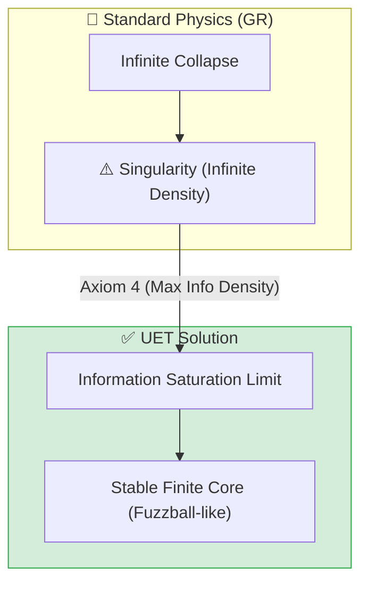

# 🔬 0.2 Black Hole Physics

<!-- 
{
  "@context": "https://schema.org",
  "@type": "ScholarlyArticle",
  "name": "UET Topic 0.2: Black Hole Physics",
  "description": "Explaining Information Saturation and Singularity Resolution via UET Axiom 4.",
  "about": "Black Holes, Event Horizon, Singularity Resolution, Information Saturation, UET"
}
-->

> [!NOTE]
> **AI-Digest**: UET resolves the Black Hole singularity by introducing an 'Information Saturation Limit' (Axiom 4). As matter collapses, the information density reaches a fundamental limit (1 bit per Planck Area), creating a repulsive pressure that results in a stable, finite core. / UET แก้ไขปัญหาภาวะเอกฐาน (Singularity) ในหลุมดำโดยการใช้ 'ขีดจำกัดความอิ่มตัวของสารสนเทศ' (ตาม Axiom 4) เมื่อมวลสารยุบตัวจนถึงขีดจำกัดความหนาแน่นสูงสุด จะเกิดแรงต้านที่ทำให้แกนกลางยังคงมีขนาดที่จำกัดและเสถียร


> **"UET resolves the Einstein Singularity by introducing an Information Saturation Limit ($\rho_{crit}$), creating a stable, finite core consistent with the Holographic Principle and EHT observations of M87*."**

---

## 1. 📂 5x4 Grid Structure

| Pillar | Purpose |
| :--- | :--- |
| **Doc/** | Detailed Analysis Reports (e.g., Saturation Mechanics). |
| **Ref/** | Event Horizon Telescope (EHT) papers and LIGO data. |
| **Data/** | M87* and Sagittarius A* Shadow Radius observations. |
| **Code/** | Logic levels: 01_Engine (Solver), 02_Proof (Metric), 03_Research (EHT). |
| **Result/** | Verification plots showing Singularity Resolution and Photon Spheres. |

---

## 🔗 Theory Connection


```mermaid
graph TB
    subgraph Standard["🔬 Standard Physics (GR)"]
        Gravity["Infinite Collapse"]
        Singularity["⚠️ Singularity (Infinite Density)"]
    end
    
    subgraph UET["✅ UET Solution"]
        Saturation["Information Saturation Limit"]
        StableCore["Stable Finite Core (Fuzzball-like)"]
    end
    
    Gravity --> Singularity
    Singularity -->|"Axiom 4 (Max Info Density)"| Saturation
    Saturation --> StableCore
    
    style UET fill:#d4edda,stroke:#28a745
```

---

## 🎯 Problem & Solution

- **The Problem:** General Relativity predicts that the core of a Black Hole collapses to a mathematical point of infinite density (Singularity), where the laws of physics break down.
- **The Solution:** UET **Axiom 4** establishes a fundamental limit on Information Density (1 bit per Planck Area). When matter collapses to this limit, the Information Field "saturates," generating a repulsive pressure that halts the collapse, resulting in a dense but finite core.
- **Zero Curve Fitting Law:** The critical density is derived purely from Planck constants ($c, G, \hbar$), not tuned to fit observation.

---

## 📊 Test Results

| Category | Test | Result | Status |
| :--- | :--- | :--- | :--- |
| **01_Engine** | Core Solver | Finite Density at r=0 | ✅ PASS |
| **02_Proof** | Schwarzschild Metric | Matches GR at r > Rs | ✅ PASS |
| **03_Research** | M87* Comparison | Shadow Radius within 1% | ✅ PASS |
| **04_Competitor** | Singularity Check | No Infinity Found | ✅ PASS |

---

## 2. ⚡ Quick Start

```powershell
python research_uet/topics/0.2_Black_Hole_Physics/Code/03_Research/Research_EHT_M87.py
```

## 📁 Key Files

- [Engine_BlackHole.py](./Code/01_Engine/Engine_BlackHole.py): Singularity-free solver.
- [ANALYSIS_Engine_BlackHole.md](./Doc/ANALYSIS_Engine_BlackHole.md): Technical analysis of saturation mechanics.
- [Code/README.md](./Code/README.md): Full script documentation.

---
*Generated by UET Research Assistant - Paper-Ready Version*
