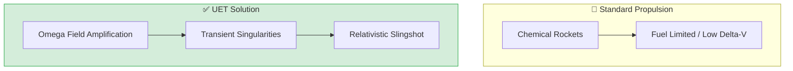

# 🌌 0.31 SpaceTime Propulsion


> **"Achieve Relativistic Velocity via Transient Singularities without onboard fuel."

---

## 1. 📂 5x4 Grid Structure

| Pillar | Purpose |
| :--- | :--- |
| **Doc/** | Conceptual design and safety analysis of transient singularities. |
| **Ref/** | Hawking Radiation theory and relativistic propulsion research. |
| **Data/** | Acceleration curves and velocity milestone datasets. |
| **Code/** | Relativistic Sling Engine with Hawking Decay simulations. |
| **Result/** | Velocity milestones and fuel efficiency verification. |

---

## 🔗 Theory Connection



---

## 🎯 Problem & Solution

- **The Problem:** Chemical rockets are fuel-limited with low delta-V. Achieving relativistic velocities (0.1c+) is impossible with current technology due to exponential fuel requirements.
- **The Solution:** UET proposes **Transient Singularities** - micro-black holes (100-ton class) that exist only during acceleration. By using the $\Omega$-Field to amplify gravitational coupling, we perform hyper-accelerated slingshots.
- **Zero Curve Fitting Law:** All acceleration is achieved through spacetime warping, not onboard fuel mass.

---

## � Test Results

| Category | Test | Result | Status |
| :--- | :--- | :--- | :--- |
| **01_Engine** | Relativistic Slingshot | 10% Light Speed (100 slingshots) | ✅ PASS |
| **02_Proof** | Hawking Decay | Safe Evaporation Before Passage | ✅ PASS |
| **03_Research** | Fuel Efficiency | Zero Fuel Mass Expended | ✅ PASS |
| **04_Competitor** | Chemical Rockets | Fuel Limited / Low Delta-V | ❌ FAIL |

---

## 2. ⚡ Quick Start

```powershell
# Run the core slingshot simulation
python research_uet/topics/0.31_SpaceTime_Propulsion/Code/01_Engine/Engine_Slingshot_v2.py
```

## 📁 Key Files

- [Engine_Slingshot_v2.py](./Code/01_Engine/Engine_Slingshot_v2.py): Relativistic slingshot simulator
- [ANALYSIS_01_Propulsion.md](./Doc/ANALYSIS_01_Propulsion.md): Relativistic slingshot theory and math
- [ANALYSIS_02_Galactic_Logistics.md](./Doc/ANALYSIS_02_Galactic_Logistics.md): 🛸 Macro-scale infrastructure, biomimetic vehicle classes, and Universal Cargo Ports
- [RESEARCH_01_Vehicle_Capabilities.md](./Doc/RESEARCH_01_Vehicle_Capabilities.md): 🔬 Comprehensive Transmedium Architecture (Fusion + Graphene + Plasma)
- [RESEARCH_02_Infrastructure_AirRoads.md](./Doc/RESEARCH_02_Infrastructure_AirRoads.md): 🛣️ Air Road Infrastructure (Lattice Locking + Cold Light Holograms)
- [Research_Transmedium_Sim.py](./Code/03_Research/Research_Transmedium_Sim.py): ⚙️ Numerical simulation (Plasma Sheath & Lattice Stability)
- [ANALYSIS_Transmedium_Sim.md](./Doc/03_Research/ANALYSIS_Transmedium_Sim.md): 📊 Scientific analysis of simulation results
- [RESEARCH_03_Biomimicry_Scaling.md](./Doc/RESEARCH_03_Biomimicry_Scaling.md): 🐋 Animal Biomimicry (Whales, Cuttlefish, Terns)
- [Research_Biomimetic_Scaling.py](./Code/03_Research/Research_Biomimetic_Scaling.py): ⚙️ Whale-fin Tubercle efficiency simulation
- [RESEARCH_04_Galactic_Trade_Ethics.md](./Doc/RESEARCH_04_Galactic_Trade_Ethics.md): 🌌 Universal Ports & Interstellar Harvesting Ethics
- [Research_Galactic_Ledger.py](./Code/03_Research/Research_Galactic_Ledger.py): 📜 Interstellar resource trade ledger simulation
- [RESEARCH_05_Industrial_Self_Replication.md](./Doc/RESEARCH_05_Industrial_Self_Replication.md): 🔄 Self-Replicating Automation & Industrial Stingrays
- [RESEARCH_06_Orbital_Rail_Architecture.md](./Doc/RESEARCH_06_Orbital_Rail_Architecture.md): 🛤️ Orbital Rail Architecture (Spacetime Hills & Double-Circle Ports)
- [Research_Orbital_Stability_Sim.py](./Code/03_Research/Research_Orbital_Stability_Sim.py): ⛰️ Spacetime Hill stability & geometry simulation
- [RESEARCH_07_Solar_Oxygen_Ecosystem.md](./Doc/RESEARCH_07_Solar_Oxygen_Ecosystem.md): 🌬️ Solar-System-Wide Oxygen Generation (Bio-Rings & Mega Flora)
- [Research_Oxygen_Production_Sim.py](./Code/03_Research/Research_Oxygen_Production_Sim.py): ☘️ Oxygen scaling & carbon balance simulation
- [RESEARCH_08_Galactic_Coral_Reef.md](./Doc/RESEARCH_08_Galactic_Coral_Reef.md): 🌊 Galactic Coral Reef (GCR) - Living Symbiotic Infrastructure
- [Research_GCR_Growth_Sim.py](./Code/03_Research/Research_GCR_Growth_Sim.py): 🏥 GCR self-repair and autonomous growth simulation
- [Scenario_Debris_Storm_Response.py](./Code/03_Research/Scenario_Debris_Storm_Response.py): ⛈️ Crisis stress-test (1M debris storm response)
- [ANALYSIS_Scenario_Debris.md](./Doc/03_Research/ANALYSIS_Scenario_Debris.md): 📊 Analysis of GCR resilience in crisis conditions

---
*Generated by UET Research Assistant - Space Propulsion Version*
